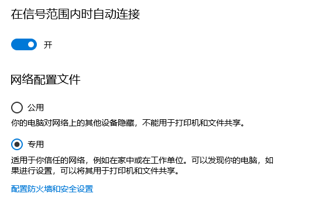
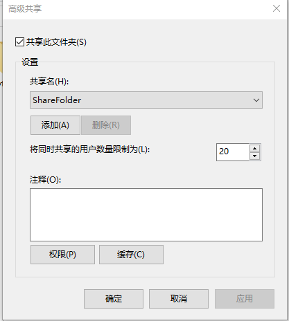

+++
date = '2025-08-11T10:26:51+08:00'
draft = false
title = '在windows上使用SMB'
description = '介绍如何在windows上使用SMB'
image = 'smb_logo.png'
categories = [
    'SMB',
    'Windows'
]
+++


## 安全声明

本文章主观性较强，仅从**技术实现角度**对比文件传输方案，所提及的工具（SMB/MT管理器/QQ/微信等）均无商业推广意图。所有测试数据基于作者个人设备环境，**结果可能因硬件/系统差异浮动**

本文提供的优化方案（如开启SMB端口）需用户自行评估网络环境安全性，操作不当导致设备入侵或数据泄露，作者不承担责任。
## 概念介绍
首先上一下概念，关于什么是SMB：
SMB是一种网络通信协议，主要用于在网络上共享文件、打印机和其他资源。它允许不同设备（如电脑、手机等）通过局域网或互联网连接到同一服务器，实现资源共享和协作。

## 为什么要做这篇博客
### 对比其他工具
对比一下手机开文件服务器将端口打到局域网上，如mt管理器开的远程管理以及其他第三方文件管理工具，以及是聊天软件自带的文件传输工具，至少在我这里，都没有用的太顺手，mt文件管理器可能受制于手机WiFi模块性能以及软件优化限制，不一定能进行相当效率的通信。

### mt管理器
mt管理器，在我的手机上，一方面可能有要求，必须要连在局域网下，通信还比较慢，我自己手机上1-2MB/s左右，很慢

### QQ和微信的文件传输工具

QQ的涉及官方服务器，一方面是不一定安全，传文件到官方的中转站吧好像是，尤其是现在依旧存在的apk文件绑架机制，改apk为apk.1，以及我用的TIM，至少没见到这个功能，也已经不用很久了

## 使用环境

如果家里一直用着**光猫-路由器-设备**的通路，连接同一个路由器的情况下，可以做到**设备-路由器-设备**链路连通的情况下，**请注意，离开这个路由器设备就会导致远程共享不可用**。注意！如果身处公司或者单位的网络环境下，如果公司或者单位的电脑，不支持WiFi下跟宽带下在同一个私域内，也就是无法ping到，那么此方法无效
## 开始
### 打开功能
打开控制面板->程序->启用或者关闭Windows功能，点击SMB 1.0、CIFS 文件共享支持开关
### 让你的电脑能在局域网内能被ping到
`win+i `打开设置 ->网络和Internet，选中你连接的网络，选择你设置的初始的配置，比如说是来宾，公用，或者是专用，一般推荐家里或者是公司的话选择专用，然后外面网络选择公用，不允许被其他电脑访问到，可以增强一些你电脑的安全性

以下分情况，如果你是启用的WiFi，那就点WLAN，如果是以太网就点对应的位置，找到如下对应的设置,

打开 控制面板->网络和Internet->网络和共享中心->更改高级共享设置，如果按照上面推荐的配置来，那么就在专用的配置中进行操作，启用网络发现，以及启用文件和打印机共享，此项跟是否能连接到电脑相关，可以通过ping IP地址测试，方法如下，`win + r`后输入cmd呼出cmd窗口，输入ipconfig命令，一般的返回内容如下
```cmd
C:\Users\xxxx>ipconfig

Windows IP 配置


以太网适配器 以太网:

   媒体状态  . . . . . . . . . . . . : 媒体已断开连接
   连接特定的 DNS 后缀 . . . . . . . :

无线局域网适配器 本地连接* 9:

   媒体状态  . . . . . . . . . . . . : 媒体已断开连接
   连接特定的 DNS 后缀 . . . . . . . :

无线局域网适配器 本地连接* 10:

   媒体状态  . . . . . . . . . . . . : 媒体已断开连接
   连接特定的 DNS 后缀 . . . . . . . :

无线局域网适配器 WLAN:

   连接特定的 DNS 后缀 . . . . . . . :
   IPv6 地址 . . . . . . . . . . . . : xxxxx
   临时 IPv6 地址. . . . . . . . . . : xxxxx
   本地链接 IPv6 地址. . . . . . . . : xxxx
   IPv4 地址 . . . . . . . . . . . . : 192.168.0.105
   子网掩码  . . . . . . . . . . . . : 255.255.255.0
   默认网关. . . . . . . . . . . . . : fe80::1%11
                                       192.168.0.1
```

重点关注上述内容中的==`IPv4 地址 . . . . . . . . . . . . : 192.168.0.105`==

一般使用ipv4地址进行连接，手机上如果有termux终端的话，输入ping IP地址进行测试，我的网络环境下，我手机内termux终端内输入==`ping 192.168.0.105`==即可，你们的环境换成你们对应的IPv4地址即可，也就是==`ping [IPv4 address]`==,如果命令产生类似以下回复，并没有产生丢包，那说明你成功了，能让其他互联网设备访问到你的电脑了，只要不是丢包就行

```cmd
C:\Users\xxxx>ping 192.168.0.105

正在 Ping 192.168.0.105 具有 32 字节的数据:
来自 192.168.0.105 的回复: 字节=32 时间<1ms TTL=128
来自 192.168.0.105 的回复: 字节=32 时间<1ms TTL=128
来自 192.168.0.105 的回复: 字节=32 时间<1ms TTL=128
来自 192.168.0.105 的回复: 字节=32 时间<1ms TTL=128

192.168.0.105 的 Ping 统计信息:
    数据包: 已发送 = 4，已接收 = 4，丢失 = 0 (0% 丢失)，
往返行程的估计时间(以毫秒为单位):
    最短 = 0ms，最长 = 0ms，平均 = 0ms
```

### 新建一个专门用于SMB的用户
桌面此电脑右键，选中管理，打开计算机管理页面，计算机管理(本地)->系统工具->本地用户和组->用户，在右侧名称下方空白处单击右键，点击新用户，如果你有其他的偏好也可以自己选择用户名和密码，用户名推荐英文的，假定用户名设置了SMBUser， 描述可填可不填，可以选择填入SMB共享专用用户也可，密码也自己填，假定你的密码是password **（请注意尽量此处别填此密码，安全系数较低，容易被破解）** 

### 进入组策略编辑操作一些内容

输入`Windows + R`呼出运行窗口，在其中输入`gpedit.msc`（组策略编辑器）
#### 提示Windows找不到gpedit.msc
如果没有gpedit.msc，windows家庭版，可以通过以下代码来实现组策略编辑器的安装
```bat
@echo off
pushd "%~dp0"
dir /b %systemroot%\Windows\servicing\Packages\Microsoft-Windows-GroupPolicy-ClientExtensions-Package~3*.mum >gp.txt
dir /b %systemroot%\servicing\Packages\Microsoft-Windows-GroupPolicy-ClientTools-Package~3*.mum >>gp.txt
for /f %%i in ('findstr /i . gp.txt 2^>nul') do dism /online /norestart /add-package:"%systemroot%\servicing\Packages\%%i"
pause
```
以上为保存成bat脚本后运行，以下内容可直接在cmd命令行中运行，二者择一即可
```cmd
FOR %F IN ("%SystemRoot%\servicing\Packages\Microsoft-Windows-GroupPolicy-ClientTools-Package~*.mum") DO (DISM /Online /NoRestart /Add-Package:"%F")
FOR %F IN ("%SystemRoot%\servicing\Packages\Microsoft-Windows-GroupPolicy-ClientExtensions-Package~*.mum") DO (DISM /Online /NoRestart /Add-Package:"%F")
```

#### 成功安装组策略编辑器后
以下为需要确认的一些内容

1. 计算机配置->管理模板->网络->Lanman工作站->==启用不安全的来宾登录==   确认此选项为否
2. 计算机配置->Windows设置->安全设置->本地策略->安全选项-> ==Microsoft 网络服务器: 对通信进行数字签名(始终)==     确认此选项为禁用
3. 与2选项同窗口，==Microsoft 网络服务器: 对通信进行数字签名(如果服务器允许)==  确认此选项为启用
4. 与2选项同窗口，==网络访问:本地账户的共享和安全模型==   确保其为经典
### 打开本地安全策略

输入`Windows + R`呼出运行窗口，在其中输入`secpol.msc`（本地安全策略）

1. 本地策略->用户权限分配->拒绝通过远程桌面服务登录，双击后点击添加用户或组，单击高级，再次单击立即查找，看到SMB账户后选中，点击确定，外部窗口再次确定

此步骤是为了防止SMB账户被登录拿到权限做一些事，但其实对我来说没什么用，因为一般情况下我的管理员账户也暂时允许了远程登录，如果真有要做什么事，黑客大概率可能会来破解我的主账户，但由于是家庭环境，不存在有公网IP的电脑账户配置那么复杂，也不需要多用户，看完此教程后你会明白，如果没有做特殊管理，使用管理员用户完全能够访问文件夹

2. 跟1.同窗口内，有拒绝本地登录选项，也同样标上选定的SMB账户

## 配置要共享的文件夹



选中需要共享的文件夹后，按`Alt+Enter`呼出文件夹的属性，点击共享选项卡，点击高级共享，有共享此文件夹的一个选项，打勾，共享名建议设置成英文，同页面，点击权限，删除everyone后，添加SMB账户，添加用户操作如上，查找用户添加即可，单击你的用户，权限选项卡将完全控制，更改，和读取三个选项全部勾上，此时配置已经完毕了

此为如何开启SMB服务的教程，怎么使用SMB进行连接请看[SMB连接教程](https://adeepblue.github.io/p/%E9%83%A8%E7%BD%B2%E5%B1%80%E5%9F%9F%E7%BD%91%E4%BA%91%E7%9B%98%E5%85%A8%E8%AE%B0%E5%BD%95/)