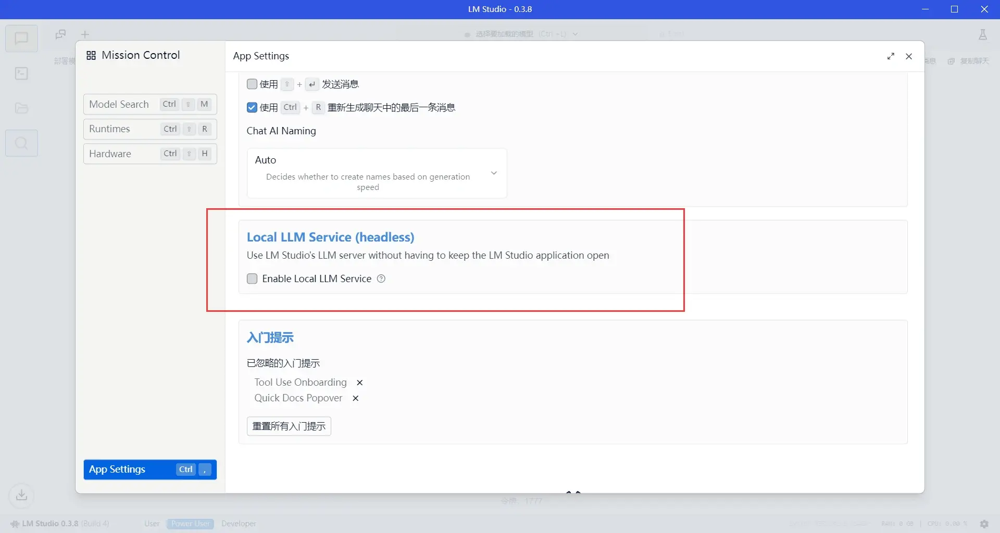
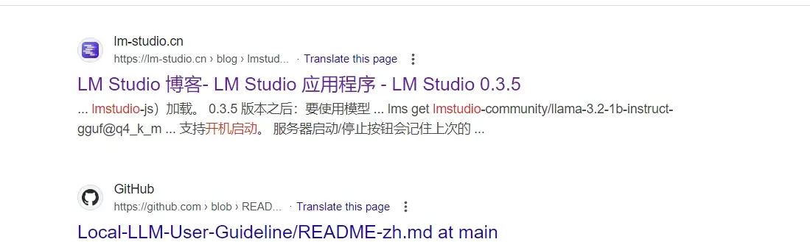
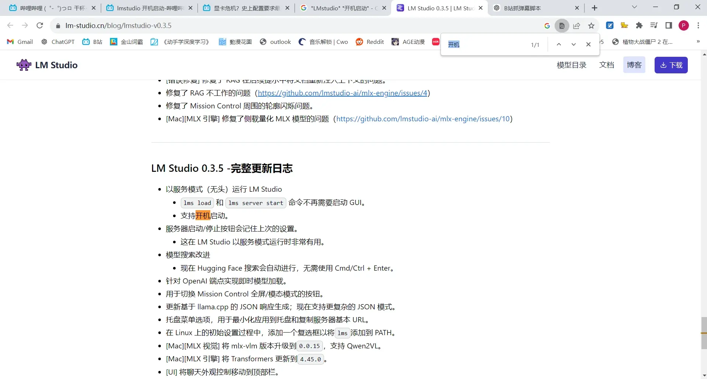
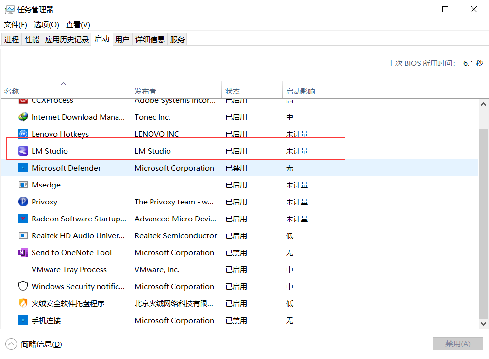
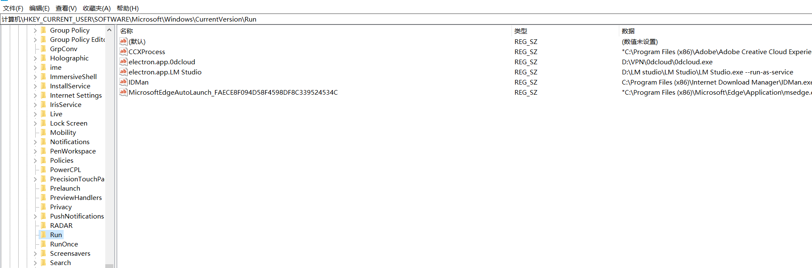
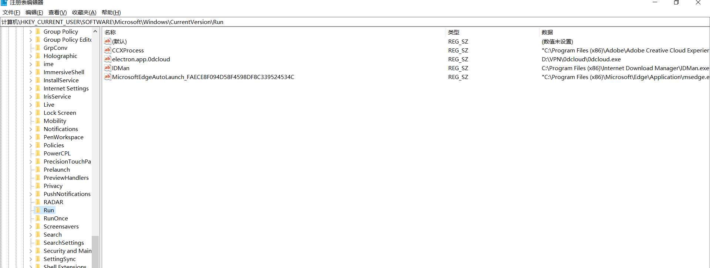
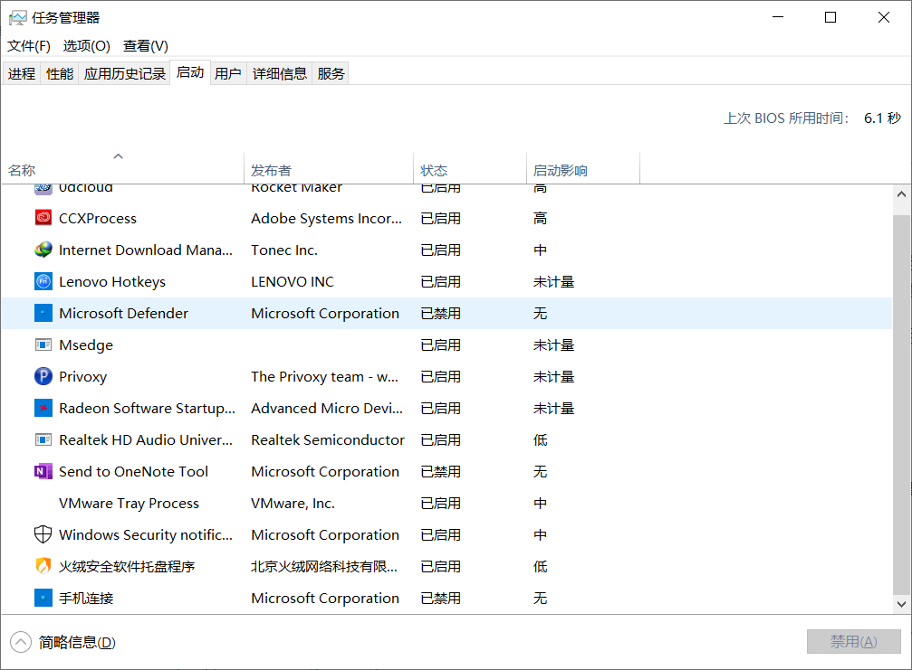

+++
date = '2025-02-08T13:52:52+08:00'
draft = false
title = '关闭 LM studio的开机启动'
description = "分享关闭LM studio开机启动的方法"
image = "LM-studio.jpg"
+++

# 分享关闭LM studio开机启动的方法

## 关闭方法
关闭无头开关(headless)就可以不让LMstudio开机启动

## 我是如何找到的
之前搜了一圈发现没找到来着，虽然B站发了，但是这里还是再发一篇吧，这是B站这边的链接[网页链接](https://www.bilibili.com/read/cv40562346),区别在于我会在这里讲一下我是怎么找到这个的

没找到显式开关的情况下，当时搜谷歌时候的内容如上，其他内容几乎没有，当时觉得挺绝望的，一个半开源软件把开机自启开关都藏得这么深的么？甚至还没多少人关注这个，只是说了它支持开机启动，其中的更新日志里，
那，换个说法，之前的状态就是不支持开机启动咯，那你总有开关做着让人选的吧？

开机启动，我第一个想到的就是任务管理器里的启动，去看了一眼

这个选项明晃晃的躺在里面，那基本就是了，假定，如果这个软件只是安装的的时候通过某种手段去修改了一次设置，也有可能是每次启动修改设置吧？按照这个逻辑，我去设置那边关闭了一次这个选项企图看看什么情况，至于说要怎么观察，
关闭软件然后重新启动就可以，毕竟如果是后者的话，一旦修改成功就会观察到吧？

然后，就真的，观察到启动一次软件就把这个开关给打开了，说明，这是每次启动一旦检测到软件内一个设置选项是啥样的就会去改任务管理器里的那个开关,

再之后，我考虑到有可能是注册表注册了某个键值，导致的反复修改设置里的选项，不过没找到开关就是了，按照LM studio的名字搜了之后加上AI帮助倒是搜到了开机启动项的位置，以及我其他设定的几个开机启动项

以及又按照上述方法测试了一下，只是这次直接就是删除相关键值，依旧也是上面的结果，也就是坐实了就是有个设置项，再结合上述日志提到的无头开关，它只提到了最小化托盘选项开关的事，开机启动只是带过了一嘴，
那我有理由怀疑，这个开关同时也控制着开机启动？

结果，一测试，还真是，任务管理器内的启动那边，和注册表这边的，同时变了

那也就彻彻底底确定了，就是那个开关的问题，但这个开关同时写了允许最小化托盘的选项，以及是开机启动选项，我估计多少会引起一些不希望开机启动但是可以有最小化托盘的用户的不满了，但既然软件现在也就做了一个开关，
这些用户可能也只能无可奈何接受了。

