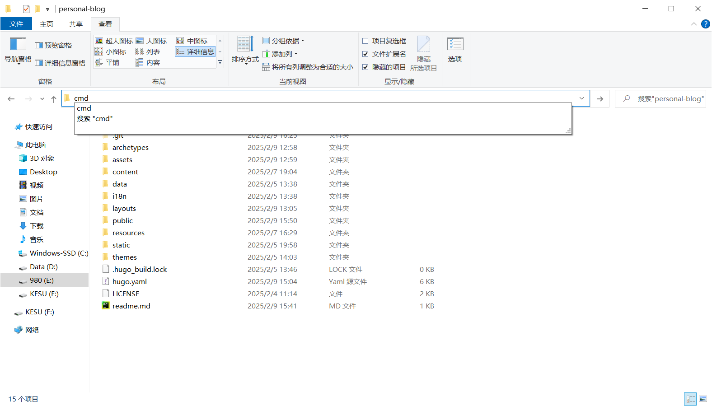

+++
date = '2025-02-04T22:34:00+08:00'
draft = false
title = 'Cmd命令介绍'
description = "介绍一些基于cmd的脚本基础用法，也当作自己的笔记"
image = "CommandLineIcon.png"
categories = [
    "cmd"
]
+++
# CMD一些命令介绍


先新建一个cmd窗口，可以使用`Win + R`打开运行窗口中输入cmd打开，也可以在地址栏输入cmd打开cmd窗口，如下,不过还是第二种方法常用，因为第一种需要重新切换目录，
除非你只是需要开一个cmd窗口，第二种可以基于当前环境下开cmd窗口，运行窗口打开的cmd，通常是基于你的用户名的
`C:\Users\Deepblue>`你当前登录的用户是什么，一般就会显示在这，至于地址栏开启的，比如上面从文件资源管理器的地址栏打开的，打开显示的页面就是
`E:\personal-blog\personal-blog>`基于当前页面的窗口，也叫工作目录

## 切换目录，创建目录，创建文件，查看当前目录下的文件
### **dir**
用于显示你当前目录下的文件和文件名以及其他一些详细信息的
一些我用的多的参数：

**/s**:你可以通过跟上/s的方式递归查看它的所有子目录里的文件
**/b**:忽略其他的输出信息
如果后面跟一些类正则的表达式则可以搜索目录下的一些文件或者目录，一般我平常习惯用的就是文件资源管理器下打开这个，然后用`dir [给定的搜索条件] /s/b`来搜索自己想要的文件
举个例子:
```DOS
dir *.apk /s/b
```
表示搜索当前目录下的以apk结尾的文件，其中*表示通配一切字符，跟正则库不太一样的是，这里直接就是`*`，而要调用正则的话则是`.*`,后者.表示统配一切字符，然后`*`表示若干前面前面的字符
不限制数量，有多少匹配多少，前者也表示这个意思，所以说，如果你需要查找什么带某个字符的文件名，比如说我只记得这个软件的部分文件名，就可以这样做
```DOS
E:\软件>dir *spacesniffer* /s/b
E:\软件\spacesniffer_1_3_0_2
E:\软件\spacesniffer_1_3_0_2\SpaceSniffer.exe
E:\软件\文件索引、扫描工具\spacesniffer_1_3_0_2
E:\软件\文件索引、扫描工具\spacesniffer_1_3_0_2.zip
E:\软件\文件索引、扫描工具\spacesniffer_1_3_0_2\SpaceSniffer.exe
E:\软件\资源类软件\spacesniffer_1_3_0_2.zip
```

### **cd**
假设我当前工作目录如下
`E:\personal-blog\personal-blog>`
其中打开dir查看了一眼这个目录下的所有文件，如下，然后，我想让工作目录切换到已经标记了assets的文件夹，那么直接在命令行输入
`cd assets`就可以切入assets目录了
```DOS
E:\personal-blog\personal-blog>dir
 驱动器 E 中的卷是 980
 卷的序列号是 B407-DA03

 E:\personal-blog\personal-blog 的目录

2025/02/09  15:41    <DIR>          .
2025/02/09  15:41    <DIR>          ..
2025/02/09  12:59    <DIR>          assets
REM --此处文件夹已经被删去多处，为了节省显示空间--
               4 个文件          7,917 字节
              12 个目录 245,086,658,560 可用字节
```

观察到前缀显示多了assets即表示成功切入，补充一点，cmd有补全机制，会识别你当前的参数部分是否是当前文件文件夹下的，比如说这里可能
敲个ass再按**tab**就可以补全assets文件夹的全称了,也可以同时串起切入多个文件目录，比如说`cd ./assets/scss`，切入多个嵌套并没有任何影响

```DOS
E:\personal-blog\personal-blog>cd assets

E:\personal-blog\personal-blog\assets>
```
如果需要回退父目录，比如说上面这段我想切到E:\personal-blog\personal-blog文件目录，则只需要敲入 `cd ..`
即可切出

### 创建文件和创建目录
**mkdir**

在当前目录下创建一个文件夹，记得复制完文件目录以后把斜杠改成反斜杠，起初我以为是用斜杠/来实现分割目录，结果后面发现是反斜杠，就，挺不方便的，得稍微注意一点，其中
`mkdir .\a\b\c\d`可以递归创建文件，也就是，当前并不存在a以及下面的所有目录，这一行命令就可以一次性创建所有使得`cd .\a\b\c\d`可以直接访问了

基于当前目录下创建 ~.\a\b\c\d的目录

**touch**
同样的文件分割方式，创建文件可以用touch函数
`touch .\a\b\c\d\e.txt`
但注意，创建的是空文件，一般结合mkdir使用

### 打印输出，定义变量和环境变量
**echo**

顾名思义，类似于python中print的功能 语法则是`echo [输出内容]`，如果输出内容包含空格，需要英文双引号包裹输出内容两侧
**set**

可以临时定义变量，`set "a=1"`不过需要被包裹在双引号里面，调用的时候需要`%a%`来调用即可，比如说`echo %a%`,也可在%a%前后加入内容，比如说"echo 1-%a%"输出1-1

**环境变量**

一般情况下，你输入其他目录的文件，通常cmd不会给出回应，但如果你将目标目录的文件夹路径添加到环境变量后，那么你就可以访问了，比如说你添加了hugo的源目录
`D:\hugo_extended_withdeploy_0.143.0_windows-amd64`,其中下面有hugo.exe 那么你直接通过cmd敲入hugo相关的相关的命令即可在当前目录下使用hugo了，
很多时候这相当有用，其中环境变量可以通过`win+S`呼出搜索框然后输入环境变量打开对应的设置选项即可，而我，我更懒，我直接新建了一个快捷方式，填入了`C:\Windows\System32\SystemPropertiesAdvanced.exe`
并把快捷方式命名成了environment，然后把这个快捷方式加入了环境变量，然后，我就可以很方便的通过`win R`运行框中输入environment进行直接打开环境变量属性框了
尤其是配合历史记录的情况下，如果你上一次打开的是cmd，这次你不输入任何值默认就会显示cmd，以及如果发现这个功能没了请去设置内开启下列图片中的开关，即可使用这个功能了


## 一定的写入方法
一般cmd环境下，如果你想把一部分内容直接输入到某个文件上，可以通过以下命令实现

`command_output > 1.txt`

例如下面这个命令

`dir *spacesniffer* /s/b >1.txt`

下面是原本的输出的内容，但是一旦加上了`>1.txt`后，所有的输出都被截断，命令行不显示输出，取而代之把输出写入了当前工作目录的1.txt文件中，注意，这个文件也可以不存在，这一行命令会自动新建1.txt文件

```DOS
E:\软件>dir *spacesniffer* /s/b
E:\软件\spacesniffer_1_3_0_2
E:\软件\spacesniffer_1_3_0_2\SpaceSniffer.exe
E:\软件\文件索引、扫描工具\spacesniffer_1_3_0_2
E:\软件\文件索引、扫描工具\spacesniffer_1_3_0_2.zip
E:\软件\文件索引、扫描工具\spacesniffer_1_3_0_2\SpaceSniffer.exe
E:\软件\资源类软件\spacesniffer_1_3_0_2.zip
```

## 其他用途
在我的手里，一般cmd是一个默认的启动器吧，比如如果不希望启动pycharm这么个庞然大物去运行某个python脚本的话，一般可以通过
```DOS
@echo off
python python-script.py
```
这样的方法去启动某个脚本，也省去了你敲命令的时间，比如隔壁git教程那一侧[git教程](https://adeepblue.github.io/p/git%E5%88%9D%E5%A7%8B%E5%8C%96%E8%AE%B0%E5%BD%95/)
```DOS
@echo off
cd ..
cd personal-blog
hugo
git add .

set "year=%date:~0,4%"
set "month=%date:~5,2%"
set "day=%date:~8,2%"
set "formatted_date=%year%-%month%-%day%"

git commit -m "Upload file in %formatted_date%"
git push -u origin main
pause
```
其中`@echo off`为关闭回显状态，也就是不显示`E:\personal-blog\personal-blog>`这个以及命令本身，但不会关闭这个命令本身的输出，pause会使得命令不会跑完就命令窗口消失

## 一些杂谈
一般bat脚本被用来直接用for循环的还是少，一般会被用来作一些简单的启动，比如启动python执行某个脚本什么的，这种比较方便，虽然有for循环
但对比其他语言来说，实在有点眼花缭乱，一般用AI去问问就差不多了，我不喜欢在cmd命令里用for循环，在里面定义读取个变量很多时候也够呛，
但也不否认，如果用它写一些简单的东西，可以省去很多的重复劳动，做到一定的自动化，这一点我还是比较喜欢的