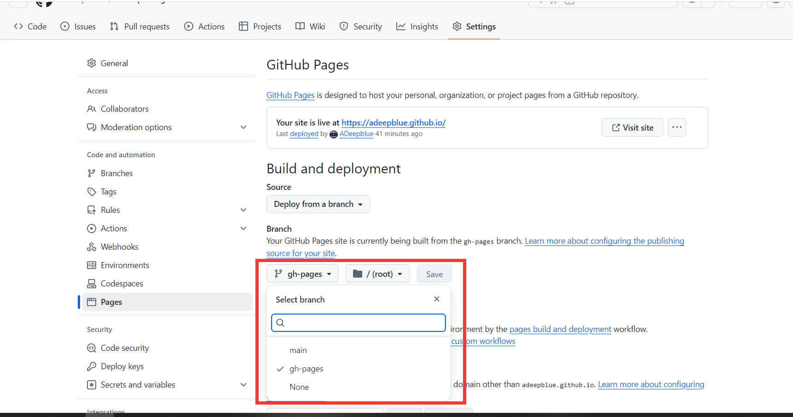

+++
date = '2025-02-04T21:39:19+08:00'
draft = false
title = 'Git初始化记录'
description = "方便下次初始化仓库"
image = "git-bash.svg"
categories = [
    "git"
]
+++

# Git连接踩坑记录
## 配置SSH
重装电脑之后（并不重装D盘），git又连不上GitHub了，也不知道是出了什么毛病，
昨晚连接SSH都连不上，我只依稀记得以前踩了许多坑，再回过头来
捣鼓又是估计好一番功夫了，所以在这写下这篇文章为以后的我参考，方便以后快速配置
<br>`ssh -T git@github.com`<br>
`ssh -vT git@github.com  `(加了v之后会输出调试信息)<br>
也疯狂报错
报错信息如下
```
$ ssh -T adeepblue@github.com
/usr/bin/bash: line 1: exec: nc: not found
Connection closed by UNKNOWN port 65535
```

## 报错查找
但我依稀记得我当时折腾ssh和GitHub的时候没用nc代理工具，这回莫名奇妙有这个报错了
曾经的目录长这样
```bash
C:\Users\Deepblue\.ssh>dir /b
authorized_keys
id_ed25519
id_ed25519.pub
id_rsa.pub
id_rsa_2048
known_hosts
testpub
config
```

最后对比曾经重装电脑留下的备份文件发现多了一个config，然后点进去发现这玩意居然
显示要nc的配置什么的，幡然醒悟，哦，ssh出问题原来就是你这个文件捣的鬼，

文件内容如下:
```
Host github.com
  User git
  ProxyCommand nc -v -x 127.0.0.1:4780 %h %p
```
如果我当初没有备份目录我可能都没意识到，一删
除这个文件之后`ssh -T git@github.com`立马可以通了，也是给我整无语了


## 初始化仓库
# 仓库的配置，先需要初始化仓库
HTTPS协议的通道的演示：

```bash
git init
REM 新建并切到主分支（此处为cmd的备注方式）
git checkout -b main
REM 添加所有文件到git暂存区
git add .
REM 提交到分支
git commit -m "提交信息,比如init"
REM 配置代理，以我电脑上目前的科学上网工具为例，本地环路端口号为4780
git config --global http.proxy http://127.0.0.1:4780
git config --global https.proxy https://127.0.0.1:4780

REM git 添加你的仓库，此处不带git，因为我使用了SSH配置，所以也使用SSH的方式
REM 推送另一种方式我没用所以此处不写
REM 初次添加使用add，如果是一不小心输入错误需要修改就用第二条命令 set-url参数的
git remote add origin https://github.com/Adeepblue/adeepblue.github.io
git remote set-url origin https://github.com/Adeepblue/adeepblue.github.io
REM 推送，如果本地分支跟远程分支不同可使用-f参数强制推送
git push -f origin main / git push origin main --force

REM 列出所有配置
git config --list
REM 删除配置
git config --global --unset http.https://github.com.proxy
```
以上，调试完毕

如果走SSH协议的话，上面add origin或者是set-url origin后面的命令得修改成 git@github.com:Adeepblue/adeepblue.github.io，其中要确保SSH已经验证过了，

```bash
git add -f public
git commit -m "Publish site"
git subtree push --prefix public origin gh-pages
```
以及，现在的hugo推送，这样就可以推送到gh-pages分区进行展示了，需要GitHub修改一下仓库设置



## 仓库迁移
最近自动化上传的时候遇到了这么个提示，也就是上面配置这边原始的命令那，git得补上了，我也不知道为什么，至少它现在提示了
```bath
remote: This repository moved. Please use the new location:        
remote:   git@github.com:ADeepblue/adeepblue.github.io.git   
```
然后我现在就用一行命令移动过去了

```
git remote set-url origin git@github.com:ADeepblue/adeepblue.github.io.git
```

[//]: # (## 关于对git一些主要功能的解释)

[//]: # ()
[//]: # (1. **Git 仓库初始化及相关状态**)

[//]: # ()
[//]: # (`git init` 命令用于初始化仓库，创建主分支到一个提交分支的状态。可理解为时间戳 + 文件的 MD5 加密值（用于区分不同版本的提交）+ 文件本身组成了初始状态。若未做任何更改，就不会产生新的状态，一旦改动文件，就进入文件已改动但未添加到暂存区的状态，此时使用 `git add` 可将文件添加到暂存区。)

[//]: # ()
[//]: # (2. **暂存区的作用**)

[//]: # ()
[//]: # (暂存区的存在提供了灵活性。比如希望一次添加多个文件（如 a.txt、b.mp3、c.flac 等），但又不想一次性添加所有文件时，暂存区就派上用场了。可以分批次添加文件到暂存区，也可以一次性将所有想添加的文件加进去，然后再进行提交操作，这样能避免因没有暂存区而导致的一次性提交多个文件时可能出现的诸多提交版本问题。)

[//]: # ()
[//]: # (3. 提交及版本管理)

[//]: # ()
[//]: # (提交操作是将暂存区的内容一次性提交，形成新的提交版本。提交后可以通过相关命令回滚到之前的提交版本代码，也能查看不同版本间的对比。每个提交版本有对应的 MD5 值，这保证了代码不会被随意更改，一旦代码被提交，其文件结构就被锁定，若要更改就得创建新的提交版本，从而确保了代码的安全性。)

[//]: # ()
[//]: # (4. 拉取（pull）操作及状态要求)

[//]: # ()
[//]: # (如果当前处于有未提交的更改或暂存区有内容的状态下进行拉取操作，可能会导致本地的更改被远端仓库的内容覆写。所以 Git 会有相应警告，要求用户在没有未提交更改且暂存区为空的干净状态下（即处于一个已提交的稳定版本状态）才能顺利进行拉取等操作，避免用户辛苦做的工作因意外拉取而丢失。)

[//]: # ()
[//]: # (5. 提交注释的重要性)

[//]: # ()
[//]: # (在多人协作的场景中，提交注释至关重要。如果没有提交注释，别人无法快速知晓代码的用途以及此次更改添加了什么内容，只能通过查看文件目录结构和代码来了解，这样效率低下且容易混乱。而有了提交注释，就能清晰地向他人展示文件夹或代码的作用，方便团队协作和代码管理。)

## 自动化部署
我给一个我目前在用的自动化部署方案吧，我现在的仓库根目录是`E:\personal-blog\personal-blog`,我配置了我的自动化目录在`E:\personal-blog\automatical-test`
这里并不是git仓库的一部分，所以这个文件并不会上传，但是我分享在这里吧，仅作为参考，如果需要解析请移步隔壁cmd教程[cmd命令介绍](https://adeepblue.github.io/p/cmd%E5%91%BD%E4%BB%A4%E4%BB%8B%E7%BB%8D/)
```bath
REM E:\personal-blog\automatical-test\推送主分支.bat
@echo
cd ..
cd personal-blog
hugo
git add .

set "year=%date:~0,4%"
set "month=%date:~5,2%"
set "day=%date:~8,2%"
set "formatted_date=%year%-%month%-%day%"

git commit -m "Upload file in %formatted_date%"
git push -u origin main
pause
```

```bath
REM E:\personal-blog\automatical-test\发布文章.bat
@echo off
setlocal

rem 从 %date% 按位置提取年月日（假设格式固定为 YYYY/MM/DD）
set "year=%date:~0,4%"
set "month=%date:~5,2%"
set "day=%date:~8,2%"
set "formatted_date=%year%-%month%-%day%"

cd ..
cd personal-blog
git add -f public
git commit -m "Publish site %formatted_date%"
git subtree push --prefix public origin gh-pages
pause
```
# 免责声明

- **脚本仅供学习参考**：本文中分享的自动化脚本仅供个人学习和参考使用，不保证适用于所有环境或符合所有公司的规范和要求。
- **使用风险自负**：在使用本文中的脚本时，请确保您已充分了解其功能和潜在风险。如果您在公司环境中使用该脚本，请务必根据公司的相关规定和要求进行修改和调整。因使用该脚本导致的任何问题或损失，作者概不负责。
- **遵守公司规定**：如果您在公司环境中使用该脚本，请务必遵守公司的相关规定和要求。例如，提交信息的格式、仓库的命名规范等。因未遵守公司规定而导致的任何问题或纠纷，作者概不负责。
- **自行测试和验证**：在将该脚本应用于实际工作环境之前，请务必在测试环境中进行充分的测试和验证，以确保其符合您的需求和环境要求。