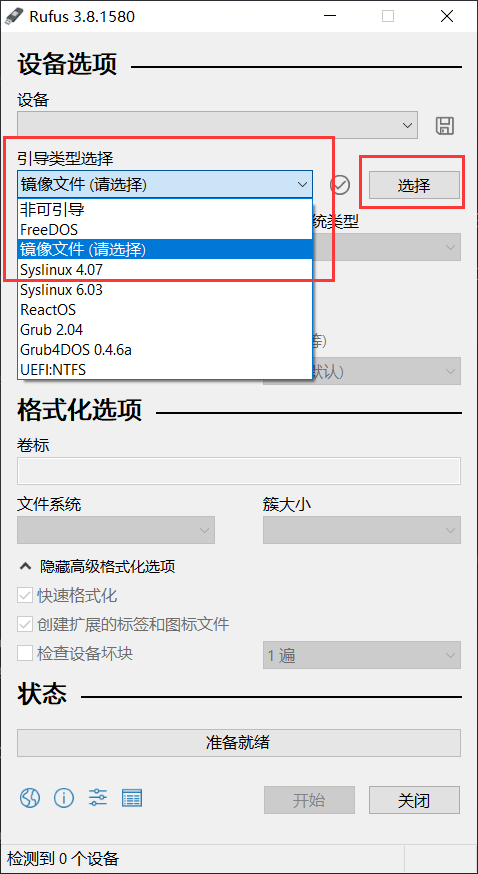
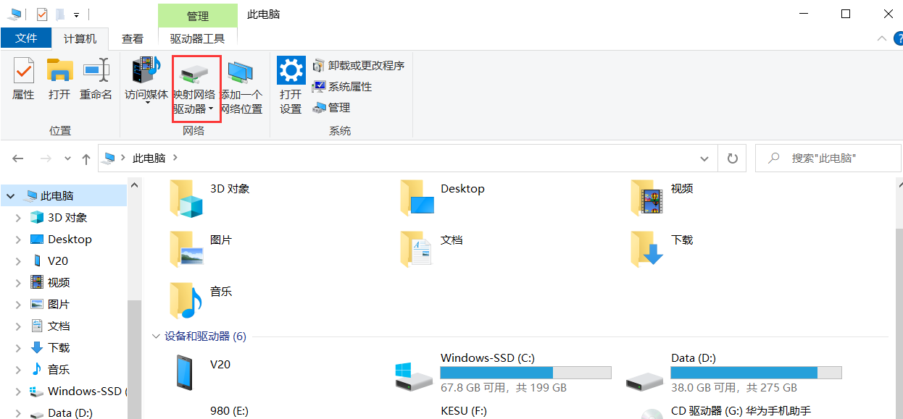
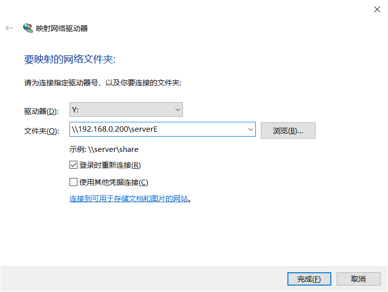

+++
date = '2025-04-08T11:04:34+08:00'
draft = false
title = '部署局域网云盘全记录'
math = true
image = "smb_logo.png"
categories = [
    "ubuntu","linux","云盘","服务器"
]
+++

# 记录一下搞的过程

## 准备工作

1. 一台旧电脑
2. 一块大容量的硬盘，无论机械固态
3. 一个U盘，作为安装介质

## 软件介绍

### Rufus

Rufus是一款免费、开源的U盘启动盘制作工具，它能够快速将ISO镜像文件写入USB驱动器，制作可启动的安装介质，这里我们用它来刷入Ubuntu系统，这是它的下载地址[网页链接](https://rufus.ie/zh/)

## 准备安装介质

其中此处我选择的是Ubuntu的服务器，可以从官网下载ISO镜像文件，也可以从阿里云以及其他一些镜像云上下载，此处我选用ubuntu发行版的20.04进行下载，这是[下载地址](https://mirrors.aliyun.com/ubuntu-releases/20.04/)



选择ISO刷入U盘，完成后你就得到了一块Ubuntu的U盘安装介质

## 刷入系统

### BIOS
将刷好的U盘插入你要当作服务器的旧电脑上，进入BIOS页面，不同品牌的BIOS进入方法不同，我此时用的是旧一点的dell的BIOS，进入设置是按的F2，然后选择USB storage优先级排在最高，
然后即可进入刷系统页面

### 网络设置
第二步设置网络时，插上网线后，先由DHCP自动分配IP地址记录下MAC后，推荐去路由器页面分配一下静态IP，具体操作搜一下就行，分配好静态IP后，
如果再写auto自动分配可能会出错，选择manual手动分配，subnet是指你目前的子网，我目前的是192.168.0.0/24，其中24指的是，把IP地址转为二进制后，就是$8*4$,32位二进制数，
我的局域网分配的子网IP是最后一位从100到255，也就是说，最后八位是会变动的，24也就是前面192.168.0部分的，也就是24位二进制数，全部相同，归属于相同子网， 范围如此设定即可

address网络地址填你刚设定的静态IP地址，
gateway可以通过已经连入网络的设备查看网关即可看到，假如你已经有一台设备连入该局域网，Windows系统，打开cmd后使用ipconfig看默认网关是什么复制过来，还有一个name servers是指你的DNS解析地址，此处填114.114.114.114，我是用IP地址查询归属地，是一个江苏的IP地址，也就是DNS服务器在江苏，如果网络出错DNS服务器挂了可以修改DNS服务器地址指向

search domains这里不填，并不需要非局域网绑定域名

### 修改镜像源

人在国内的话推荐改为清华源或者阿里源

>阿里源:https://developer.aliyun.com/mirror/ubuntu/
>
>清华源:https://mirrors.tuna.tsinghua.edu.cn/help/ubuntu/

### 刷入Ubuntu服务器系统数据

由于我这里打算用双系统，并不打算覆盖win7的系统，所以我选择格式化其中的一个空盘，<span style="color:red">在图前面需要选择一个custom 选项才会出现这个页面，默认是全分区格式化!!!（注意数据安全，别把带重要数据的盘给格式化了，本教程概不负责）</span>


选择ext4后此处的盘会移至上面file system summary处，此处记得配置磁盘为根目录即可，也就是"/"

### 其余选项


选中空的地方变为X，好像是按空格还是回车我忘了，其他配置选项点上nextcloud，我其他点了个docker，按需增加即可，点完安装系统即可，用户名自己记得搞，登录时也需要用，
后面使用ssh连接，命令格式为`ssh username@address` 如果配置过静态IP就不需要担心DHCP分配IP地址导致的IP变动了，我此处用户名是deepblue,IP 是192.168.0.104
所以我的登录指令就是`ssh deepblue@192.168.0.200`接下来提示输入设定的密码即可

## 基础的一些其他命令

```bash
lscpu # 查看CPU配置
```

```bash
deepblue@deepblueubuntu:~$ lscpu
Architecture:                       x86_64
CPU op-mode(s):                     32-bit, 64-bit
Byte Order:                         Little Endian
Address sizes:                      39 bits physical, 48 bits virtual
CPU(s):                             4
On-line CPU(s) list:                0-3
Thread(s) per core:                 2
Core(s) per socket:                 2
Socket(s):                          1
NUMA node(s):                       1
Vendor ID:                          GenuineIntel
CPU family:                         6
Model:                              158
Model name:                         Intel(R) Core(TM) i3-7100 CPU @ 3.90GHz
Stepping:                           9
CPU MHz:                            832.639
CPU max MHz:                        3900.0000
CPU min MHz:                        800.0000
BogoMIPS:                           7799.87
Virtualization:                     VT-x
L1d cache:                          64 KiB
L1i cache:                          64 KiB
L2 cache:                           512 KiB
L3 cache:                           3 MiB
NUMA node0 CPU(s):                  0-3
Vulnerability Gather data sampling: Mitigation; Microcode
Vulnerability Itlb multihit:        KVM: Mitigation: Split huge pages
Vulnerability L1tf:                 Mitigation; PTE Inversion; VMX conditional cache flush
                                    es, SMT vulnerable
Vulnerability Mds:                  Mitigation; Clear CPU buffers; SMT vulnerable
Vulnerability Meltdown:             Mitigation; PTI
Vulnerability Mmio stale data:      Mitigation; Clear CPU buffers; SMT vulnerable
Vulnerability Retbleed:             Mitigation; IBRS
Vulnerability Spec store bypass:    Mitigation; Speculative Store Bypass disabled via prct
                                    l and seccomp
Vulnerability Spectre v1:           Mitigation; usercopy/swapgs barriers and __user pointe
                                    r sanitization
Vulnerability Spectre v2:           Mitigation; IBRS; IBPB conditional; STIBP conditional;
                                     RSB filling; PBRSB-eIBRS Not affected; BHI Not affect
                                    ed
Vulnerability Srbds:                Mitigation; Microcode
Vulnerability Tsx async abort:      Not affected
Flags:                              fpu vme de pse tsc msr pae mce cx8 apic sep mtrr pge m
                                    ca cmov pat pse36 clflush dts acpi mmx fxsr sse sse2 s
                                    s ht tm pbe syscall nx pdpe1gb rdtscp lm constant_tsc 
                                    art arch_perfmon pebs bts rep_good nopl xtopology nons
                                    top_tsc cpuid aperfmperf pni pclmulqdq dtes64 monitor 
                                    ds_cpl vmx est tm2 ssse3 sdbg fma cx16 xtpr pdcm pcid 
                                    sse4_1 sse4_2 x2apic movbe popcnt tsc_deadline_timer a
                                    es xsave avx f16c rdrand lahf_lm abm 3dnowprefetch cpu
                                    id_fault epb invpcid_single pti ssbd ibrs ibpb stibp t
                                    pr_shadow vnmi flexpriority ept vpid ept_ad fsgsbase t
                                    sc_adjust bmi1 avx2 smep bmi2 erms invpcid mpx rdseed 
                                    adx smap clflushopt intel_pt xsaveopt xsavec xgetbv1 x
                                    saves dtherm arat pln pts hwp hwp_notify hwp_act_windo
                                    w hwp_epp md_clear flush_l1d arch_capabilities
```

```bash
free -m # 查看内存配置
```

## 挂载硬盘

一般服务器版本的默认貌似不会挂在硬盘，所以需要手动挂载,使用`sudo fdisk -l`列出所有已经挂载的硬盘

其中我这里的显示的一部分内容400G是被我分配了根目录，sda1是C盘，sda6是E盘

Device     Boot      Start        End    Sectors   Size Id Type
/dev/sda1  *          2048  209719295  209717248   100G  7 HPFS/NTFS/exFAT
/dev/sda2        209719296 1953523711 1743804416 831.5G  f W95 Ext'd (LBA)
/dev/sda5        209721344 1048588287  838866944   400G  7 HPFS/NTFS/exFAT
/dev/sda6       1048590336 1953523711  904933376 431.5G  7 HPFS/NTFS/exFAT


在mnt新建文件夹，文件夹名取决于自己，我现在需要挂载E盘就直接使用e_drive代替了
sudo mkdir /mnt/e_drive

sudo mount -t ntfs-3g /dev/sda6 /mnt/e_drive 
-t表示指定文件系统类型，ntfs-3g是个开源的ntfs文件系统驱动，支持读写ntfs分区，将设备/dev/sda6挂载至/mnt/e_drive，即可读写原来的E盘，`ls /mnt/e_drive`也会有反应了

挂载其他盘同上操作

## 安装SMB服务以及配置

挂载成功后，安装smb相关的一个库，`sudo apt install samba`[smb服务介绍](https://baike.baidu.com/item/samba/455025)

```bash
smbpasswd -m deepblue
```


### 单用户配置

其中deepblue是我的用户，已知用户，这个密码对应后面的访问用户凭证，然后进入root权限去编辑一个文件

```bash
vim /etc/samba/smb.conf
```

进入文件后按i切换插入模式，在文件末尾追加以下内容,其中会需要改变的是path和合法用户，修改完按esc退出插入模式，输入`:wq!`保存强制退出即可，然后以root身份运行`smbd start`即可，
与start对应的参数常用的有stop restart


```
[serverE]
path = /mnt/e_drive
browseable = yes
writable = yes
available = yes
valid users = deepblue
```

到此，一个人用的云盘已经部署完毕，使用方法如下：




其中第二张图中的\\后的为IP地址，后面的为上述的追加内容开头的serverE,`\\192.168.0.200\serverE`,会要求弹出使用凭证登录，使用smbpasswd中对应的用户输入的密码即可


### 多用户配置

貌似默认Ubuntu就存在sudo和users用户组，只要把用户拉入用户组，然后@用户组即可实现管理，表示谁能访问什么盘，使用以下命令以用户名代替即可

```bash
sudo usermod -aG sudo deepblue
sudo usermod -aG users deepblue
sudo usermod -aG users sun
```

想要查看用户属于哪些分组的话直接使用`groups user`就可以查看了，比如`groups sun`
然后合法用户改成@分组即可

```
[serverE]
path = /mnt/e_drive
browseable = yes
writable = yes
available = yes
valid users = @users
```

### 其他一些问题

权限管理，如果只是上述的配置而并没有改动权限的话，有可能会遭遇无法访问的问题，我查看完我的e_drive文件夹，发现所有者和允许读写的用户都是root用户，此时就需要改动一些东西了，
其中用户组部分上述已经提过了，chmod的参数g+rwx表示管理采用用户组，特定的用户组可以访问，以及是，使用chown来指定可以访问的用户组，如第二条命令就是指指定users可访问

```bash
root@deepblueubuntu:/home/deepblue# chmod -R g+rwx /mnt/e_drive/
root@deepblueubuntu:/home/deepblue# chown -R: users /mnt/e_drive/
```

执行完上述两条指令后，你会发现可以访问了

虽然文件夹所有者还是root，但是users内的用户可以进行读写和执行权限了

```bash
deepblue@deepblueubuntu:~$ ls -ld /mnt/e_drive/
drwxrwxr-x 3 root users 4096 Apr 10 16:19 /mnt/e_drive/
```

## 其他
手机端的访问我目前在用cx文件管理器，可以支持远程管理SMB协议的远程存储，mt管理器虽然有，但是要会员，不是太行


## 开机自动挂载

```
sudo blkid /dev/sda2
```

先用这个命令查看一下已经挂载的盘，

```
deepblue@deepblueubuntu:~$ sudo blkid /dev/sda2
/dev/sda2: LABEL="KESU" UUID="6406AD3F06AD12DA" TYPE="ntfs" PARTLABEL="Basic data partition" PARTUUID="794b2add-e382-4ee2-a30a-b39955cf2df8"
```

### USB硬盘开机挂载
在 Ubuntu 系统中，要实现开机自动挂载硬盘，可以通过编辑 /etc/fstab 文件来实现。

sudo vim /etc/fstab，末尾追加

UUID=6406AD3F06AD12DA /mnt/kesu ntfs defaults 0 2

其中UUID请自行替换上面获得的UUID字段

AI 告诉我PARTUUID和UUID可以同时用，至少我现在注释的那条没法用上

1. 使用 UUID
UUID 是文件系统的唯一标识符，适用于大多数情况。
如果你的硬盘是内部硬盘（如系统盘或固定硬盘），建议使用 UUID。
在 /etc/fstab 中填写的 UUID 是：6406AD3F06AD12DA。
2. 使用 PARTUUID
PARTUUID 是分区的唯一标识符，与文件系统无关。
如果你的硬盘是动态的（例如 USB 硬盘或可能被重新格式化的硬盘），建议使用 PARTUUID。
在 /etc/fstab 中填写的 PARTUUID 是：794b2add-e382-4ee2-a30a-b39955cf2df8。

```
# / was on /dev/sda5 during curtin installation
/dev/disk/by-uuid/864029eb-f4d1-4bed-a532-0b142c4e309a / ext4 defaults 0 1
/swap.img       none    swap    sw      0       0

# PARTUUID=200~794b2add-e382-4ee2-a30a-b39955cf2df8 /mnt/kesu/ ntfs defaults 0 2
UUID=6406AD3F06AD12DA /mnt/kesu ntfs defaults 0 2
```

目前方案1可用不想去折腾方案2了，没折腾到可行目前