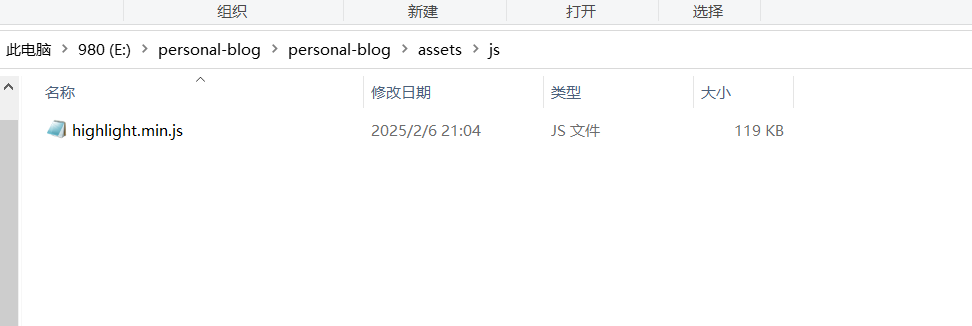
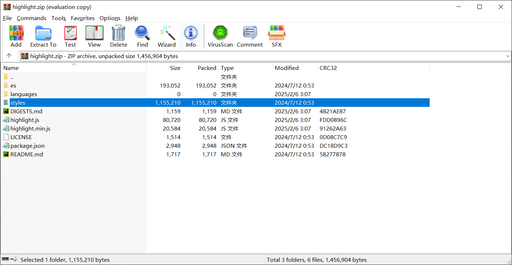
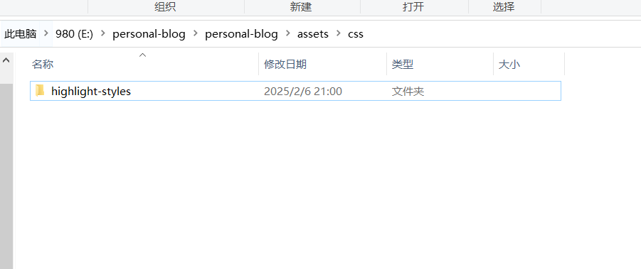
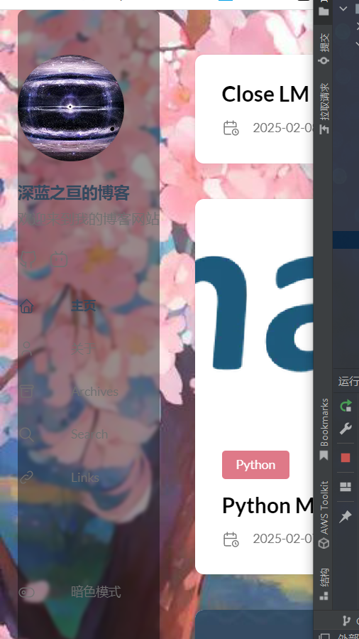
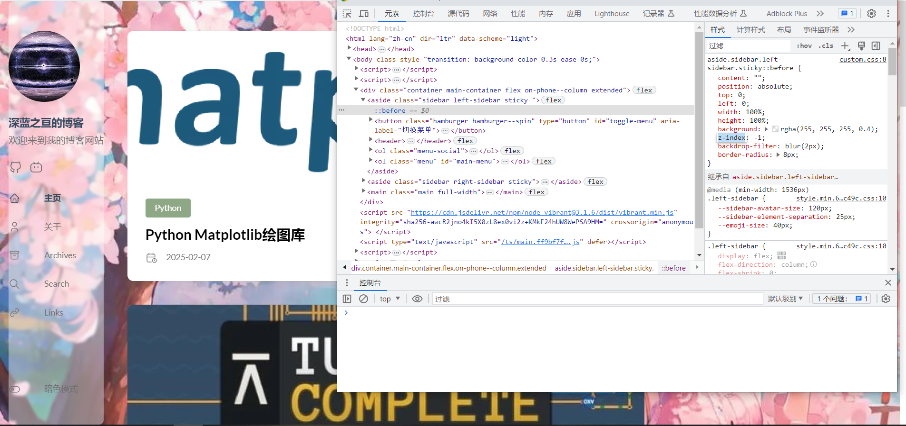
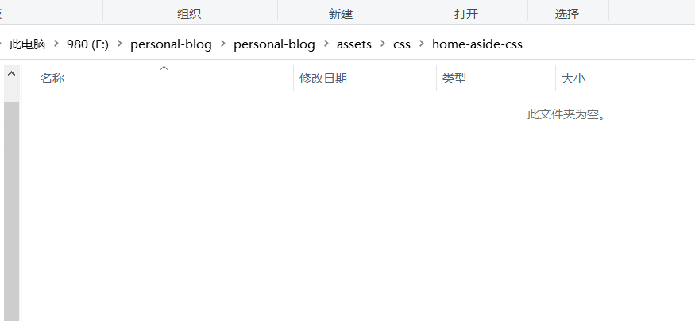
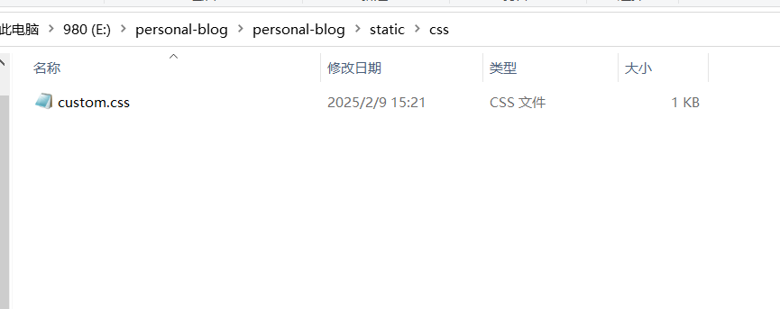

+++
date = '2025-02-04T22:34:00+08:00'
draft = false
title = 'Hugo初始化网站笔记'
description = "hugo初始化记录"
image = "Logo_of_Hugo_the_static_website_generator.svg.png"
categories = [
    "hugo"
]
+++

# Hugo笔记


首先是先下载hugo,我的话因为后面可能命令行会比较常用，所以手动把它添加进了环境变量 path里面
也是有这个步骤才可以下面直接hugo命令直接用了

前前后后也搞了不少时间，万一以后文件丢失了可以来这边参考我自己写的hugo笔记
## 建站

### 新建站点
命令如下

`hugo new site personal-blog`

此处personal-blog可替换文件夹名字，会自动新建文件夹然后在该文件夹下放初始化的内容

### 新建页面

新建完网站本身之后就可以开始写md文件了，比如此处我新建了`hugo/hugo-init.md`文件，命令如下

`hugo new hugo/hugo-init.md`

命令行返回为

```
E:\personal-blog\personal-blog>hugo new git/git-init.md
Content "E:\\personal-blog\\personal-blog\\content\\git\\git-init.md" created
```

但一般推荐写文章在./content/post/foldername/index.md下，其中用文件夹名用标识内容方便自己后续区分，比如说例如这篇文章就在./content/post/hugo/index.md下，因为默认hugo识别文章一般
会去./content/post/文件夹下找md文件，例如我的文件结构如下

```
├─categories
│  └─Test
├─page
│  ├─about
│  └─search
└─post
    ├─cmd
    ├─git
    ├─hugo
    ├─python-matplotlib
    ├─test
    └─turing-complete
```

其他page和categories文件夹我没去管，等到文章写多了才会利用那些整一整

## md文件头和文件内容
再有就是自带的文件头，
```
+++
date = '2025-02-04T21:10:15+08:00'
draft = false
title = 'Test'
+++
```
原本`draft`中的值是true,需要改成false才能进行页面发布
，可能是因为类似审核的过程？方便管理确认？亦或者说不想显示
某篇文章先用这种方式隐藏起来？虽然也只是我的猜测而已罢了
```
# 文章标题

这是你的主要内容部分。你可以在这里添加文本、列表、引用、图像等。

## 子标题

### 列表示例

- 第一项
- 第二项
- 第三项

### 引用示例

> 这是一个引用的例子。

### 图片示例


### 代码示例

`ssh git@github.com`
```
## 一般文件结构介绍
以及是，`content`目录下必须包含_index.md文件，不然会不显
示主页，这就是主页， 命令可以以下方法实现

`hugo new _index.md`
但一般如果是用的第三方主题可以把exampleSite文件夹中的content和hugo.yaml文件拉出来，其中的content文件夹就包含了_index.md，这样也就不用自己写了
除非是要自己构建主题，那就得自己新建_index.md布局文件


然后我目前打算添加的代码，虽然已经弃用（用第三方主题了）
```
---
menu:
    main:
        name: 主页
        weight: -100
        params:
            icon: home
---
```
## 曾遇到的问题
目前git处文章不显示，未知原因，起初发现`draft=true`没修改，但目前不清楚因为什么导致不显示

总觉得hugo挺多bug的，之前有404过不少时间，调试了很久重新开始hugo new site personal-blog 
然后重建git仓库，弄了许久没弄好，现在又出现`hugo new post/cmd/index.md`没法创建
疑似可能是因为hugo server正在启动无法使用new命令吧

写的文markdown文件如果不是index.md的话会出现头字段(front matter)image字段图片加载失败的问题

## 修改背景图片
也奇怪，一开始没搞定背景图片，这次一遍过了，下面这条命令是创建文件夹的命令，在网站根目录打开cmd运行

`md .\assets\background`

然后在这个文件夹内放背景图片后，运行以下命令创建

```
md .\layouts\partials\footer
touch .\layouts\partials\footer\custom.html
```
并将以下代码直接放入上面新建的custom.html内部
```
<style>
  body {
    background: url({{ (resources.Get "background/背景图片名").Permalink }}) no-repeat center top;
    background-size: cover;
    background-attachment: fixed;
  }
</style>
```

此处感谢`莱特雷-letere`大佬的博客指引[网页链接](https://letere-gzj.github.io/hugo-stack/p/hugo/custom-background/)

## 代码高亮
呃啊，折腾了一两天的代码高亮，我以为被原始的样式覆盖了，折腾了很久都没搞好，结果一删AI生成的代码立马好了，我无法接受啊啊啊啊

不推荐用
`npm install highlight.js`的方式安装，我安装完少了`highlight.min.js`文件

`highlight.min.js`放在./assets/js/目录下，
styles文件夹复制出来改文件名成highlight-styles后放在/assets/css/目录下，如下  
虽然我也没搞懂是什么个情况就稀里糊涂的搞好了，其中hugo.yaml中的配置如下
```yaml
    highlight:
        noClasses: false
        codeFences: true
        guessSyntax: true
        lineNoStart: 1
        lineNos: false
        lineNumbersInTable: false
        tabWidth: 4
        style: monokai
#        noHl: true
```
至此，莫名其妙的搞定了，本人也是hugo新手，其他人博客的很简便写的东西没怎么看懂，奈何html水平不够，写这些在这方便参考

## 加入图片
```

```
也可以直接插入HTML片段，比如直接在markdown环境下输入这个调整图片的大小，markdown的另一种调整方式疑似在stack主题下或者说hugo环境下不可用，不过我并没有做过测试就是

<code>
{\{< figure src="picture.png" width="400px" height= "340px" title="title" align="left" >\}\}
</code>

不过最后的align参数貌似没什么用就是了，是从网上看来的

下面是hugo环境下不可用的写法,至少我目前测试是不可用的
```

```

## 标记文字
<span style="color:blue">标记方法如下</span>
`<span style="color:blue">标记方法如下</span>`这样标蓝就行

### 也可以插入div表示一个块

<div class="myclass text-danger" style="text-align:center;color :red;">
居中且标红的 <u>HTML</u>。
</div>
其中上面的代码如下

```
<div class="myclass text-danger" style="text-align:center;color :red;">
居中且标红的 <u>HTML</u>。
</div>
```

## 图表绘制

| x | 1 | 2 | 3  | 4  | 5  | 6  | 7  | 
|:-:|:-:|:-:|:--:|:--:|:--:|:--:|:--:| 
| y | 1 | 0 | -1 | -2 | -3 | -4 | -3 | 
|   |   |   |    |    |    |    |    | 
| x | 1 | 2 | 3  | 4  | 5  | 6  | 7  | 
| x | 1 | 2 | 3  | 4  | 5  | 6  | 8  | 
这样的图表应该怎么绘制呢？看以下源代码，其中第二行得标识对齐，其中-这个符号即是表示这一列的长度最长的显示位数
不得多于对应的长度，比如说如果只有一个-，就不能输入-1了，要表示-1必须在第二行对齐处多加一个-,也就是--
其中单左冒号表示左对齐，单右冒号表示右对齐，两边都有则是居中，一般markdown中输入会跟随你的最长的数字，已经组好表格的
情况下，你如果在这一位插入数字会自动帮你添加-，但删到数字没有了记得补上-,因为你把文本删光了对应上面也就没有-了，
需要手动去调整
```
| x | 1 | 2 | 3  | 4  | 5  | 6  | 7  | 
|:-:|:-:|:-:|:--:|:--:|:--:|:--:|:--:| 
| y | 1 | 0 | -1 | -2 | -3 | -4 | -3 | 
|   |   |   |    |    |    |    |    | 
| x | 1 | 2 | 3  | 4  | 5  | 6  | 7  | 
| x | 1 | 2 | 3  | 4  | 5  | 6  | 8  | 
```
| x | 1 | 2 | 3  | 4  | 5  | 6  | 7  | 
|:-:|:-:|:-:|:--:|:--:|:--:|:--:|:--:| 
| y | 1 | 0 | -1 | -2 | -3 | -4 | -3 | 
|   |   |   |    |    |    |    |    | 
| x | 1 | 2 | 3  | 4  | 5  | 6  | 7  | 
| x | 1 | 2 | 3  | 4  | 5  | 6  | 8  |

## 链接css样式表进页面
因为我当时要改左侧样式表的页面，因为完全没有颜色会让左侧标签栏变得看不到，如下，我选择了加入伪元素达到类似蒙版的效果



因为deepseek给出的文件放置位置错误，当时它提示我放在./assets/css/custom.css中调用，调用的时候只需要调用/css/custom.css就行了，
结果没生效，到头来是在./static/css/custom目录下调用成了,参考了[网页链接](https://hugo-mini-course.netlify.app/sections/styling/custom/)这篇文章



## 企图修改边栏文字
修改内容如下
```
./content/pages/archives/index.md
# title 字段和slug字段，分别改成中文
./content/pages/search/index.md
# 同上
```
以及hugo.yaml文件中
```yaml
        homepage:
            - type: search
            - type: archives
```
以及文件夹部分
```
./content/pages/search/改为./content/pages/搜索/
./content/pages/archives/改为./content/pages/归档/
```
结果：改完可以生效左侧文字，但是右侧工具栏失效

## 删除多语言选项框
配置一下hugo.yaml文件就行
以下
```yaml
languages:
    zh-cn:
        languageName: 中文
        title: 深蓝之亘的博客
        weight: 2
        params:
            sidebar:
                subtitle: 欢迎来到我的博客网站
```
上述位置删掉en键值就行，只保留一个zh-cn，或者保留en但需要去调模板的值