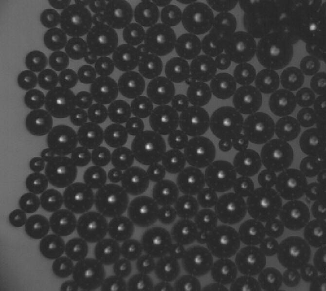
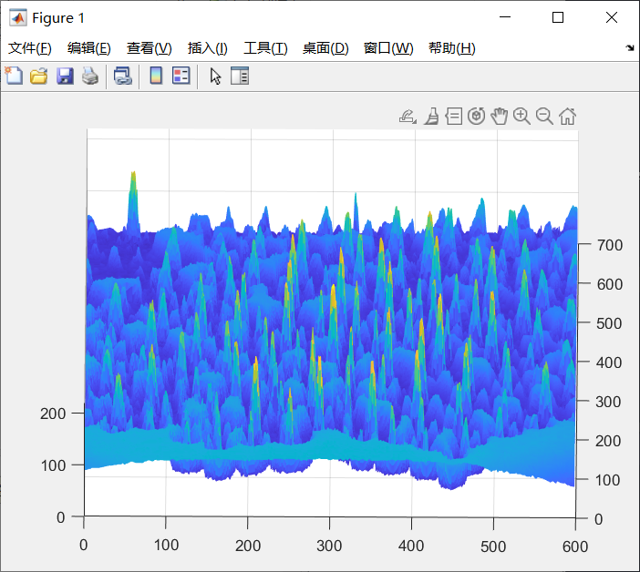

+++
date = '2025-03-19T23:34:59+08:00'
draft = false
title = 'Matlab图像加工处理'
image = "/image/MATLAB-Symbol.jpg"
math = true
categories = [
    "matlab"
]
+++

## 图像分割

此为应朋友需求写的代码改核心而来，仅供参考
图源[https://zhuanlan.zhihu.com/p/57405494](https://zhuanlan.zhihu.com/p/57405494)



### 图像读取(Image Read)

```matlab
% 单图片读取方式
img = imread("image.jpg"); %image.jpg为图源
% 从视频的某一帧读取，此处注释
% vid = VideoReader("video.jpg")
% frame = read(vid,index);
```

### 一定的加工(Process Image)

#### 加工方案1
```matlab
% 灰度化
grayFrame = rgb2gray(img);
% 二值化
bw = imbinarize(grayFrame,"adaptive","Sensitivity",0.7);
% 反转颜色
bw = not(bw);
% 填充孔洞
bw = imfill(bw,"holes");
```

这里使用了 `imfill`来填充图片内部的孔洞，也可以用imopen和imclose进行处理，但是需要注意精度，其中需要not反转的原因主要是气泡是黑色的，二值化处理之后其他背景部分都是白色的，
只有气泡是黑色的，黑色对应的是0，不是1，其他地方对应的都是1，如果黑色的反而是缺陷处了，如果使用imfill会直接将黑色气泡的洞填掉，这一点尤为需要注意

#### 加工方案2

```matlab
grayFrame = rgb2gray(img);
    bw = imbinarize(grayFrame,"adaptive","Sensitivity",0.7);
    bw = not(bw);
    % 形态学开闭运算去噪
    bw = imopen(bw, strel('disk', 2));
    bw = imclose(bw, strel('disk', 3));
```

(下面此行解释来源于deepseek)
解释:形态学开运算是先腐蚀后膨胀，用于去除小物体和平滑边界，而闭运算是先膨胀后腐蚀，用于填充小孔和连接邻近物体。结构元素的大小（如`strel('disk',3)`）决定了操作的强度，较大的结构元素会影响更大的区域。

上面的imfill好处在于单个气泡的填充，忽视了一些图像过滤的方面，形态学开和闭运算则是直接去掉一些大小不满足的气泡，不过,因为先膨胀后腐蚀的原因，需要注意一下图像的精确度，有可能会丢失一些边缘信息

### 图像分割(image segmentation)

```matlab
% 设定区域的最小像素数量
minArea = 20;  
% 分割图像，其中bw后跟的是你所需要的参数，现在是面积，还有当前所在
stats = regionprops(bw, 'Area', 'Centroid', 'BoundingBox');
    areas = [stats.Area];
    invalidIdx = find(areas<minArea);
    stats(invalidIdx) = [];
```

其中stats返回的是个struck结构，如果你使用`stats.Area`去获取它的属性，它只会给你第一个的值，但是如果你使用`[stats.Area]`，则可以获取到完整的所有的struck结构的值，
然后使用将`stats(invalidIdx) = [];`删除面积小于20的区域，以前我好像还没啥批量删除的思路，可能还要考虑从后往前删，现在matlab这边貌似可以直接批量把要删的内容块直接设置为空内容就行了

以下是stats的返回值，其他你所需要的返回值可以参考[官网链接](https://ww2.mathworks.cn/help/images/ref/regionprops.html)

```matlab

stats = 

  包含以下字段的 15×1 struct 数组:

    Area
    Centroid
    BoundingBox
```

其中就按照然后是从上到下，从左到右的顺序逐个标记区域，返回的值包含你想要的东西，也就是image(x,y)

## 三维可视化图像



就拿上面的那张灰度化后的图举例吧，mesh函数可视化之后会变成上图

### 绘制过程

假设你想绘制的灰度图是上面那张灰度化之后的`grayFrame`图片，我先说过程再解释原因

```matlab
[a,b] = size(grayFrame);
x = linspace(1,b,b);
y = linspace(1,a,a);
[X,Y] = meshgrid(x,y);
mesh(X,Y,grayFrame)
```

绘制需要三个数据，X，Y，grayFrame,其中grayFrame是个矩阵，$598\cdot670$大小的矩阵，我目前可以构建的是，先框定$598\cdot670$的绘制框架，再增加一个维度的它的像素数据，这就是三维了

回忆一下plot的绘制，需要x和y的数据要一一对应，这里也一样，由于绘制的是个3D曲面，我们需要掌握到所有$598\cdot670$个点的X,Y,Z的坐标的值，此时`meshgrid`函数就派上用场了，
先用`x = linspace(1,b,b);`获取到1到a的所有整数数列，linspace()函数[详解见此](https://ww2.mathworks.cn/help/matlab/ref/double.linspace.html)，y同理

其中$a = 598,b = 670$，那么x和y生成出来分别是$x:1\cdot598，y:1\cdot670$两个一维向量，然后交给meshgrid这两个向量就会生成对应的上面需要的X和Y，其中X和Y都是$598\cdot670$大小的

你可以如此理解这两个矩阵，如果把它可视化在有坐标轴的位置，其中规定(0,0)是图像左上角，670的长是x轴的1到670的位置，然后598是y轴1到598的位置，
这里也有$598\cdot670$，刚好能放下$598\cdot670$个图像的数据对吧？而且刚好能移植过来，此时这$598\cdot670$所有点的横坐标，全提出来也就是一个$598\cdot670$的矩阵，这就是上面的X，Y也如此，也就是对应着每个图像像素点的Y的值

再提一嘴，此时X，Y，grayFrame的矩阵大小都是$598\cdot670$，mesh只要读取$598\cdot670$次，每次读取都可以读到一个像素的X值（X中来），Y值（Y中来），以及像素值（grayFrame中来），这样就完成了


