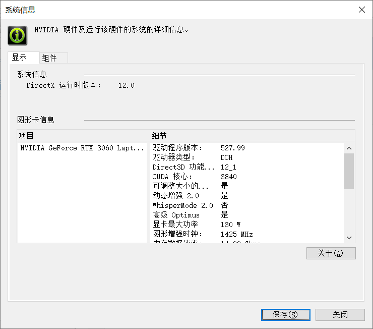

+++
date = '2025-03-26T10:36:49+08:00'
draft = false
title = 'Minimind调试记录'
image = "logo.png"
math= true
categories = [
    "语言模型"
]
+++

# 调试记录
我pip install -r requirements.txt不是很顺利

创建了新的虚拟环境，报错：缺少Microsoft C++ Build Tools构建工具，报错包为ujson==5.1.0，先将其从requirements.txt将其移除，其他都是通用可以安装的，
**实际好像是选择优先级的问题，可以优先下载tar.gz压缩包版本的，然后在本地构建，而不是直接用whl轮子构建，**

然后我选择从清华源去安装ujson的whl文件，不过在那看到了让我疑惑的东西，后面才反应过来，是cpython和PyPy的区别,因为没有适配311的ujson，我干脆下了个
ujson-5.10.0-cp311-cp311-win_amd64.whl，5.10.0的版本的，成功安装完毕

由于现在安装的torch是没有任何标注的，也就是基于CPU运行的，去[下载链接](https://download.pytorch.org/whl/torch_stable.html)找一下GPU版本的
我下的是torchvision-0.17.2+cu118-cp311-cp311-win_amd64.whl，然后版本我选择跟requirements.txt中的保持一致，使用pip list 找到torchvision对应的版本号对上即可

解释一下，cu118是指，cuda必须要大于11.8版本的，这个在N卡控制面板->帮助->系统信息处  可以找到

torch同理，也需要cuda版本的，
注意!!!清华源并没有提供GPU版本的，如果你的全局设置是使用清华源来pip的，注意一下所下的GPU版本，国内镜像源似乎上交大的可用，此处附上[链接](https://mirror.sjtu.edu.cn/pytorch-wheels/cu118/?mirror_intel_list)

看了一眼作者的配置，128G的内存+3090*8，实在没绷住，有机会的话看看云端训练吧，上述为本地Windows系统的验证过程