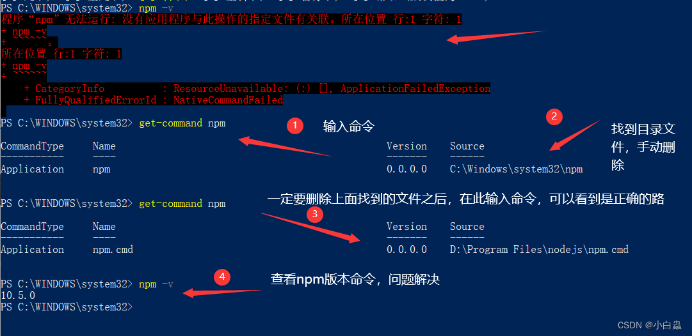
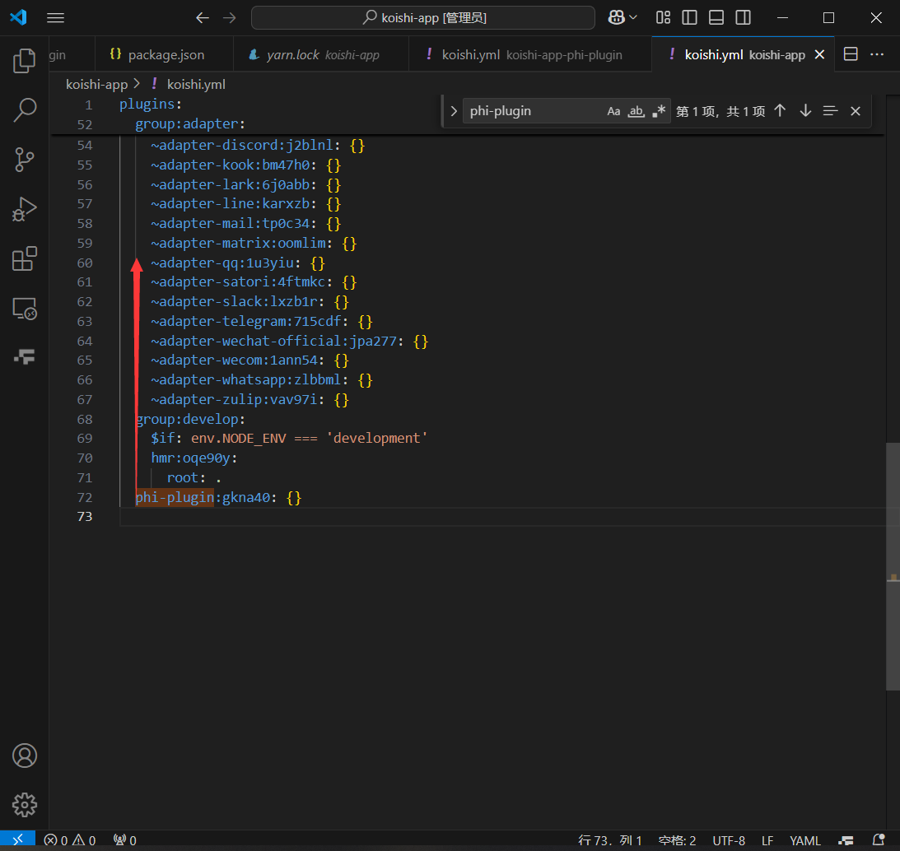

+++
date = '2025-03-01T10:55:46+08:00'
draft = false
title = 'Phi Plugin Koishi'
image = "phi-plugin-logo.png"
+++
# 教程

## 安装node.js

官网链接[node.js](https://nodejs.org/en/download)
下一步下一步安装完毕之后在cmd环境下测试一下以下命令，如果下面没有where npm添加环境变量，具体来说是在你安装nodejs文件夹下找到npm之后，添加npm所在的目录进环境变量即可，
例如这是我的安装路径，那么就把这`E:\Program Files\nodejs\`一段新增入环境变量

```
E:\Program Files\nodejs\npm
E:\Program Files\nodejs\npm.cmd
```

```bash
where npm
```

```bash
npm install axios
```



其中检查第一步的输出，是否有包含一个空的npm的文件，在system32目录下，而且在如果有就去对应目录给删了。

因为环境变量的执行优先级，system32文件夹处在一个很高的优先级上， 会导致你在命令行输入npm时，系统在环境变量内从前往后查找名为npm的文件或者支持直接执行的文件，
因为一般新增环境变量通常都是补在末尾，也就是说，system32这样的系统文件一般会获得极高的优先级，然后下面又有空的那个npm文件，就会导致你使用npm命令时调用的就是system32下面的npm空文件，
导致了你的文件不可用，但是处于system32文件夹下的npm，好像没有任何用处，删除即可  ~~（谁家包管理器有事没事往system32里塞文件啊）~~

## 安装yarn
安装 yarn
```
npm install -g yarn
```

## 安装koishi.msi文件

安装koishi.msi后，在目标目录下初始化koishi,使用以下命令

```
npm init koishi@latest
```

第一次启动会直接启动本地服务端口，第二次启动需要cd koishi-app进入文件夹后执行npm run dev
然后执行
```
yarn install
```

该命令会自动调用同目录下的package.json文件执行安装koishi的依赖

## 添加插件

### 步骤一
下载好phi-plugin-koishi之后,确保src文件上一级有额外的文件夹，比如说记录你的**父级文件夹**为**phi-plugin**，则确保目录为/phi-plugin/src这样的目录结构就行

### 步骤二

因为koishi并不会给你拖入的文件夹主动添加工作环境内，所以有两种可选的方式来初始化

#### 新建插件方案

```
yarn setup phi-plugin
```

它会在/koishi-app/目录下新建一个external文件夹,然后创建/phi-plugin/src/index.ts这样的文件结构，此时你可以直接删除phi-plugin文件夹然后拖动上面步骤一同名的phi-plugin文件夹过来，就可以正常被读取了

#### 修改koishi.yml方案

直接在/koishi-app/目录下新建external文件夹，新建插件方案的文件夹是因为yarn setup phi-plugin命令新建的，这里我们自己新建一个文件夹，然后拖动步骤一中的phi-plugin文件夹进来，
再去/koishi-app/koishi.yml文件内追加以下内容:

```
phi-plugin: {}
```

其中对齐plugin下一级即可，如下图,其中不必在意gkna40编号，添加上面的即可，npm run dev后会自动添加



## 构建源代码

yarn build

随后参考官网即可[https://koishi.js.org](https://koishi.js.org/manual/cli/development.html)
