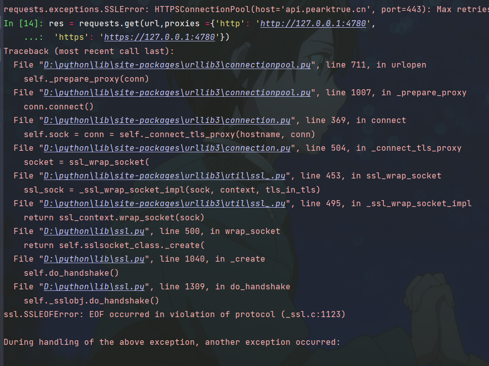
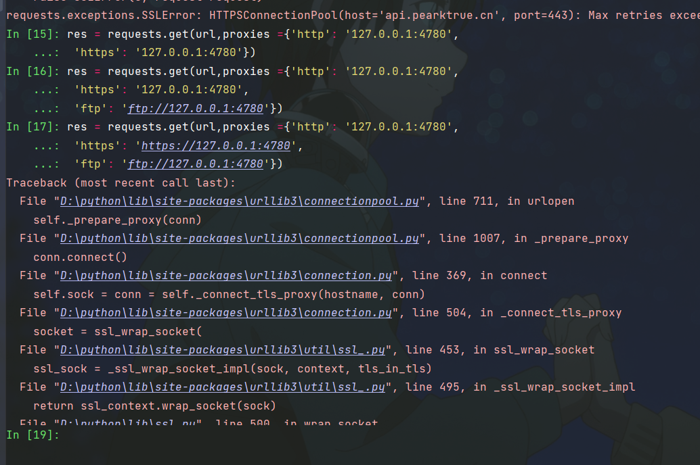

+++
date = '2025-02-11T16:35:53+08:00'
draft = false
title = 'Python 开了代理使用requests库报错SSL Error解决办法'
description = "曾经python遭遇SSLError的解决办法"
image = "python-Logo.png"
categories = [
    "python"
]
+++

# SSLError
这是我曾经新开的一个仓库下的提交的ISSUE，虽然没多少人看过了，

## 解决办法
[GitHub仓库链接](https://github.com/ADeepblue/SSLError_involve/issues/2)

windows环境下当你遇到了这个问题,可以尝试打开 设置->网络与Internet->代理 ,
手动设置代理处找到地址和端口,并将它们拼接起来,例如
```
https":"127.0.0.1:4780"
```
, 在用request.get的时候当作参数传入, 例如
```
proxies = {"https":"127.0.0.1:4780"}
```
然后传入时,需要把proxies字段作为参数传入
```
requests.get(url=url,headers=headers,proxies=proxies)
```

以及注意代理的使用情况,如果没有设置代理状态有可能会返回报错,注释掉proxies并删除参数即可.
pip同理,复制下列代码至txt文本后,根据你设置内的代理状态进行修改,然后在cmd运行
例如我的是`pip config set global.proxy 127.0.0.1:4780`(地址和端口记得改成自己的)但如若你需要关闭VPN使用pip命令记得用下面一行代码,
`pip config unset global.proxy`即可.

最近逛了一圈倒是找到了对应的文章，当时碰到的时候没有任何的提示

当时还在大学，时间紧，试通之后并没有去查到底是什么原因导致的，好像是urllib库的问题，当时问GPT也没有任何结果，最近去问了问deepseek也依旧不明白报错原因

其他人说了原理的话我也不多说了[网页链接](https://www.cnblogs.com/davyyy/p/14388623.html)，我也没有仔细去钻研过这个玩意，当时只是发现了解决办法，
但实际具体看了一下他们的东西也不一定能照搬过来，具体见

## 报错
```
HTTPSConnectionPool(host='api.live.bilibili.com', port=443): 
Max retries exceeded with url: /xlive/web-room/v1/dM/gethistory?roomid=10112&csrf_token=
 (Caused by SSLError(SSLEOFError(8, 'EOF occurred in violation of protocol (_ssl.c:1123)')))
```
出错形式会有很多种，proxyError,以及是最常见的是SSLError

高版本python目前已经修复了这个问题，python3.11已经不用担心这个问题了，python3.9还存在这个问题。
我现在也只是给一下低版本的一些解决方案，虽然可能比较麻烦，如果说在开发的过程中你已经全配置好了其他的比较难改了，那推荐你强制你的用户用高版本的python，我目前并没有测试过python3.10附近的，也没查出啥时候修复的
3.11以其版本以后的都不用如此手动配置代理了


## 如何修正
以下是两段的参考代码,我目前的版本是Python 3.9.2rc1
```python 
def get_proxy_settings():
    """代理配置函数，如果有代理直接返回代理环路地址:端口号，代理地址一般是127.0.0.1，端口号:4780，则拿到的返回可能是127.0.0.1:4780"""
    try:
        with winreg.OpenKey(winreg.HKEY_CURRENT_USER, r'Software\Microsoft\Windows\CurrentVersion\Internet Settings') as key:
            proxy_server, _ = winreg.QueryValueEx(key, 'ProxyServer')
            return proxy_server
    except FileNotFoundError:
        return None

# 其他内容
if get_proxy_settings() != None:
     proxies = {"https": get_proxy_settings()} #设置proxies,此处http不一定是必要的，以及127.0.0.1:4780前面的https也不一定是必要的，如果有错误可以试试
     res = requests.get(url,headers= headers,proxies=proxies)
else:
    res = requests.get(url,headers= headers)
# 其余操作
pass
```
这一段逻辑代码我用在过我的另一个翻译脚本上,端口一般不会变化，其实设定好了就一般不必多更改了，可以当作固定接口用的，除非你反复用不同的VPN，具体如何我也没测试过，这一段代码被我当作了
扩低版本python兼容性的解决方案，因为很有可能会出现




由上两图可见，在python版本号是 `Python 3.9.2rc1` 时https处并不能加任何东西，如果加了东西，可能就会导致内容报SSLError错误

另一种获取代理配置的方法比上述可能简单一点，但我没怎么用过，也就是urllib.request.getproxies函数,要筛除一下无关元素太麻烦了，以下是输出示例，如果你觉得
会比上述内容方便的话可以试着改一改，但我已经不想动了，要做的也就是去掉https键对应的值的https字符串，至于其他是否保留也取决于自己，仅供参考

```
urllib.request.getproxies()
Out[10]: 
{'http': 'http://127.0.0.1:4780',
 'https': 'https://127.0.0.1:4780',
 'ftp': 'ftp://127.0.0.1:4780'}
```