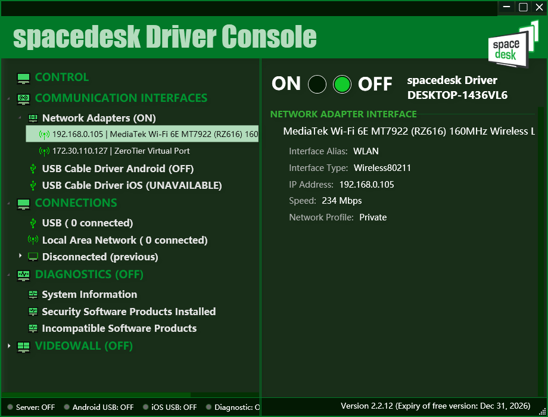
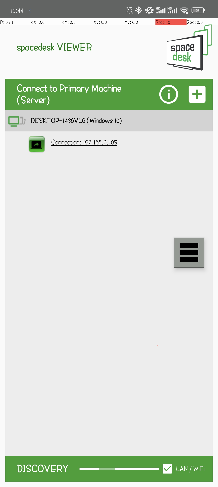
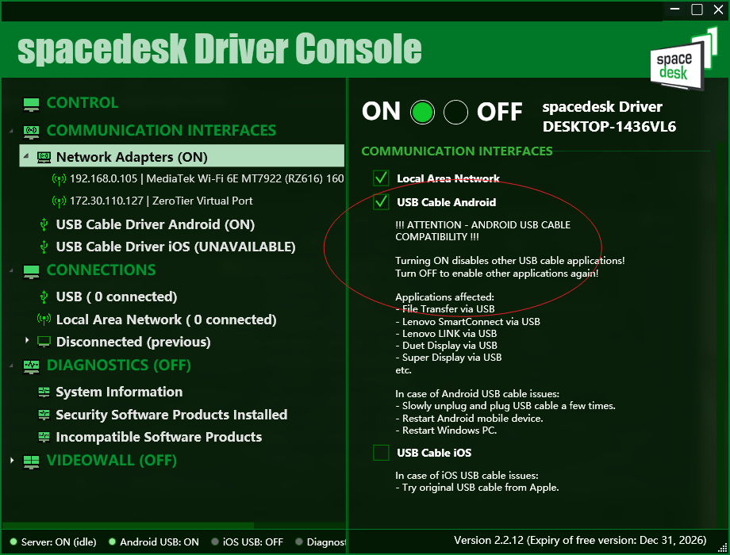

+++
date = '2025-12-05T10:21:59+08:00'
draft = false
title = '扩展副屏 spacedesk 使用指南'
description = '把你的安卓设备变成电脑的扩展副屏'
image = 'spacedesk.png'
categories = [
    ''
]
+++

## 概述

spacedesk 是一款可以将安卓设备变成电脑扩展副屏的软件，支持无线连接和有线连接两种方式，适用于 Windows 系统。通过 spacedesk，你可以轻松地将手机或平板电脑作为第二个显示器使用，提升工作效率和多任务处理能力。如果接入设备支持触摸功能，还可以实现触摸操作。

## 工作模式

spacedesk有两个工作模式,一个是基于局域网的,另一个是基于USB数据线的,前者需要占用路由器的信号带宽,后者连接USB开启开发者模式的USB调试模式可以开启
## 安装步骤

[官网地址](https://www.spacedesk.net/)从官网下载windows版本的控制终端,作为控制端,安卓或者其他带显示屏的设备安装被控端,图标即标题样式,注意别下错了

 点击右侧的ON的开关,即可开启基于局域网的无线模式
另一边安卓端直接安装网上下载下来的spacedesk客户端,点击进入之后会自动扫描本地局域网的电脑端,点击直接连接即可

## USB连接模式

### 前提条件
首先需要开启安卓设备的开发者选项和USB调试模式。具体步骤请自行网上搜索，因不同安卓版本和设备略有差异。
### 连接步骤
1. 使用USB数据线将安卓设备连接到电脑。
2. 在电脑上打开spacedesk控制端，确保USB连接模式已启用。
3. 安卓设备上会弹出授权提示，选择允许USB调试连接。
4. 连接成功后，安卓设备将作为电脑的扩展显示屏使用。

