+++
date = '2025-02-28T11:08:48+08:00'
draft = false
title = '图灵完备alpha版攻略1'
image = "/image/Turing-Complete-Logo.png"
math = true
description = "更新了图灵完备alpha版的从头到XNOR以及double trouble的关卡解法以及思路"
categories = [
    "turing complete alpha"
]
+++

# 一些关于游戏的说明
图灵完备更新了版本，疑似修复了我图灵完备攻略6的bug，但是以前的存档不能用了（可能类似于内部数据结构变动），也正好，我打算借着这个机会重新玩一下以前的关卡，有一些在现在的视角有更优雅更好的解法，
就当是补以前没写博客时的攻略了,虽然躲不掉bug也挺难受的

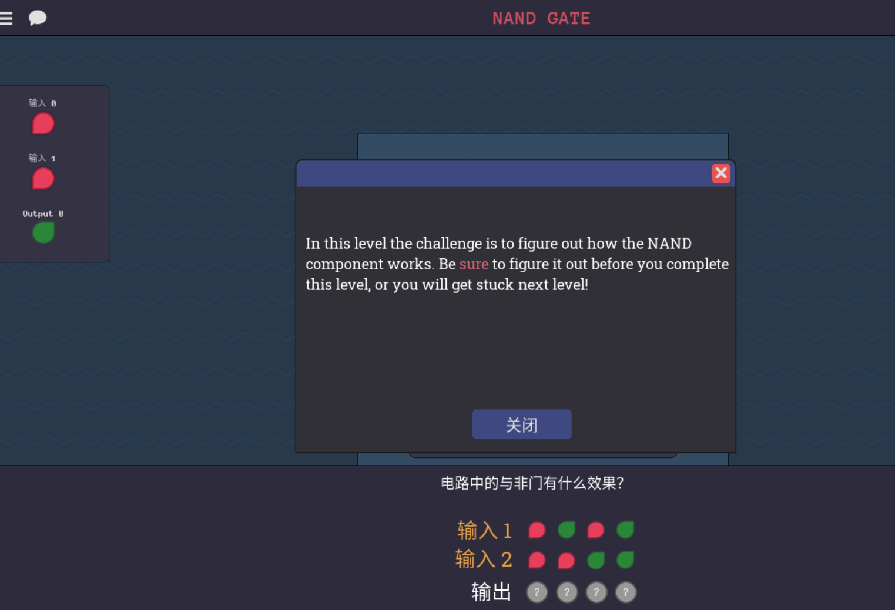

## 前置的一些逻辑说明
AND门和OR门，一定程度可以理解为统合一些条件的检查，比如说我有条件1，条件2，条件3全部满足的情况，可以理解为编程中的if，那么也就是说三个条件都要满足才会让输出变成高电平，
也就是 (condition1)&&(condition2)&&(condition3),or门同理，(condition1)||(condition2)||(condition3)，这点在以后的分类讨论中会很有用，
比如满足需要输出的条件1，条件2，条件3，然后所有需要输出的条件状态下，用or连接即可，表示只要有一个条件满足了就允许输出高电平

# 图灵完备alpha篇攻略1

## NAND门 (NAND GATE)

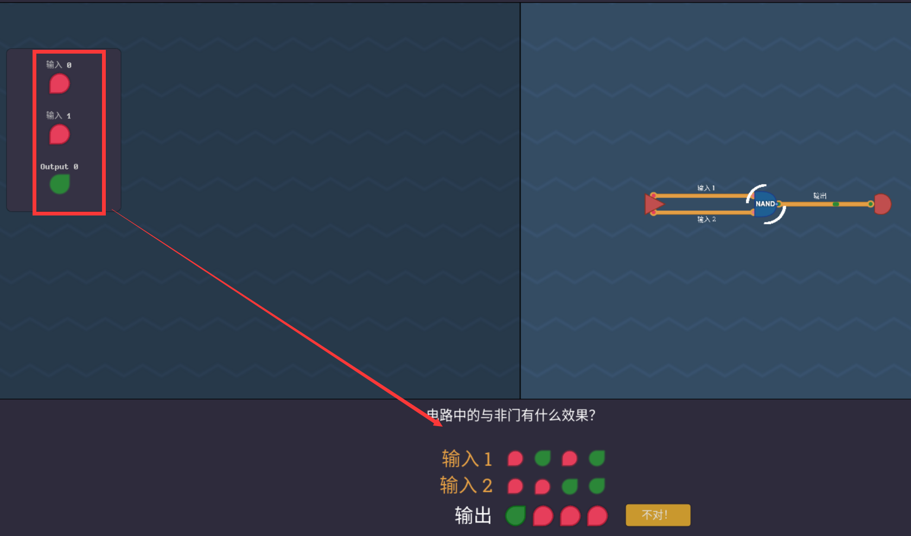

点击输入观察输出，改成对应的类型即可，最终结果是，除了输入1和2都是高电平的时候低电平输出

## NOT GATE

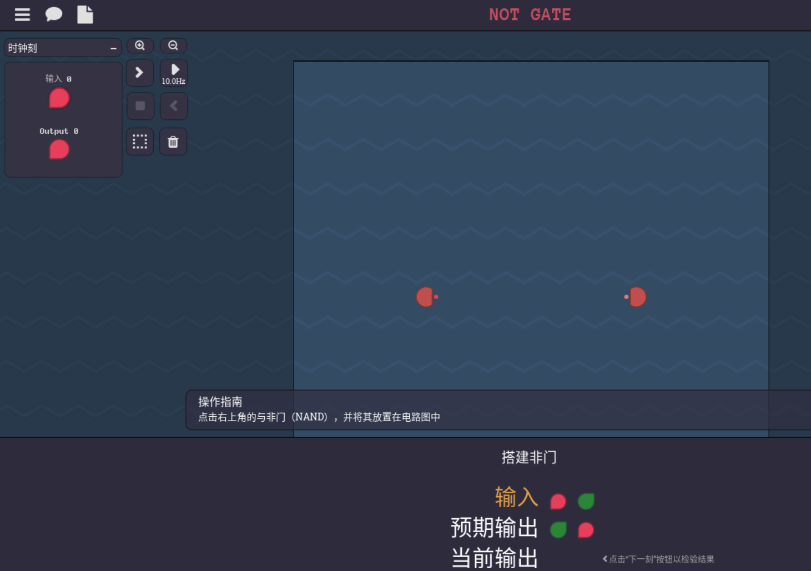

现在我们手里的只有一个NAND门，但是，由于nand门的特性，我们只要把nand的两个输入绑定成一样即可，4个不同的输入就会坍缩成2输入，也就是0和1

## AND GATE

观察NAND门，它信号也只有两个输入都是1的时候才会为0，这是一个特殊的突变点，and门也有类似的结构，但是突变点在两个输入都是1的时候，结果为1，那么，
现在已经有not门可以取反了，我就可以用not门直接反转输出结果，在nand的末尾加上not门就是and门了

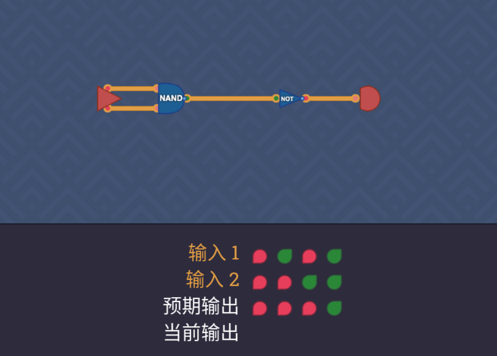

## NOR GATE 
或非门

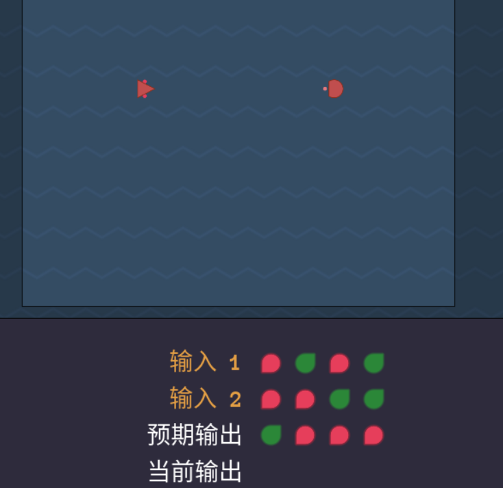

我们所使用的只有两个元件，一个nand，一个not，其中抓住突变点，两个低电平输入时,突变为高电平，那么，我直接选择反转两个输入电平，使用非门就可以了，这样突变发生在（0，0）处，
但是，这样更改后的nand门的输出跟预期输出完全相反，那么我们只需要反转一下输出，给输出加一个非门即可

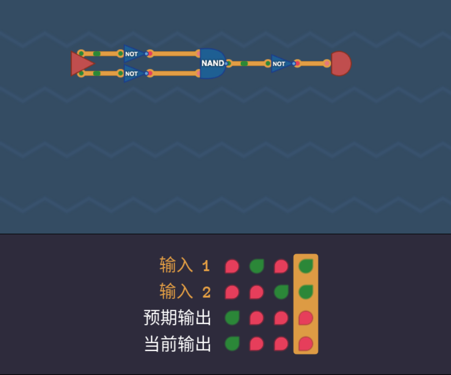

## OR GATE

或门，上面或非门不安非门即可，不上图了

## ALWAYS ON

## SECOND TICK

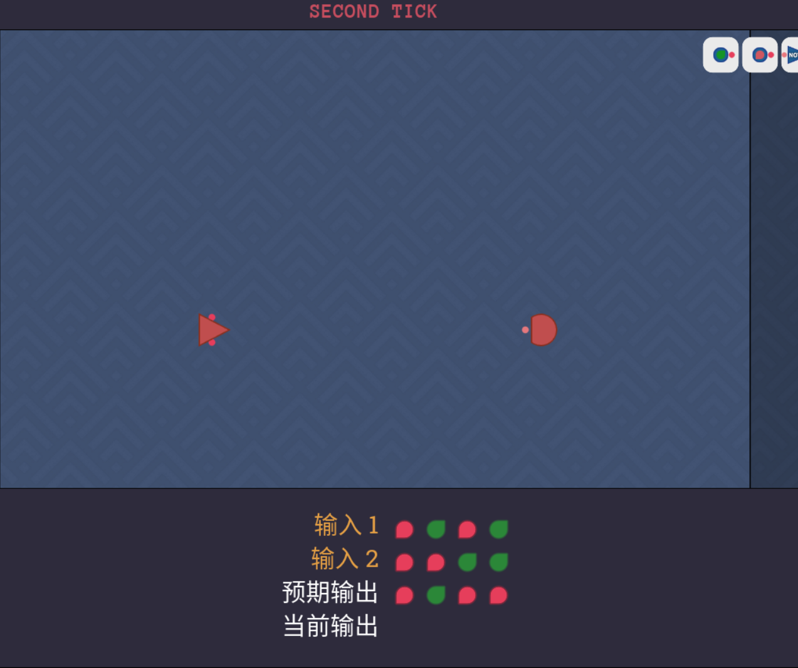

小技巧嘛，咋说呢，现在已经有and门了，and是严格限制输入的，必须两个都是正才提供输出，跟题目预期吻合，那么只要修改输入端就可以了，也就是确定了输入+not门得得到正正（输入了and才输出高电平）
那么，一个正一个负，很明显第二个需要not来反转信号

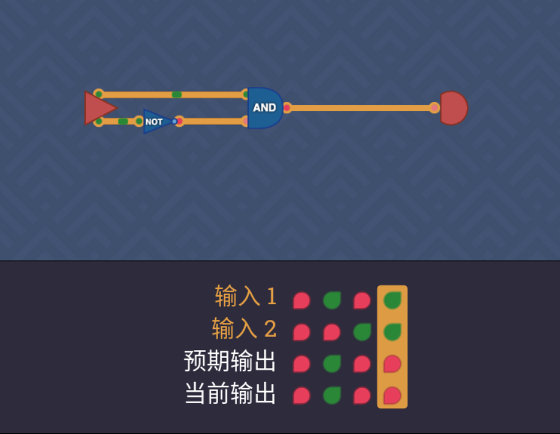

## XOR GATE
异或门

异或门
仔细观察一下，我们也可以理解为，有两个突变点，一个是正正，一个是负负，其中or,and,nor,nand门的另一个作用是，可以统合两个输入的结果,其中or门，这个形状，其实中心反转一下，
稍微重合一下，就有点类似能得到图中的结果对吧，突变点是`0，0`而另一边突变点是`1,1`找到该元件nand，这样，一边已知的是or的`1，1`处的输出需要被nand覆盖，nand处`0，0`处的输出也需要被or覆盖
其中中间部分在or和nand下都是1，那很明显了，在最后两边结果出来的时候加一个and门统合一下两边的输出即可

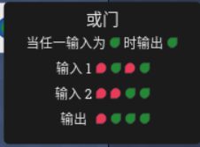
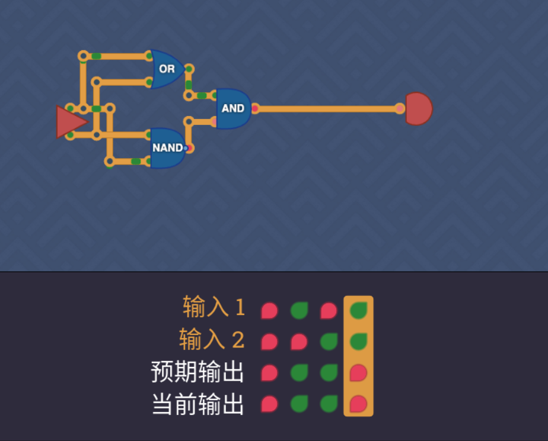

## BIGGER OR GATE
因为比较简单我直接放结果图了

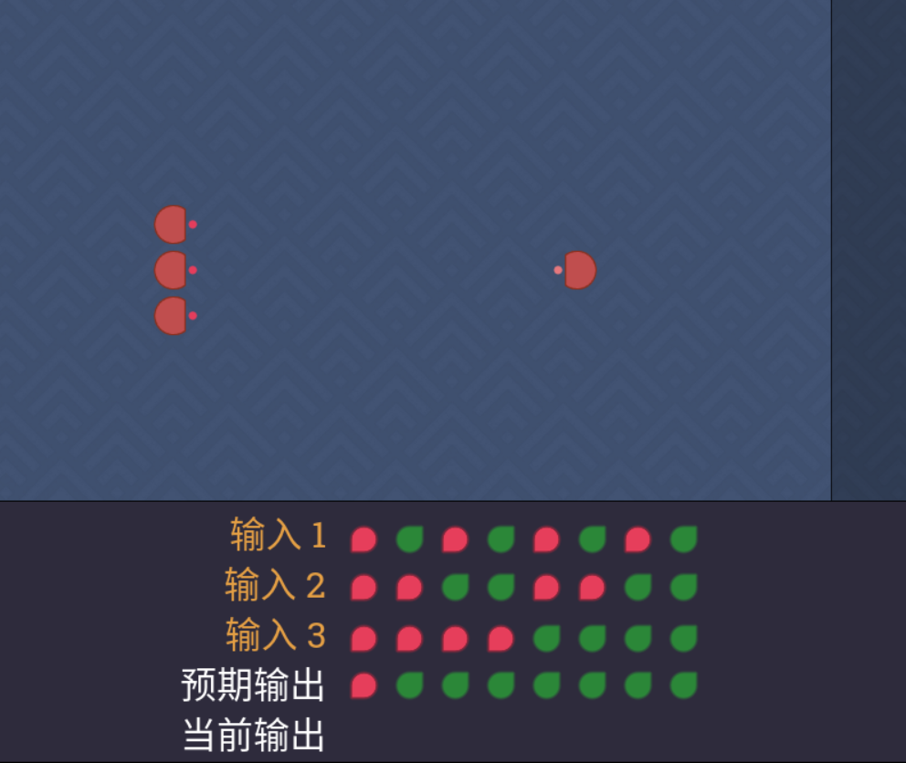
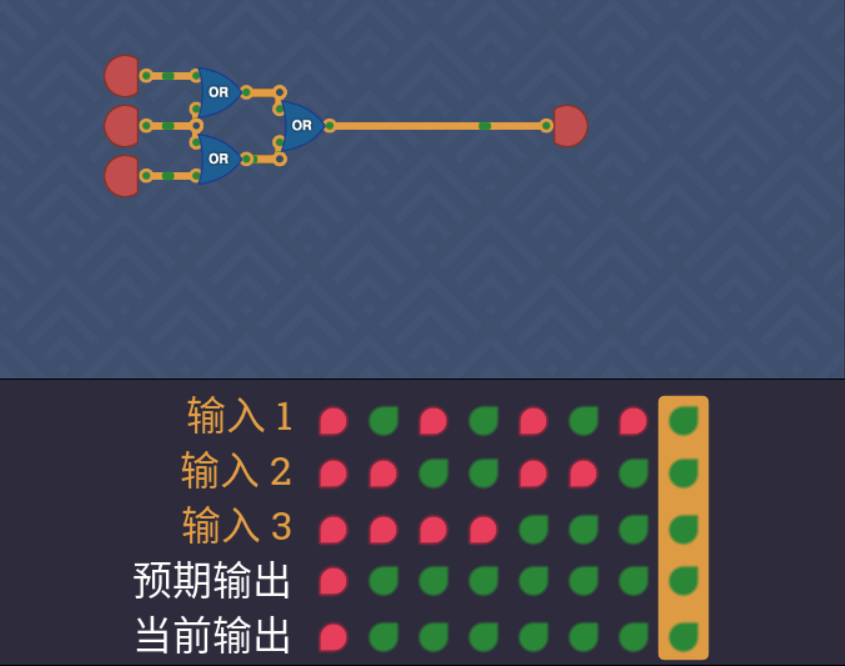

## BIGGER AND GATE

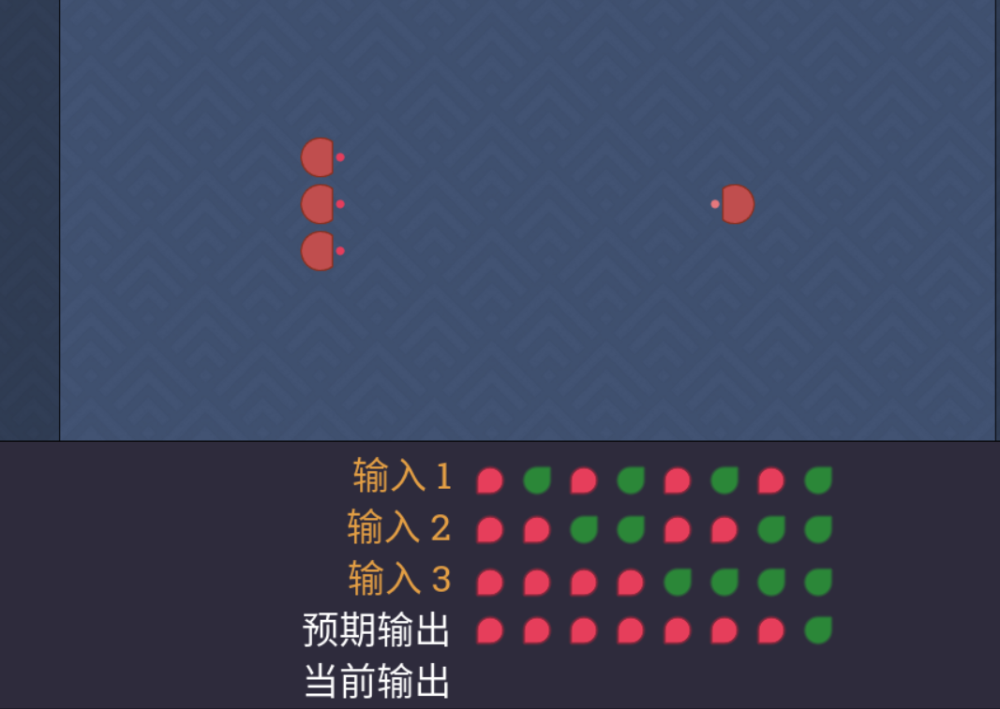
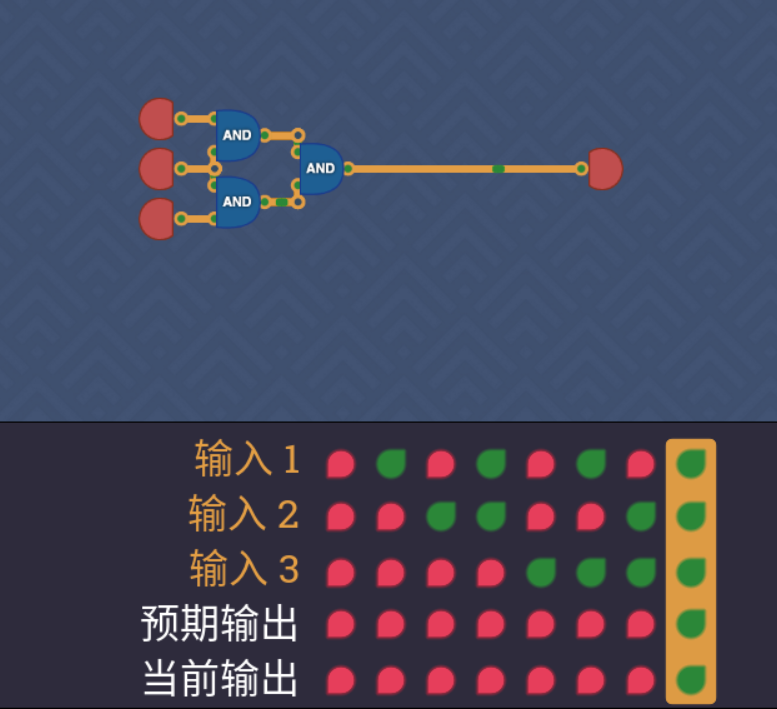

## XNOR GATE
反转XOR门即可

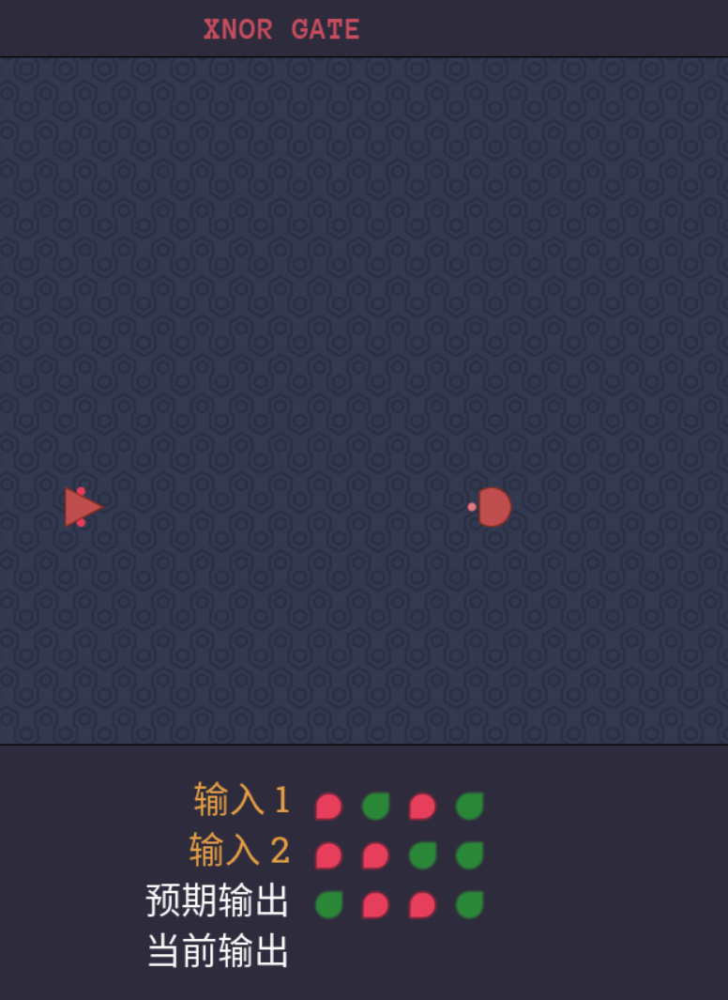

## DOUBLE TROUBLE

具体要求是，如果高电平数大于2就输出高电平，那么，我也可以理解为，对所有的输入进行一个and门操作，得到的结果有$3+2+1=6$种结果，这其中只要有一种是高电平，
就可以输出高电平了，这正好就是[逻辑说明中or门](#前置的一些逻辑说明),刚好又有3输入or门，将他们衔接起来，最后两个3or门用一个2输入or门再衔接（实际就是一个6输入or门的电路）

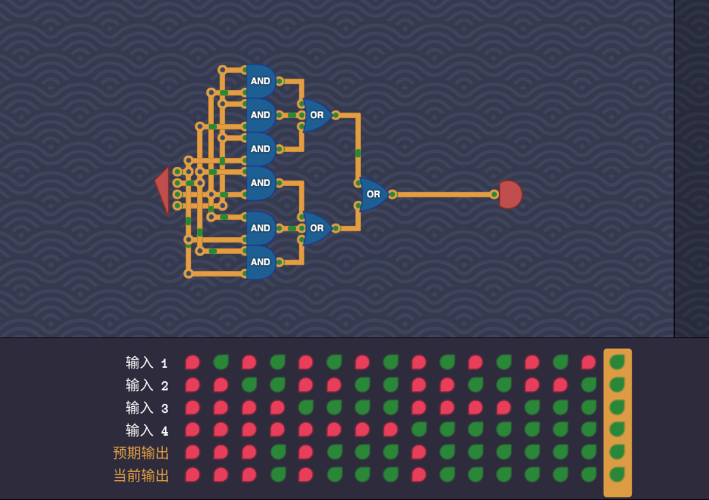

下一篇攻略链接（更新后放入）