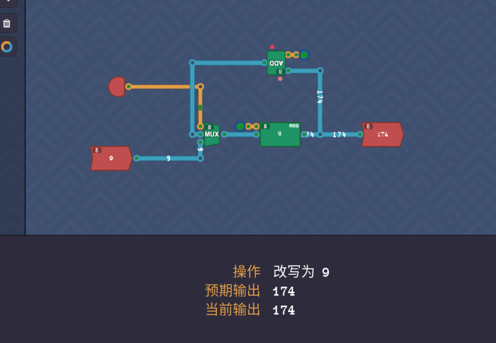
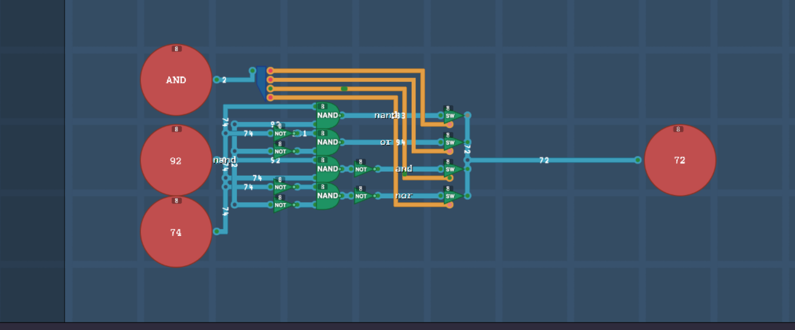
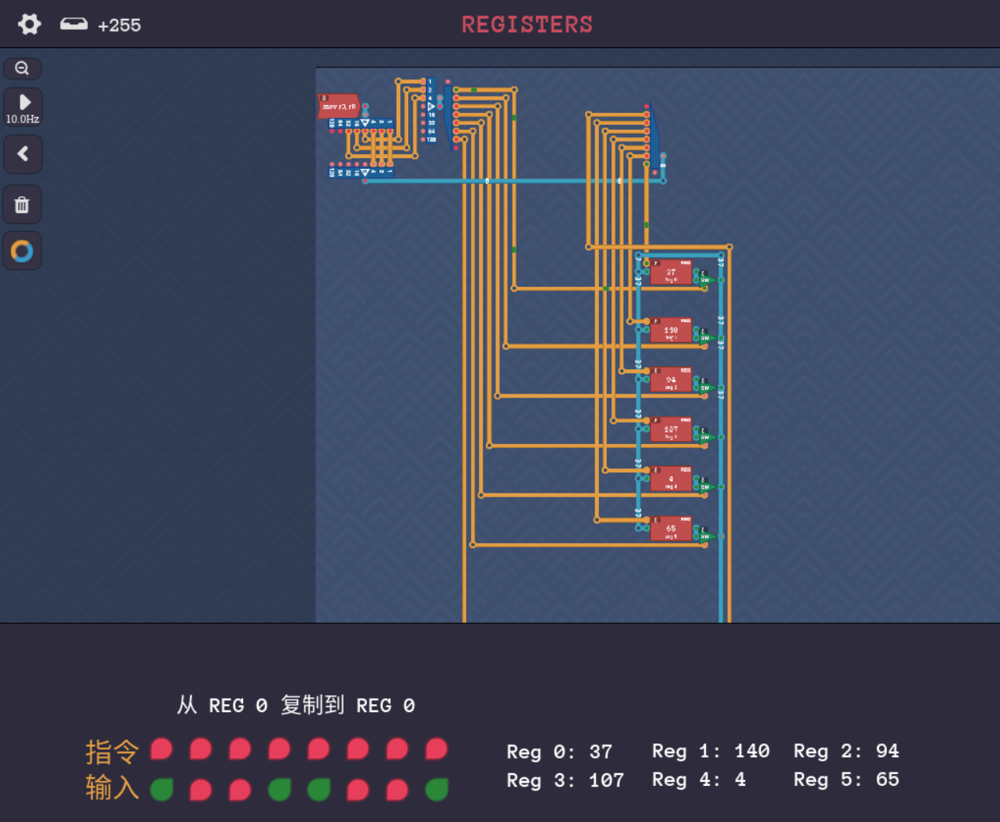
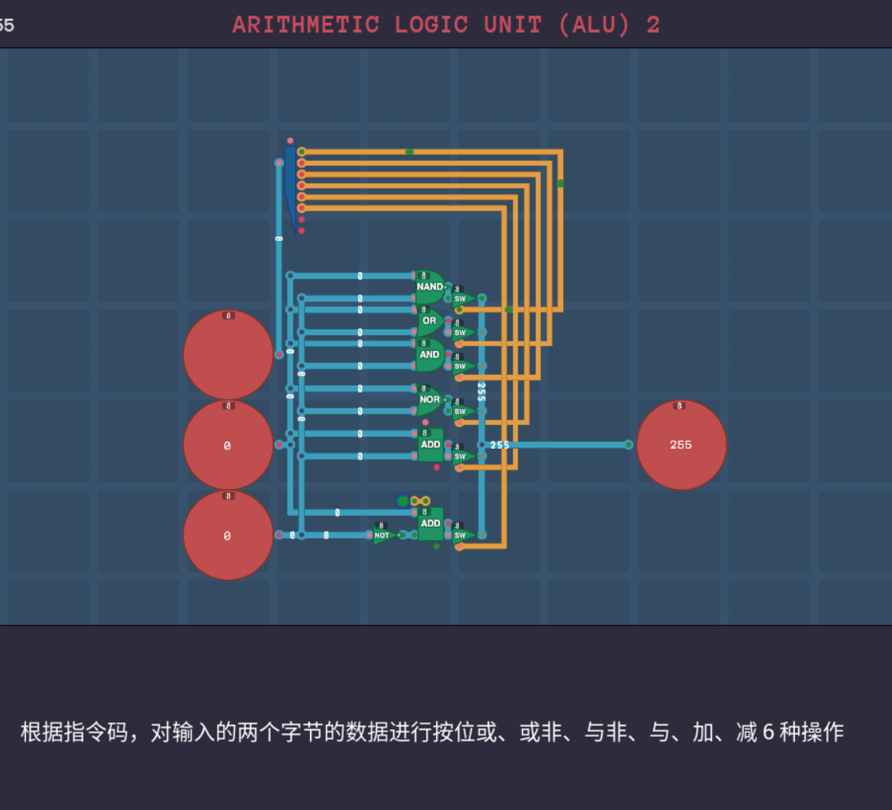
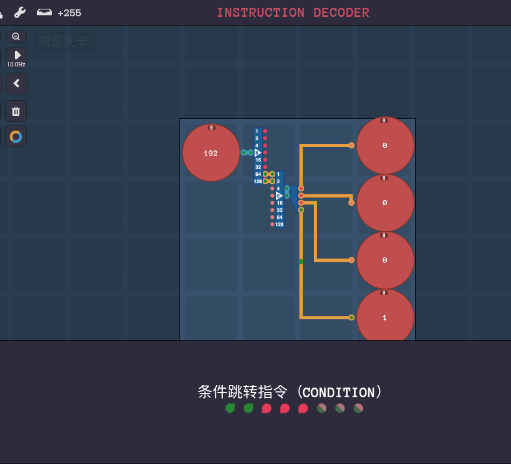
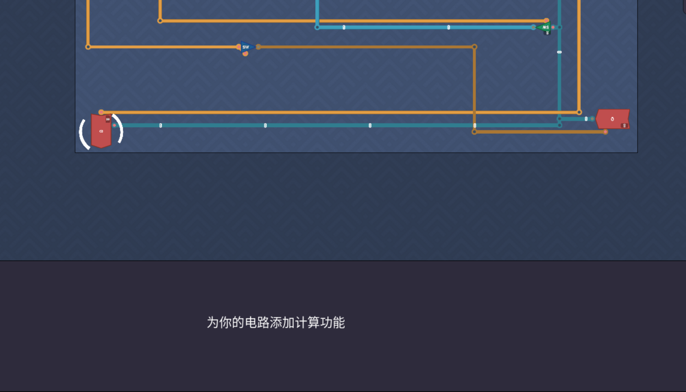

+++
date = '2025-03-05T22:37:33+08:00'
draft = false
title = '图灵完备alpha版攻略4'
image = "/image/Turing-Complete-Logo.png"
math = true
categories = [
    "steamgame"
]
+++

# 图灵完备alpha篇攻略4

## COUNTER

## ARITHMETIC LOGIC UNIT (ALU) 1
逻辑单元1

## REGISTERS

## ARITHMETIC LOGIC UNIT (ALU) 2

逻辑单元2

## INSTRUCTION DECODER

指令解码器

# 终止

因为输入输出不支持点击，导致无法区分元件，我决定切回beta版本了，日志更新到这，归档我打算放在同steam游戏了