+++
date = '2025-03-02T14:36:14+08:00'
draft = false
title = '图灵完备alpha版攻略2'
image = "/image/Turing-Complete-Logo.png"
description = "解决了包含单双数到开关的破关思路"
math = true
categories = [
    "turing complete alpha"
]
+++

# 图灵完备alpha篇攻略2

## ODD Number of Singals

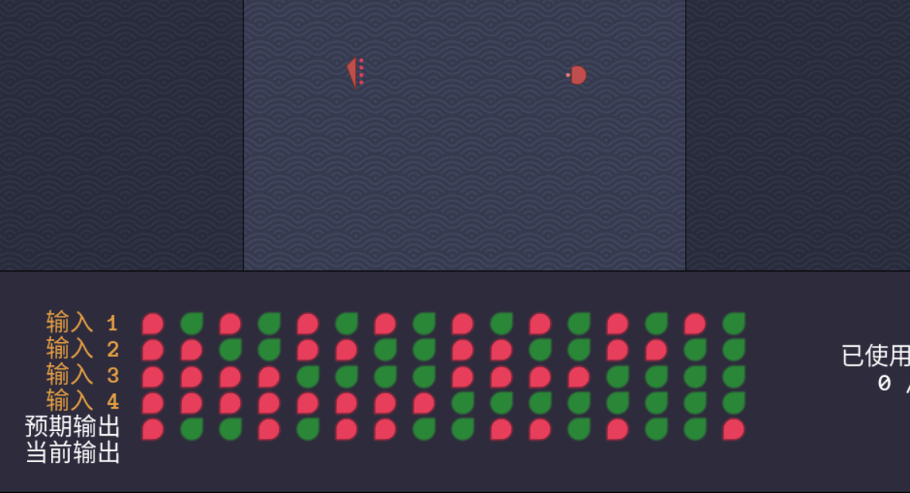

这个要求是，单数个高电平的时候输出高电平，其他时候低电平，但是，现在已经有同或门了，如果两个数相同，就输出1，不同就输出0，那么，如果输出是1，必定是一个1和一个0的组合，
也就是必定是单数，但又有，两个单数加起来是双数，所以得排除两个都是单数或者两个都是双数的情况，总结而言，就是需要一个异或门，所以，输出示例如下：

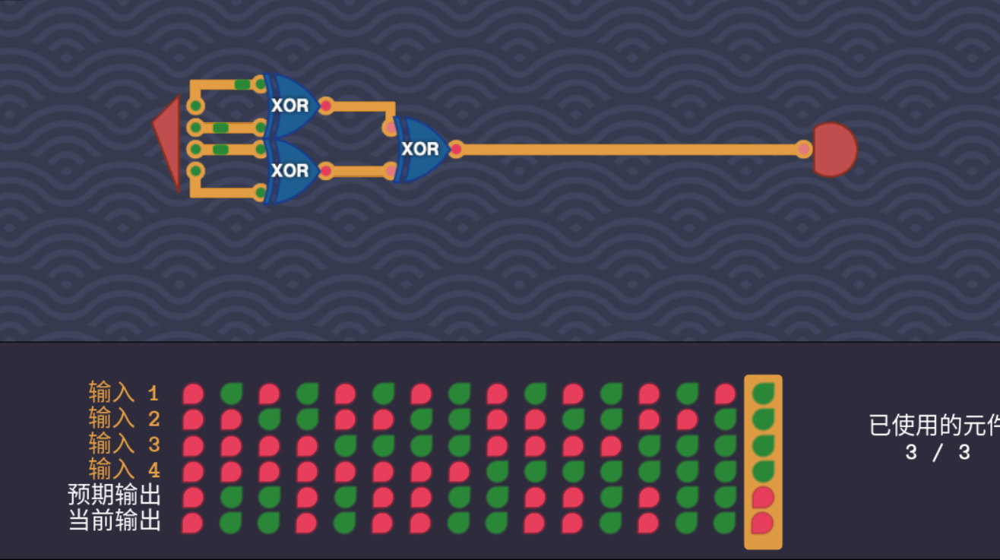

## CIRCULAR DEPENDENCY

循环依赖，输出跟输入的一个脚不同即可，最好正负还会影响输出结果，如下

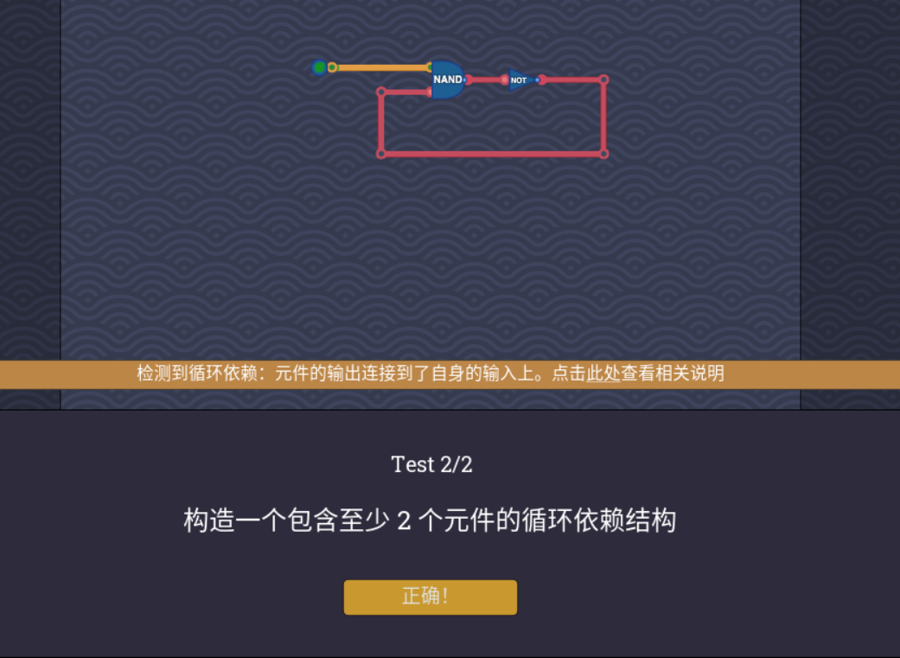

## counting siginals

### 解法1 排除法

是一个数高电平数的一个元件，输入需要按4，2，1排列，那么首先可以确定，如果四个全部亮起时，4的开关得亮起

其中第二好确认的是另一个0的位置，其中解法就在上面单双数那，因为单双数就是影响的第一位的数值，

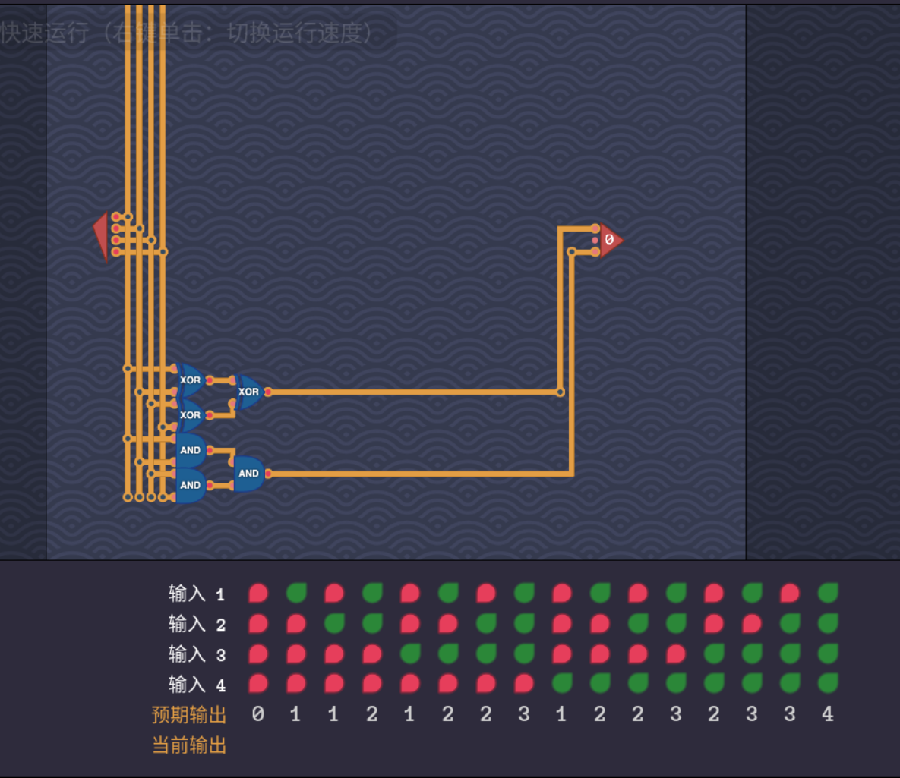

2位处最复杂，如果按照正向去找会比较麻烦，亮起时包含条件2、3，此时采用反向讨论，也就是说，我们需要排除以下几种情况，0，1，4，这样会比较方便一些，

> **0** 其实就是四个or门不满足的情况，突变点时四个输入都为0，但目前还无法搭建4or门，结构即是两个or门分别连着四路输出，然后这两个or门的输出为第三个or门的输入，此时最后如果最后一个门是or的话输出会导致突变点正常$（0,0,0,0）$，但输出相反，所以需要输出接着not，就是nor门，所以结构如下图标0处

> **1** 这里有四种情况，也就是亮的4路选一路，然后其他三路全部为0，全部为0的突变点在(0,0,0)，对应3or门，但是输出需要取反，然后这个结果需要同时满足最后一路是1，此时and门的逻辑作用就体现了，需要两个条件同时满足，即(A&B)，做法只需要把多个条件全部接入and门即可，以及，四种情况只要满足1个条件即可，所以满足条件的3个0、1个1的四种情况用三个or门连接起来即可

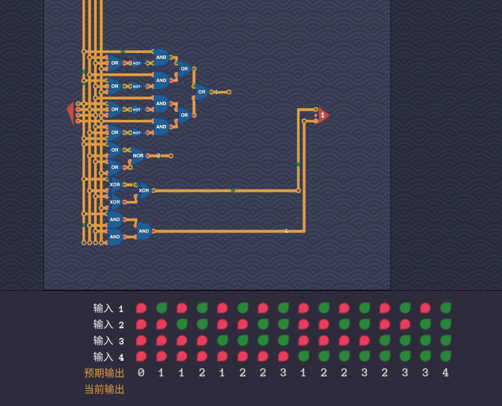

那么，要2，3的情况亮起，我需要$0,1,4$三种情况都不满足时亮起，也就是突变点对应的$(0,0,0)$,也就是说，我需要使用3or门取反即可实现

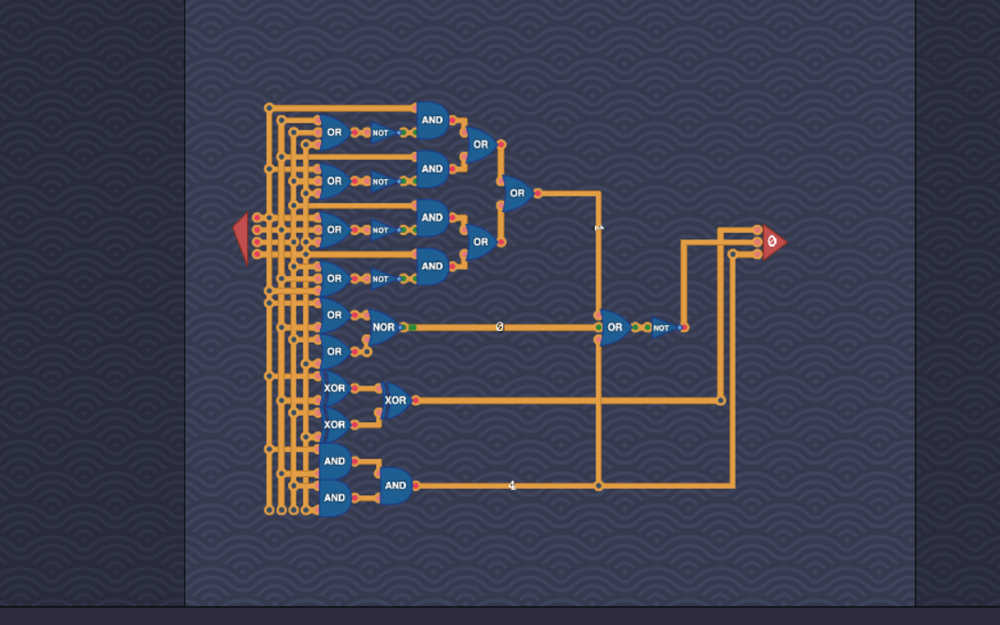

### 解法2 暴力解法

参考解法1，0，4不动，主要看中间第三路，三路参考1路解法，即调换3or门处类似换成3and门即可，正负有小的变化，但2的情况有所复杂化，按1的值来取，有
$(1,2),(1,3),(1,4),(2,3),(2,4),(3,4)$六种可能性，其中其余全是0，也就是启用nor即可，因为是6种条件随便满足一种即可，所以3*2的or门即可

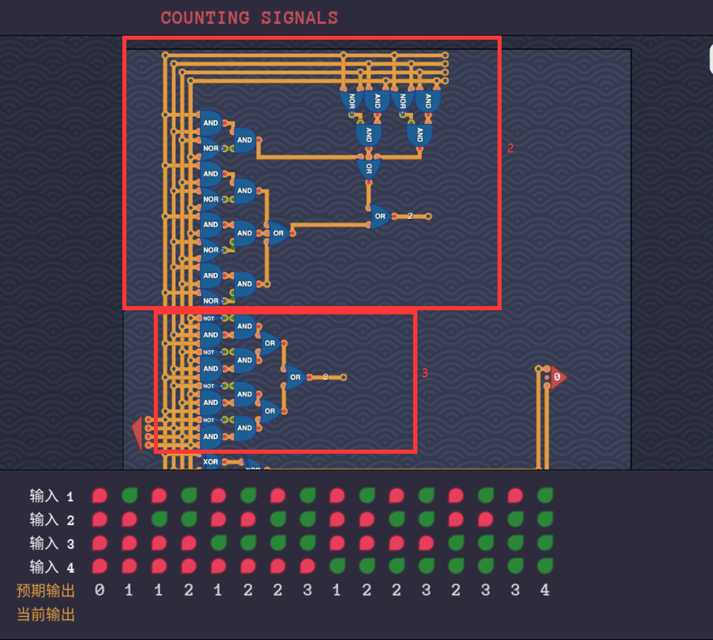
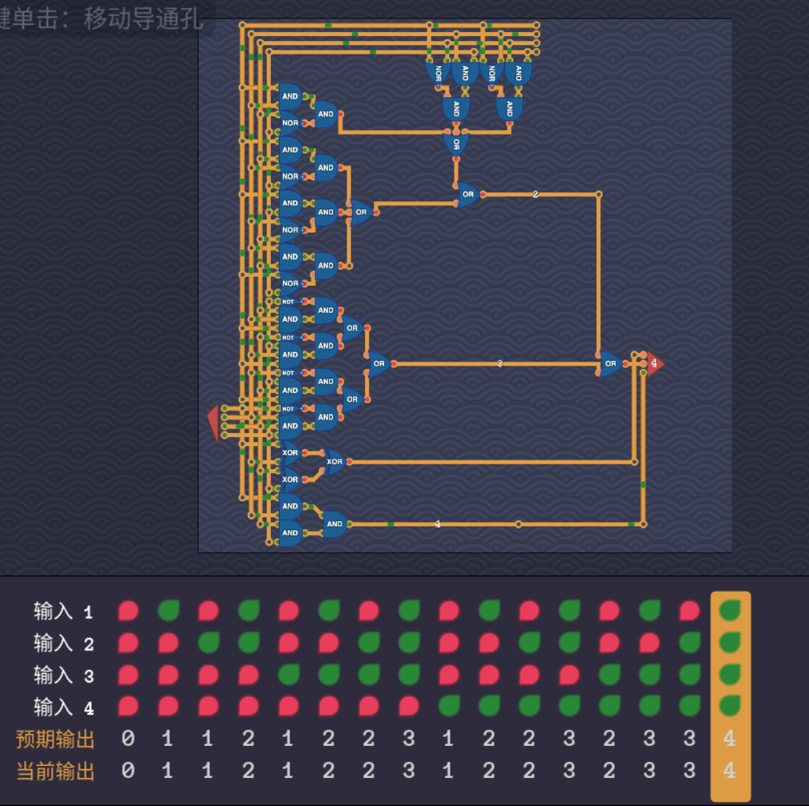

## HALF ADDER

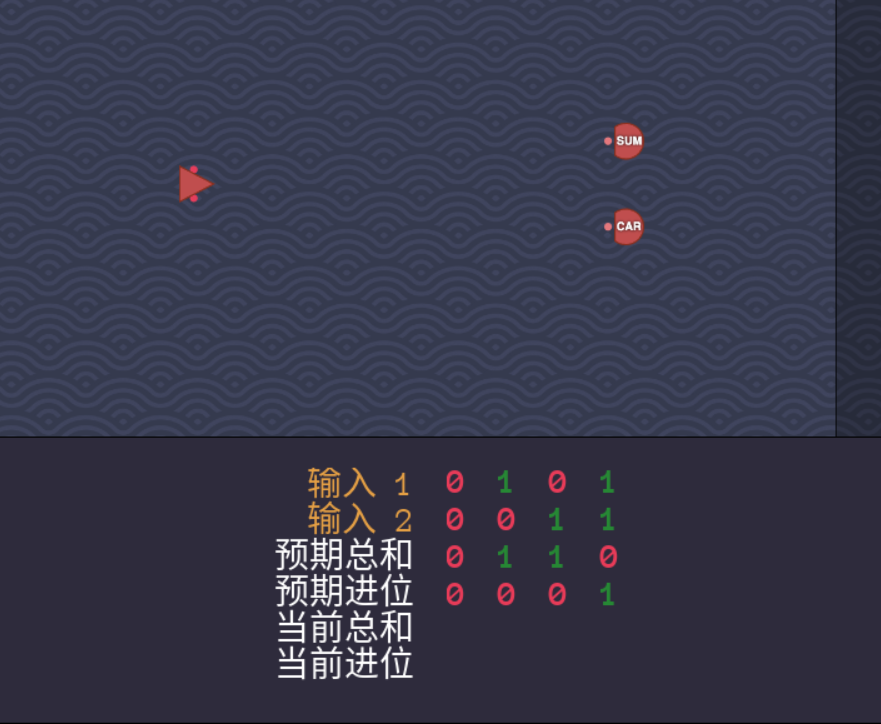
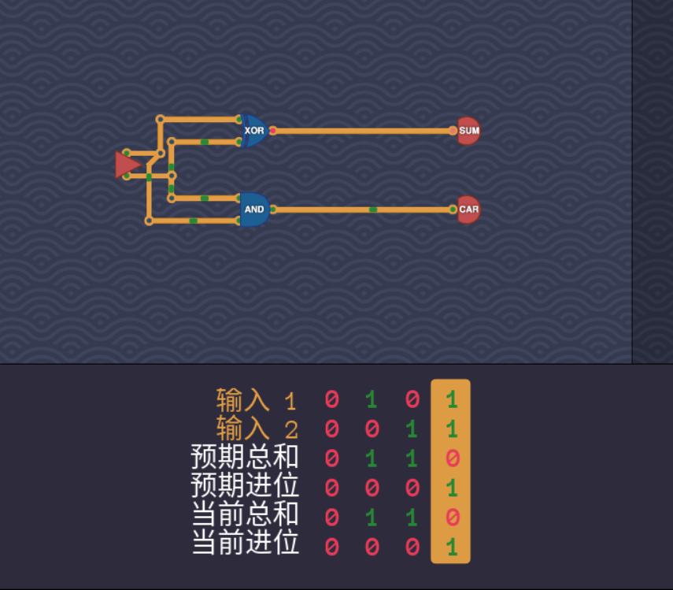

很明确，只要两个门分开处理就行，刚好能对应上异或门和与门，解法如上

## DELAYED LINES

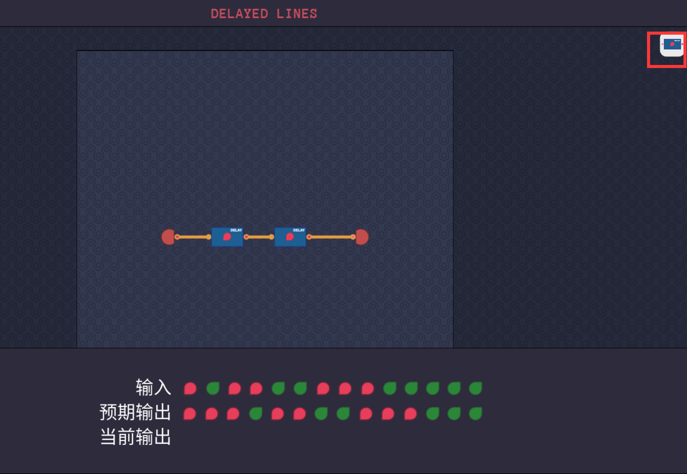

过于简单的我就不解说了，延迟两刻输出

## DOUBLE THE NUMBER

把数值放大两倍后输出，其实实际上就是左移数字，毕竟

$$假定输入数是a,a=(a_7\cdot2^7+...+a_0\cdot2^0),则2a=(a_7\cdot2^8+...+a_0\cdot2^1+0\cdot2^0)$$

或者换个写法
$$a = \sum_{0}^{7} {a_i\cdot2^i},2a=2\cdot\sum_{0}^{7} {a_i\cdot2^i}=\sum_{1}^{8} {a_i\cdot2^i}+0\cdot2^0$$

其中$2^8$部分因为进位可以直接舍去了，如果在8bit数据中，存在$2^8$就是已经溢出了，易见a_0的数值，也就是第一位被填到了第二位，以此类推，全部发生了移位操作，

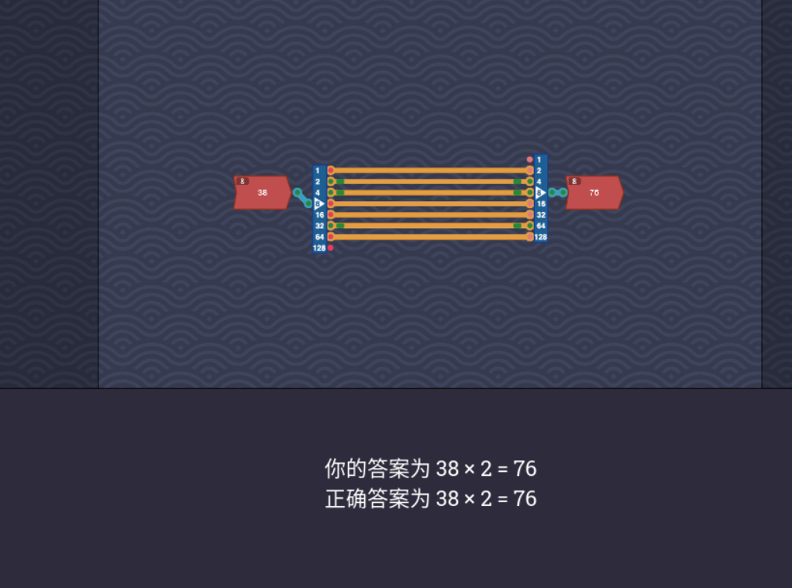

## FULL ADDER

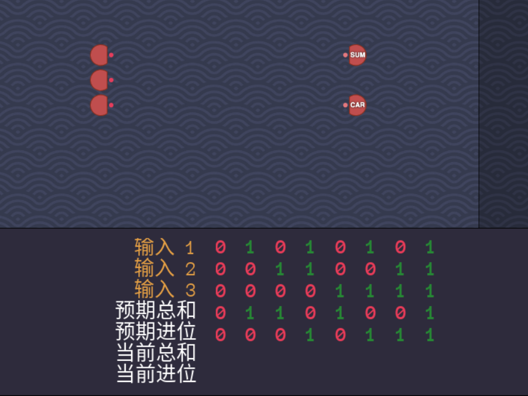

全加器，其中sum部分的很明显，只是一个观察单双数的位，另一位则是观察是否有两位以上的1，那么开工

1. 先用异或门判断两位是否相同，输出则是这两位是否是单数，如果是单数输出1，另一位也是1的话，那么输出2，不是单数，则需要输出0，也就是后面的算法依旧也是判断单双数，都亮起或者灭了就是双，不同就是单数，实际就是一个异或门，所以，使用两个异或门即可完成任务，参考如解法图
2. 第二位进位car位，需要有两位及两位以上的1，2位，刚好and门要有1的输出必须要有两个1，那么，思路很明确了，只要对3个输入进行两两检测，有and门为1即可，也就是说，3个and门只要满足一个或者以上即可，所以可以对这三个and门的输出使用3or门

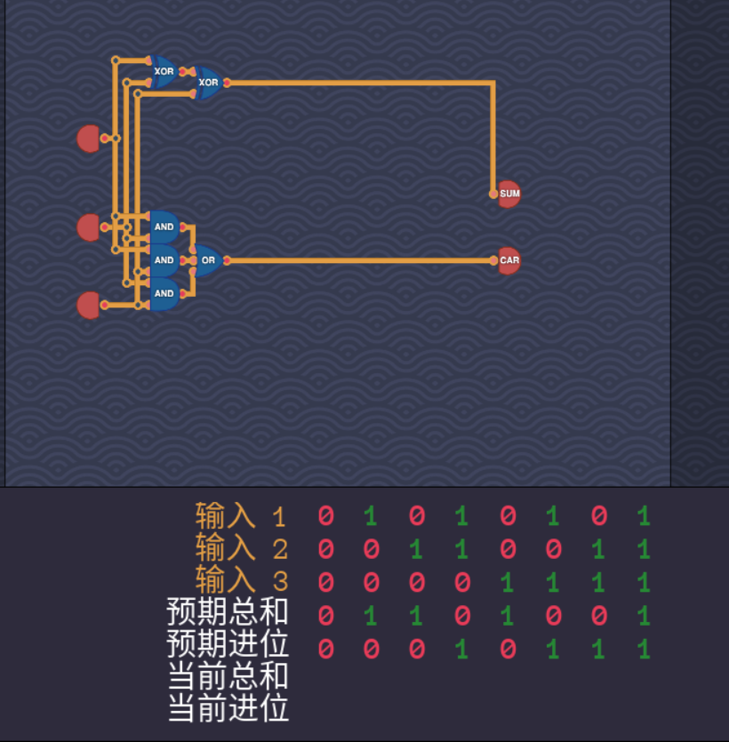

## ODD TICKS

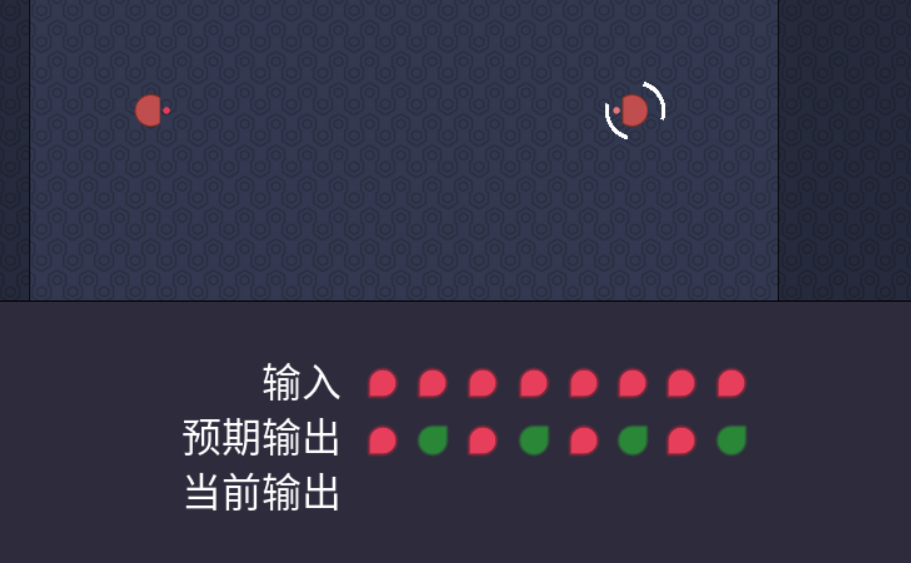
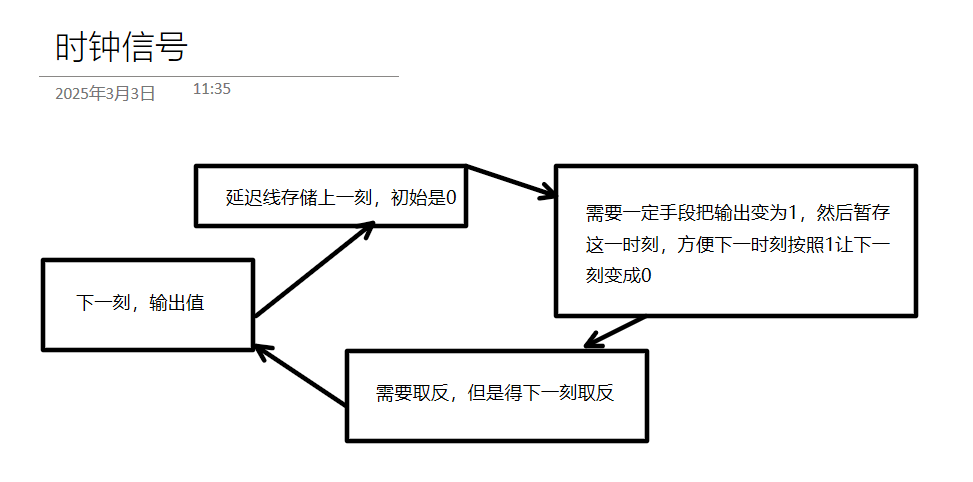

看到延迟输入，我的第一个想法就是，其他先不管，先想办法实现一下类似时钟的功能，通过or门，然后延迟输出它的相反数，这样就可以实现了，第一刻延迟线相反之后输出是1，
也就是说时钟第一刻输出就是1，然后延迟线存储上一位的1，第二刻时输出1的相反，也就是0，0or0输出0，然后，寄存器输出，为啥想到or呢，因为这时候还没有开关，图灵完备不允许0和1一起输出，
属于游戏特性，那么可以用这个数和0经过or门来实现，但第一刻是1，不是0，每个都相反了，那么只要取一次反即可

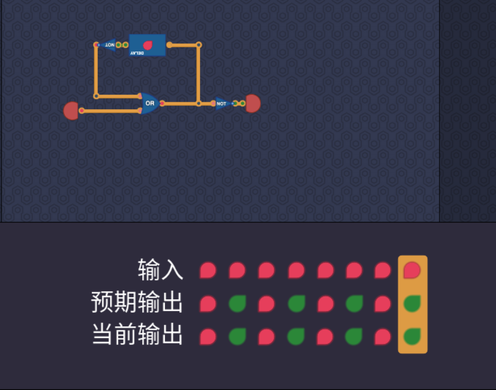

## BIT INVERTER

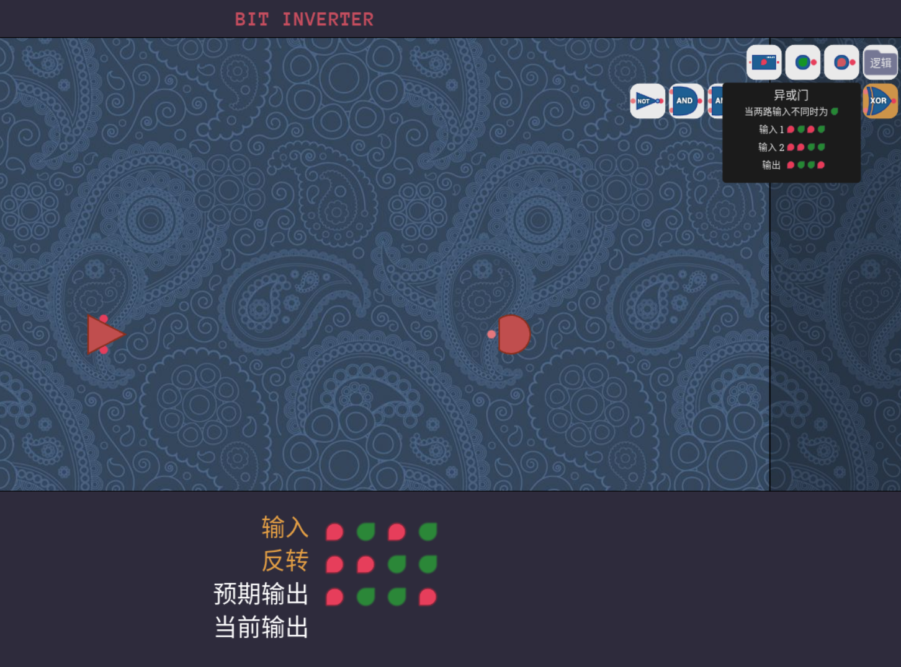
不解释，对比信号输出即可

## BIG SWITCH

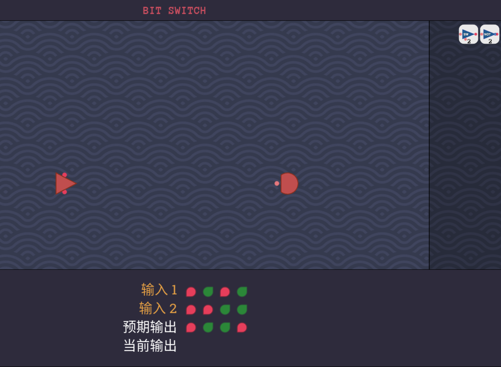

只允许使用两个开关和两个非门来完成这个关卡，无疑思路就是，两路数据，开关必须得都处于不同状态，同时开启会导致图灵完备游戏报错，怎么控制呢？思路也很明了了，有个非门在提示着，
也就是说，可以用一个输入作为信号控制开关，如果输入是1开一路，输入时2开另一路，那么另一个输入也如此了，也就是通过not来控制本信号位的通断，

先从这一位信号控制的地方下手
1. 如果信号位直接控制的一路，现在这个控制位信号是1，那么如果这开关的输入位是1的话，根据对照表，输出就得是0，此时控制位已经没法动了，所以只能是输入位接上not，此时消耗一个not

2. 又有控制位信号是0的话，控制取反信号一路的开，如果这一路输入也是0的话，得输出0，刚好不用取反，输入是1的话也导通

那么，就有

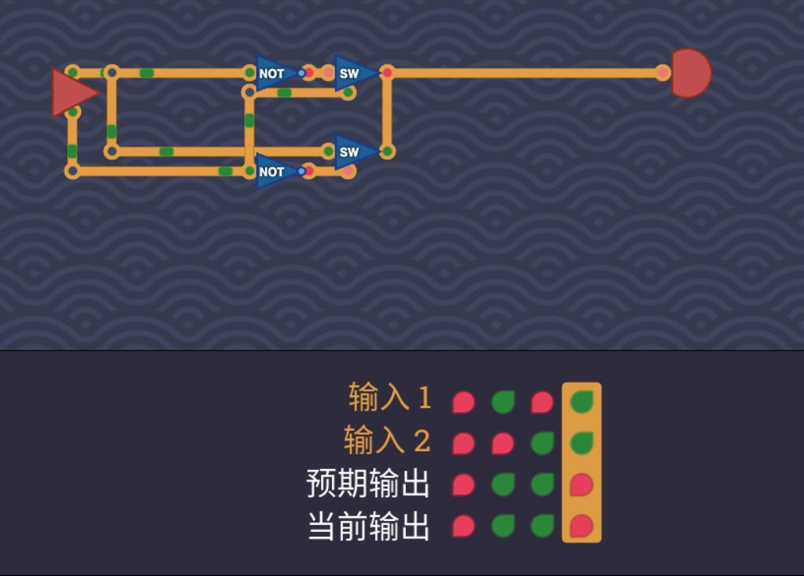

下一篇攻略连接[图灵完备alpha篇攻略3](https://adeepblue.github.io/p/%E5%9B%BE%E7%81%B5%E5%AE%8C%E5%A4%87alpha%E7%89%88%E6%94%BB%E7%95%A52/)