+++
date = '2025-03-14T21:13:36+08:00'
draft = false
title = '图灵完备游戏攻略7'
image = "/image/Turing-Complete-Logo.png"
description = "介绍一下我的64bit计算机"
math = true
categories = [
    "steamgame"
]
+++
# 完结

## 总览
耗时未知,我的64bit位的计算机终于是写完了，期间基本没有更新博客内容，指令集可以见[图灵完备游戏攻略6#我开始搭的64位计算机](https://adeepblue.github.io/p/%E5%9B%BE%E7%81%B5%E5%AE%8C%E5%A4%87%E6%B8%B8%E6%88%8F%E6%94%BB%E7%95%A56/#%E6%88%91%E5%BC%80%E5%A7%8B%E6%90%AD%E7%9A%8464%E4%BD%8D%E8%AE%A1%E7%AE%97%E6%9C%BA)

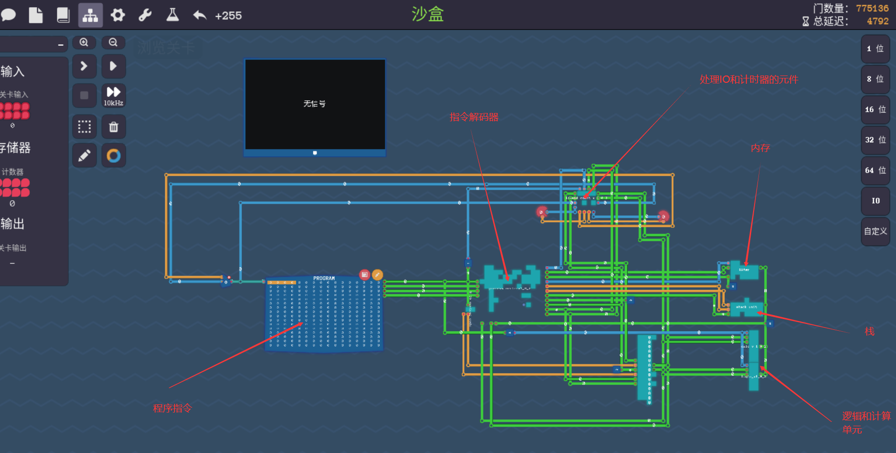
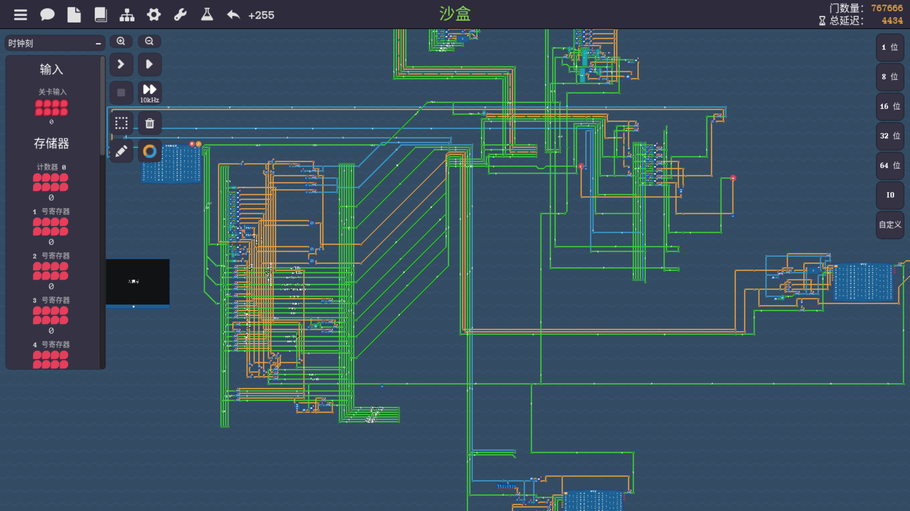

具体功能如图所示，目前没有加硬盘，也有点懒得去加了，重写了一下以前版本的64bit的计算机，以前的规模庞大而且因为没法封装，比较丑陋,最后跟群友交流后得知是因为没双向端子整个元件偷懒了才变成没有双向端子报错，有就不报错，一旦元件拥有双向端子，哪怕没有发挥实际作用，都会迫使游戏把元件拆开计算循环依赖

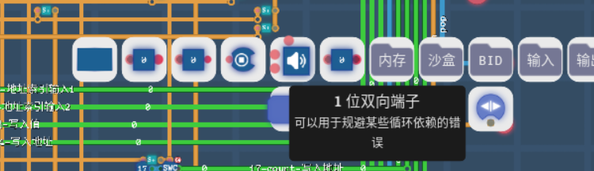
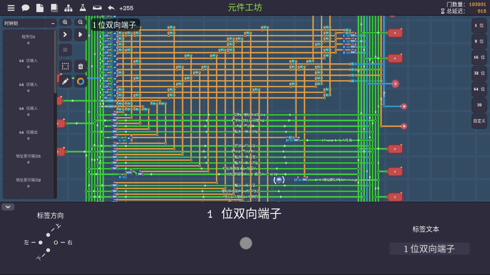

虽然抄作业可能比较难，毕竟对着手搭也挺麻烦的，展示一下我的上面展示过的各个基础元件吧
## 指令解码器

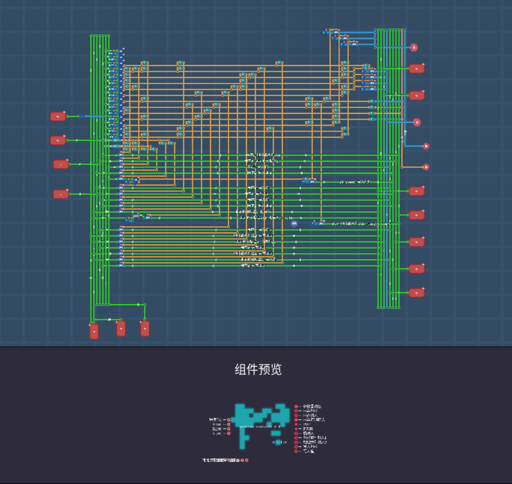
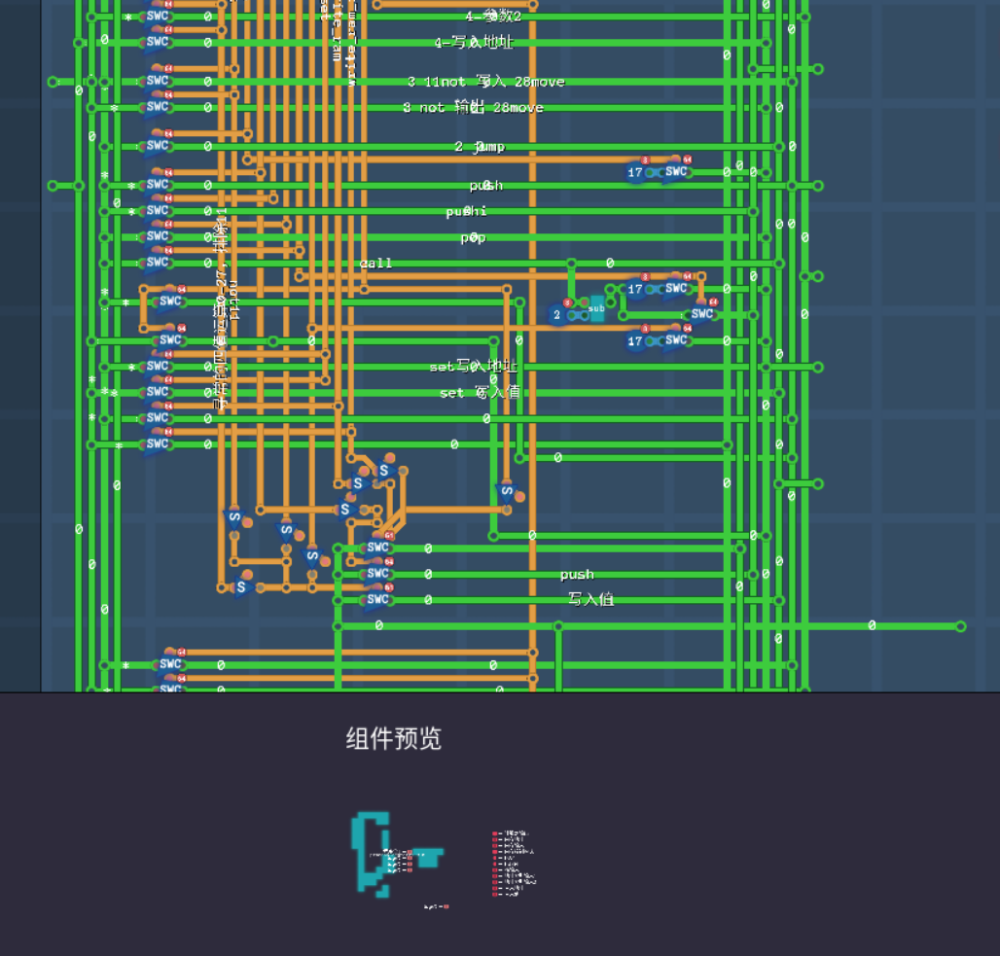

汇流的那个元件前一代属实有点不太美观，前一代通过开关的两个端口来控制信号是否流出，不流出变为高阻态不影响其他端口输出，所以用了现在的方案替代，加上前一代基本没有完成复用，有多少指令基本拉多少线

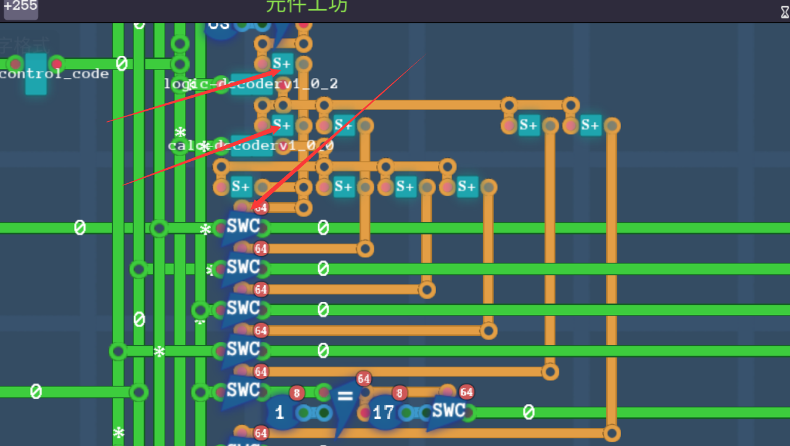

## 寄存器组

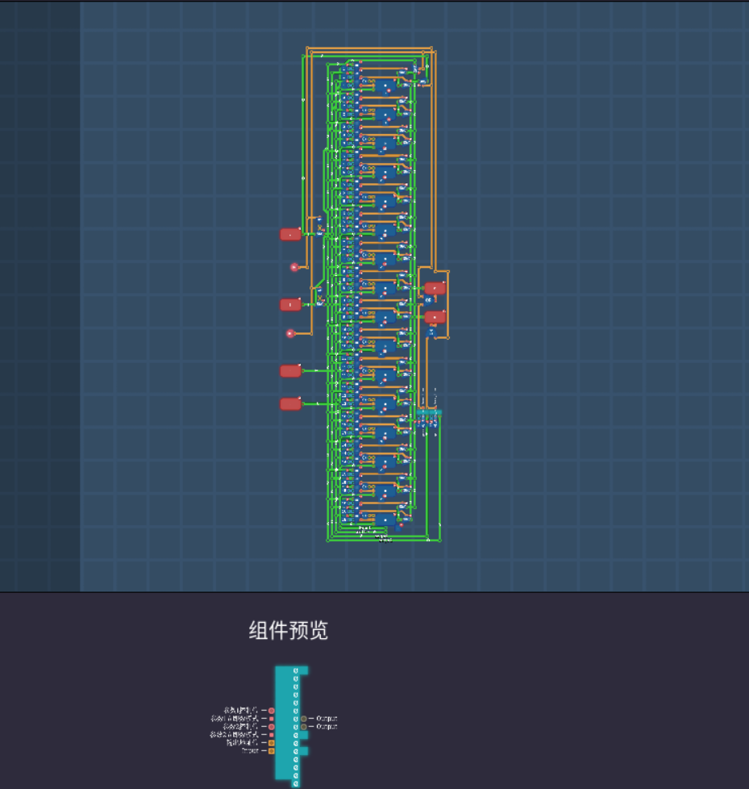
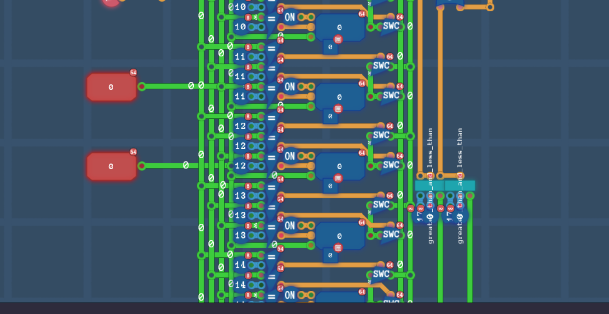

大概如此吧，也挺庞大的

## IO和计时器控制元件

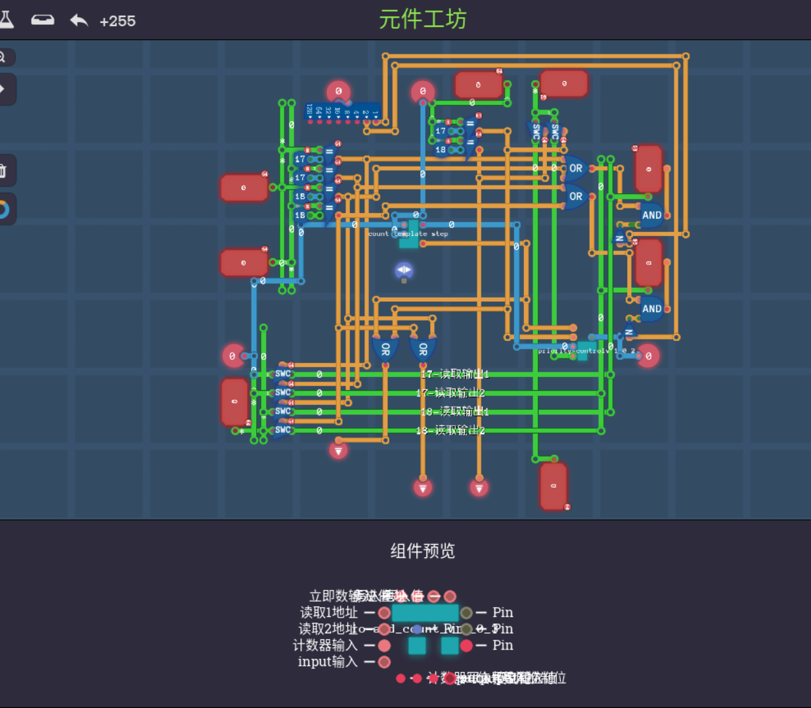

因为元件比较小，所以组件预览处的字也没那么小，能看到一些（主要还是一个个点过去展示太麻烦了），也添加了双向端口避免报错

## 内存

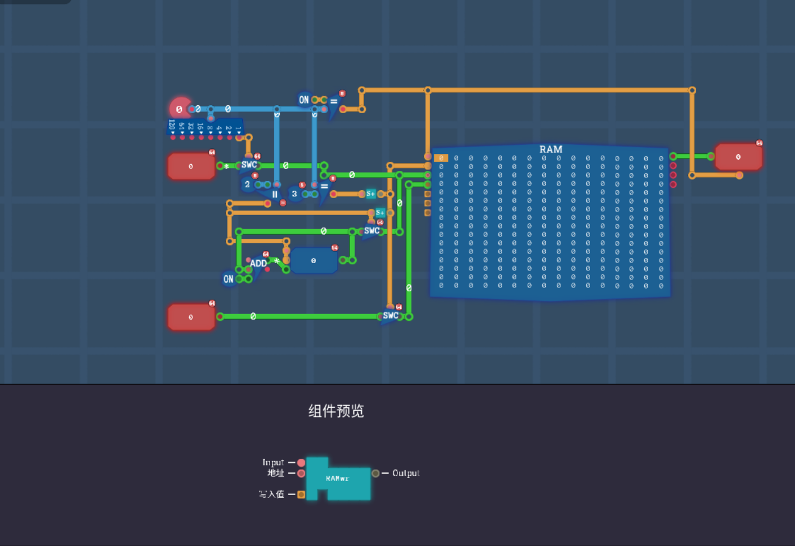

左上处为控制指令，1为read_ram,2和3都是write_ram，具体区别见指令集

## 栈

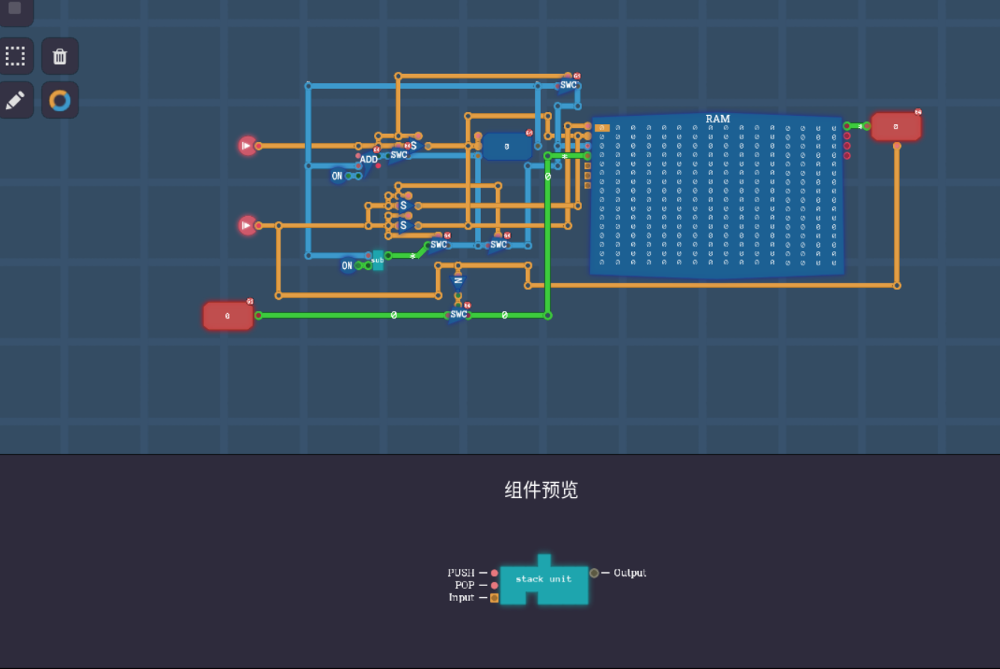

## 计算单元

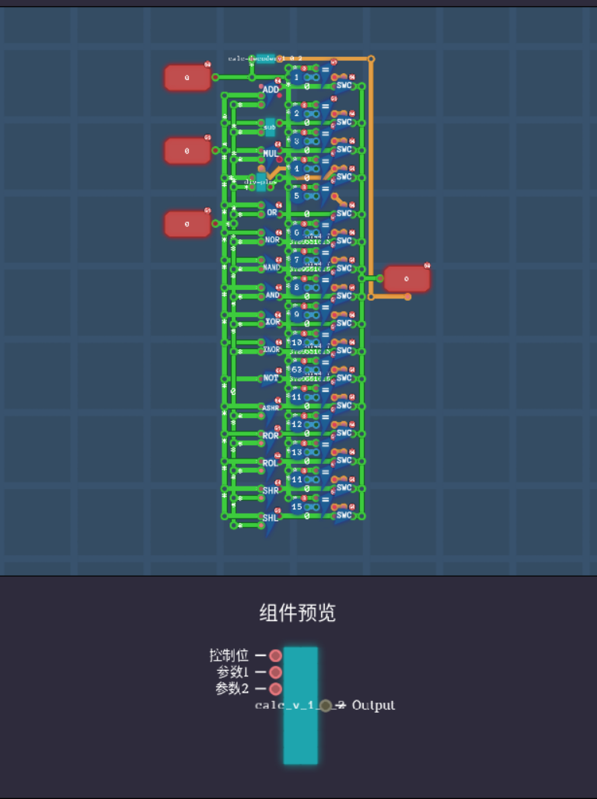

## 逻辑单元

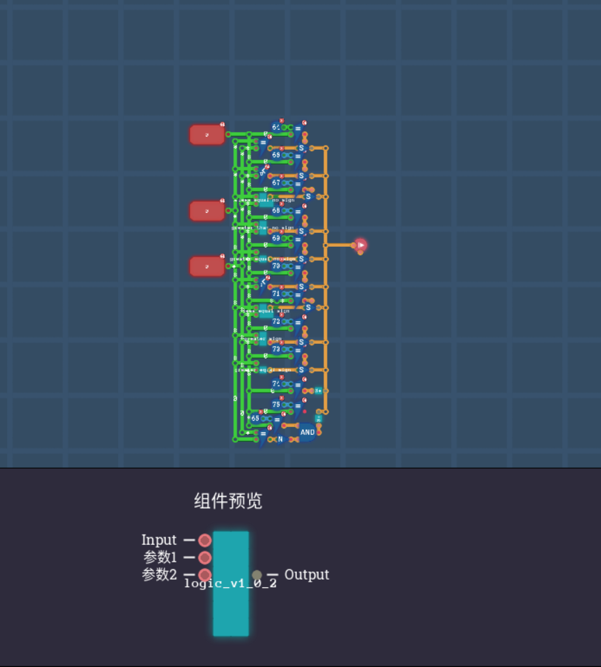

## 最后的杂谈

虽说这玩意怎么说呢，是个游戏，但其实更不像是个游戏，不过至少我在这造轮子然后搭自己的计算机搭的挺开心的，听人说alpha版后面有SSD和乱序发射，干脆先留着等以后玩吧，对比beta版就是好像要吃掉我20%的CPU资源，beta版的低一点