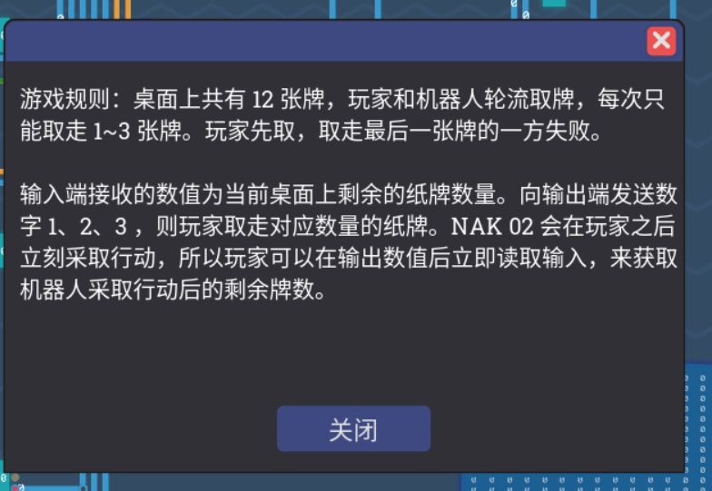
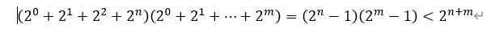
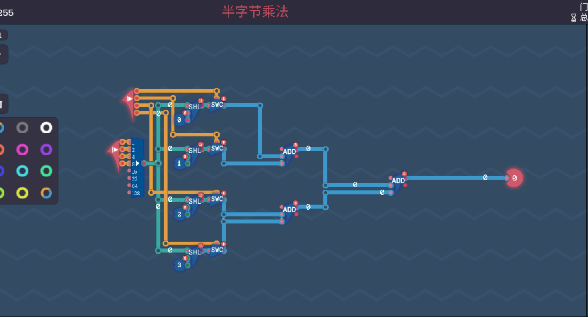
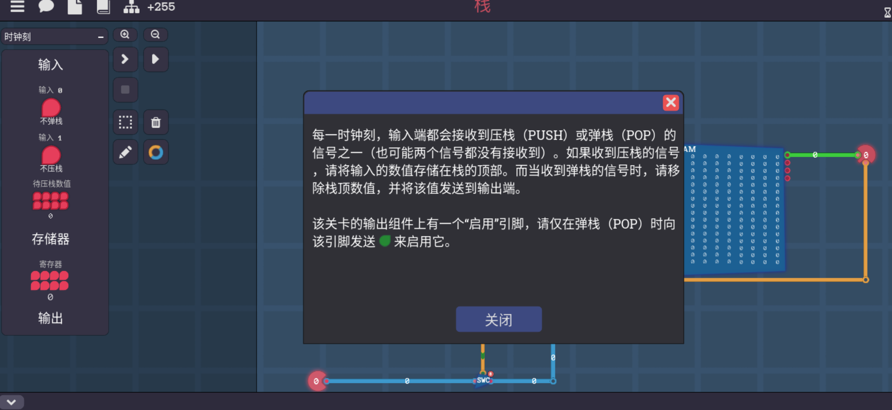
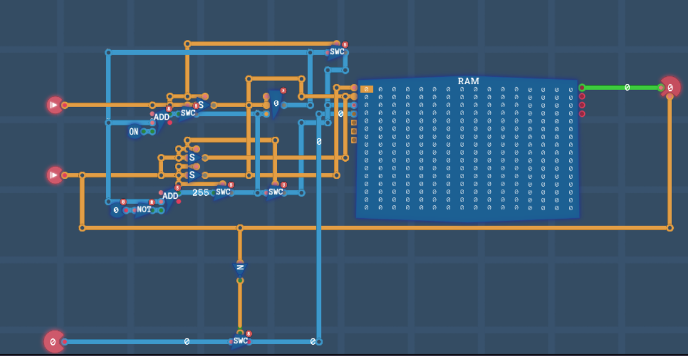
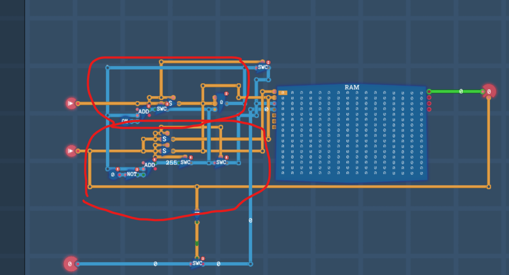
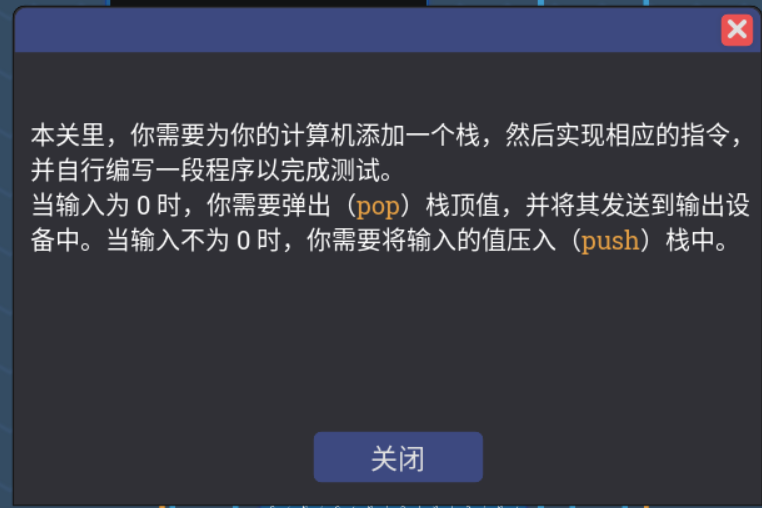
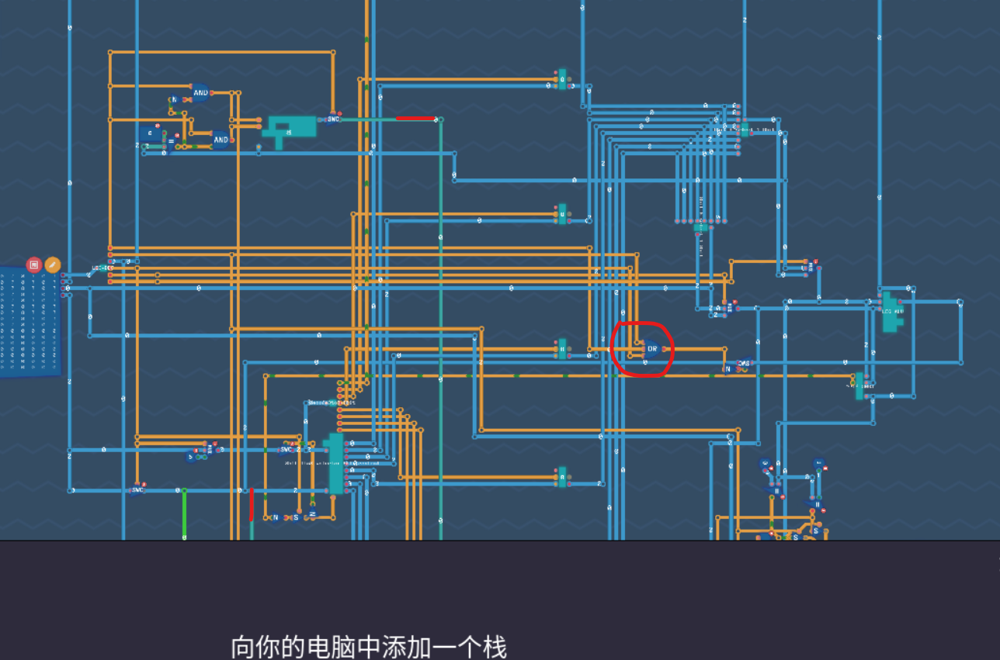

+++
date = '2025-02-17T21:35:17+08:00'
draft = false
title = '图灵完备游戏攻略5'
image = "/image/Turing-Complete-Logo.png"
math = true
categories = [
    "steamgame"
]
+++

# 图灵完备部分游戏攻略

## AI打牌



如果要机器人输，那也就是说，我得把它逼到它不得不取最后一张牌，最后一次行动，以及是，可以限制机器人跟我们之间的取牌，具体怎么限制呢？因为1到3张牌，
一回合我能做到固定一定能拿掉的牌数，是最大数加上最小数，也就是4张，比如说机器人拿1张，我就拿3张，刚好互补上，其他牌数量也一样，方针确定了，接下来就好办了，
1+4+4=9张，也就是说，我第一次就要取掉3张牌，再通过两次每回合
```
# take 3 poker
add_ii 0 3 7

# 4 poker per bout
add_i1 0 in reg0
sub_1i reg0 5 out

add_i1 0 in reg0
sub_1i reg0 1 out
```

我的汇编命名规则参照上一篇文章[图灵完备游戏攻略4](https://adeepblue.github.io/p/%E5%9B%BE%E7%81%B5%E5%AE%8C%E5%A4%87%E6%B8%B8%E6%88%8F%E6%94%BB%E7%95%A54/)
不过，看了一下是真优雅，对比起随机存储器那关来说

## 半字节乘法


解法其实挺简单的，因为已经被表示成二进制的数了，也就是说a*b已经变成

其中的展开项，其中又有乘2以及2的倍数实际上就等于数字左移，也就是说，可以按一边当作操作数那样然后后面挨个加起来，再有


所以两个4位二进制数一定不会在八位上溢出，add上的进位也不需要了，只需要直接加起来就行了



## 栈



写到这里，我其实还是挺希望我可以把我所有的思考步骤完整写下来的，但考虑到一方面比较花精力，另一方面感觉这也不是适合放在博客里的东西，有时候会太长了，
如果只是给我自己看我写这一些就已经够了，我也不知道看我博客的其他人是否多，但我感觉基本是我自己而已，有需要的话在我的B站私信或者评论区留言再考虑是否拿出来吧。





### 压栈

首先，先清楚两个操作要干什么，压栈和弹栈，分别是push和pop操作，push，也就是写入一个列表里面，想到栈我第一想到的是要用不小的存储空间，也就是先想到了内存，
毕竟寄存器也是只是临时存一下数据，空间毕竟还是太小了，但，根据前面写内存的经验来看，一般需要一个寄存器读取地址位，毕竟可以栈这个玩意，可以理解为指针放在某个位置然后在那附近进行读写或者擦除操作，
需要一个临时的存储工具，也就是寄存器，虽然整个任务比较复杂，但是这些东西构建的时候也不必慌张。

从简单的入手开始即可，比如我先从压栈操作开始实现，一旦压栈的信号电平变为高电平，
也就是开始执行压栈压入输入的数值，因为考虑到后面弹栈操作也会需要使用这个寄存器，然后再想到这个信号本身是个1bit的信号，如果不想影响其他信号可以通过这个信号到目标处添加一个开关，
然后通过这个信号来控制这个开关，那么一旦这路信号不通的时候，其他路信号控制寄存器的时候就可以被开关隔断，不过，一开始我是寄存器出来的数值直接读入内存寻址位的，
但是这部分在前面的关卡内存读写那边没写好是真的，因为内存初始值指针就是0，然后考虑到还需要累加，那么我在后面直接加入一个add 1就可以了，但是如果压栈操作信号处于低电平了，
我要求add不工作或者工作了输出，所以就有了那个add出门之后的开关，以及是，压栈开启时得开启内存的写入开关，把写入开关连上信号+开关后的输出即可，以及是需要输入端接上一个开关连到内存的输入部分即可

### 弹栈

弹栈的操作，第一是先输出完一次运算值，然后对这个值覆写0的操作，也就是其中要同时激活读和写的开关，读先是读出这个位置的数据，输出开关跟弹栈开关相连，压栈操作并不会控制它毕竟，
可以直接连，以及是对寄存器的操作，要求每次写入减1，先实现减1的操作，也就是寄存器输出的值回路连上减法器，减法器，add前面加not并不能直接实现，毕竟直接对1取反是254，
加2才会等于0，也就是说直接就是0位的取反，255,+1就等于0了，实际上是256-1，也就是说加号那边写255或者是0的取反，以及开关操作同上，

但有一点得注意的是，寄存器输出会有延迟，因为压栈的时候默认的值就是0所以才忽略不计了，然后默认每次+1,每次都可以按时写入，但读取并不是，比如说进行一次压栈操作，寄存器原来是0，输出也是0，
然后配合数值写入0位，寄存器写入1，但是此刻输出还是0，得等下一刻才会变成1，然后下一刻输出1的值，写入没关系，因为原本就放在那个位置，可以是先进行写入再移动指针等待下一刻的写入或者输出，
但弹栈不行，比如说我写入一次之后立刻进行弹栈，此时寄存器的输出是1，也就是原本的值，减法器输出0了，我们知道现在寄存器1的位置因为没有经过读写，是没有东西，
就是默认数值0的，但是我要读写1的位置怎么办呢？直接读写减号后面的输出，那已经经过运算变成0了，以及是输入处被我们禁用输入变成0了，此时可以直接同时接通读和写的开关，
先让输出要输出的值，然后写入0完成覆写，到这基本已经完成了，但是依旧有个小细节，就是，你的弹栈输出部分读和写并不能相连，一旦连上会导致压栈的时候，你一激活写的开关会把读的开关也一并激活了，
（当时我输出的开关也连上了后面的线，导致输出也被激活了，实际不应该激活的，如果是直接输出没激活输出了其实也没事）所以我选择用另一个信号+开关的方式来分别激活读和写的信号位。
到此，两个功能就实现结束了

## 压栈和弹栈



既然要集成到LEG体系内，就基本必须得给分配一位信号位了，我分配了一个16bit的信号位给压栈和弹栈，然后直接输入输出交互，但是为了以后的可操作性，我把第二位分配成了输入地址位，
然后第四位分配成了输出地址位，第三位置空，其中有个注意事项就是，一旦这一位栈位亮起，意味着前面的运算位的输出得受到抑制，以及是，输出接到第四位没过解码器之前，
然后通过最后一位进入输出位即可，其中下图上方部分得稍加判断输入信号的值




29/18

