+++
date = '2025-02-14T15:10:30+08:00'
draft = false
title = '图灵完备游戏攻略4'
image = "/image/Turing-Complete-Logo.png"
description = "解决了条件判断2、移位、延迟量、随机存储器的破关思路"
categories = [
    "steamgame"
]
+++

# 图灵完备部分游戏攻略

## 条件判断

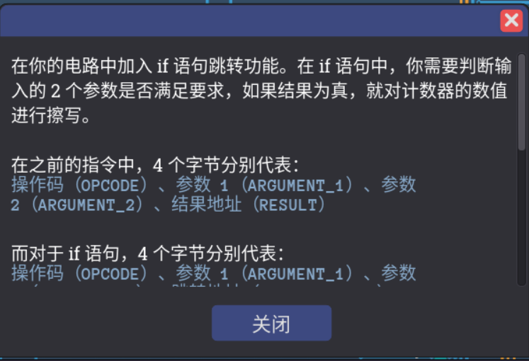
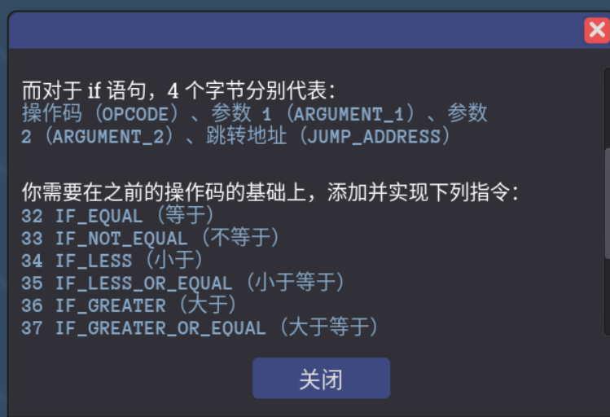
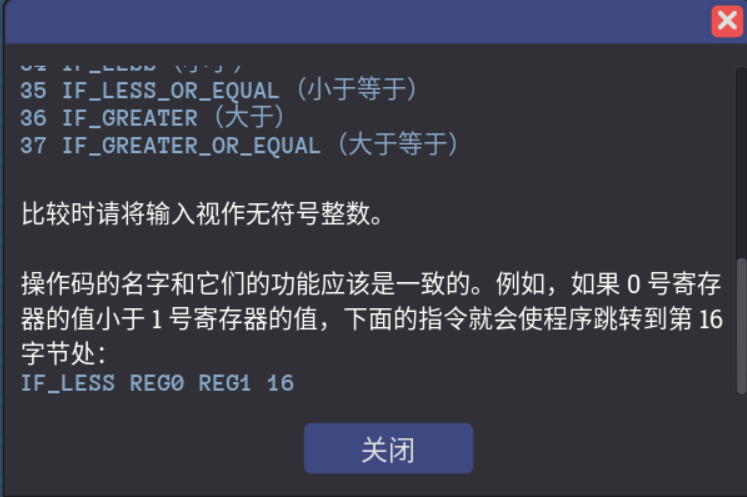

现在可以自定义指令集了，顺带改一改吧就，刚差点没找到怎么移动描述的位置，抓住AND右边的引脚拉到最边上再拖动左边的引脚即可

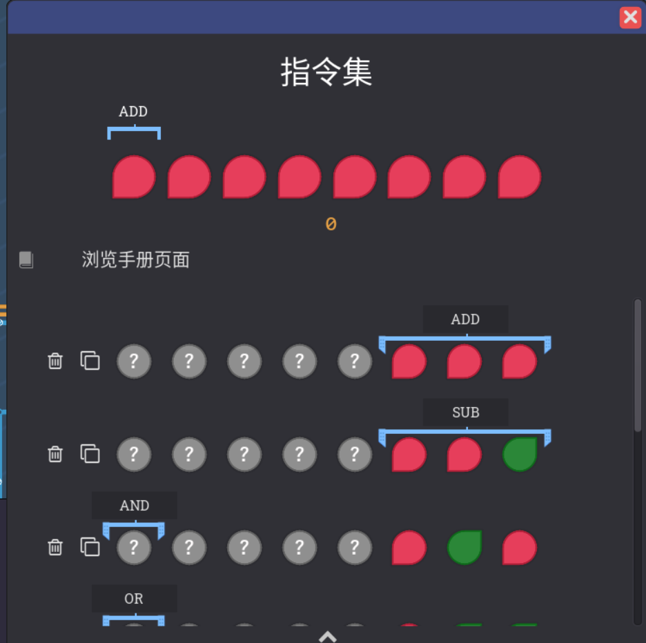
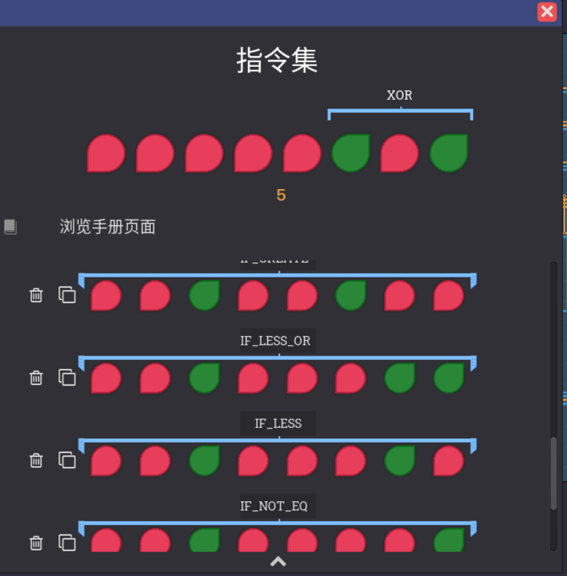

通过新建的指令集我们能看到，如果一旦涉及条件判断了，32位是必定亮起的，既然我们之前用过自定义的解码器，这回就得继续在解码器上进行修改了

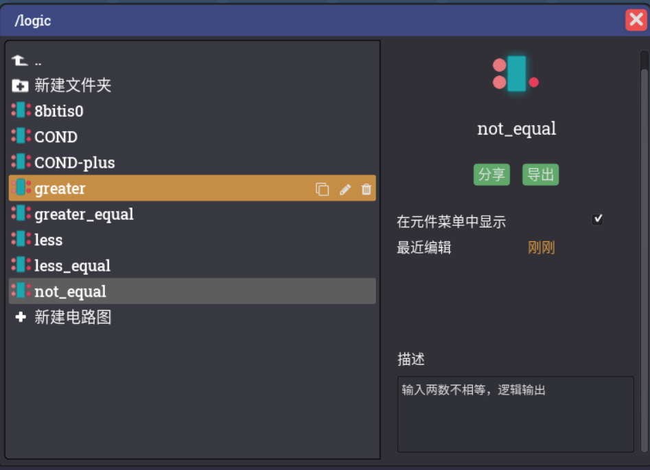

逻辑电路的元器件我就不开图了，在之前我已经发过了，链接放在这<span style="color:red">[点击跳转](https://adeepblue.github.io/p/%E5%9B%BE%E7%81%B5%E5%AE%8C%E5%A4%87%E6%B8%B8%E6%88%8F%E6%94%BB%E7%95%A52/#%E6%97%A0%E7%AC%A6%E5%8F%B7%E5%B0%8F%E4%BA%8E)</span>
小于的搞定了，小于等于条件也就是小于+等于也就是加一个或门就可以了，小于等于反面就是大于，也就是前面小于等于取一个反就可以了，大于等于是小于的反面，同样取反，
不等于也就是等于的取反，因为这里涉及1bit的信号8选1嘛，又没有这个元件，只好自己写了一个

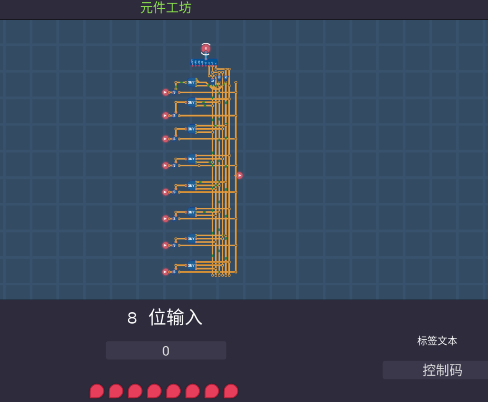
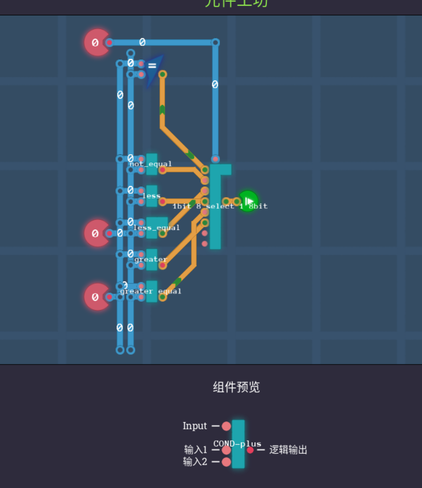


首先先把COND-plus元件加入main中，并顺带蹭一下隔壁ALU的输入，因为都是一样的，其次用八位开关分别控制输出内容的去向，安排完cond-plus先把它的输出放着，来改动另一边的

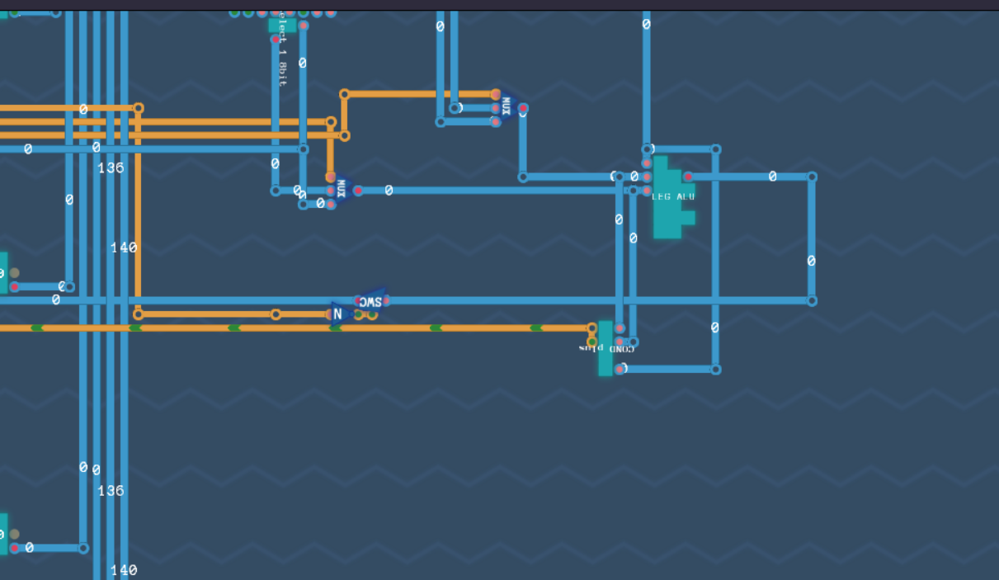
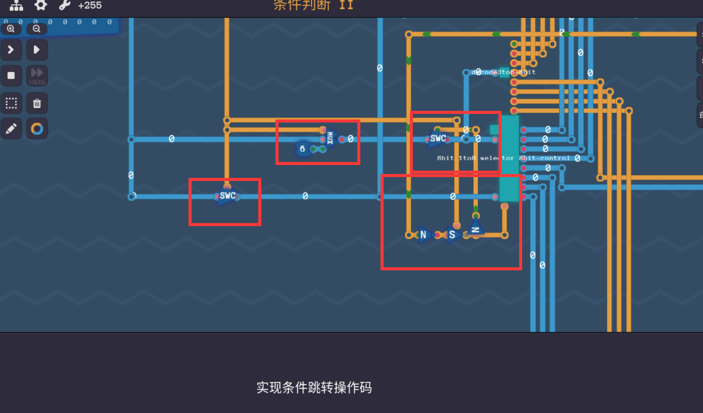

说明一下左侧的内容，因为切到条件判断之后，原本是作为地址码输入的第四位，变成了直接修改计时器的值的数，因此，它需要两边都有能过的线，下面一侧直接输入的值，
也就是上面的32位的值，一旦处于1的状态就放行下面这个，使他作为一个数直接输入进计时器，另一侧，原本是直接输入地址码的变成了直接固定以访问计数器栏的值，
也就是说需要一个二选一的数据选择器，一旦条件改变变成执行条件检查就打到6这侧，这就完了么？不，并没有，还记得上面那一侧的COND的输出么？如果COND输出为0，
也就是说条件不成立，那么是否应该拦住去计数器的信号呢？那条画着没放全的线，就作为了右边两处方框的控制开关，如果条件没有成立，那就通过开关来自动关闭，即，
如上

## 移位

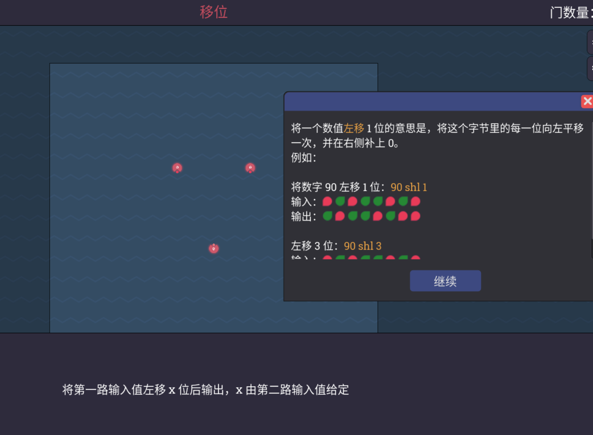

唔，刚好以前写了，就很离谱，当时写乘法运算器的时候用到了

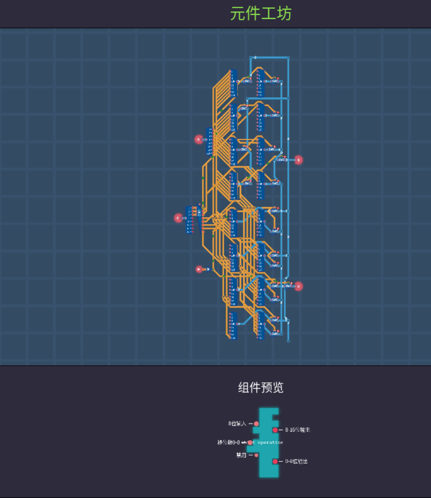

当时还采用了两位8bit数的输出，不过看起来这里只需要给一位分配输出就好了，以及还有禁用开关，实际本质上就是把输出的8bit数分线后移位挨个输出，然后另一个按照八位开关考虑好输出哪一位就好了，
原理其实挺简单，实际画的东西相当多就是了


## 延迟量


六个单位延迟量，以及是使用五个nand门，结果需要有变化，nand的突变点在于两个高电平会返回低电平，其他时候都是高电平，那也就是说，如果两个口都接一处，
两个信号不同的情况会坍缩了，输出相反，同理，这样可以再接一级，再是最后一个nand再改一次，
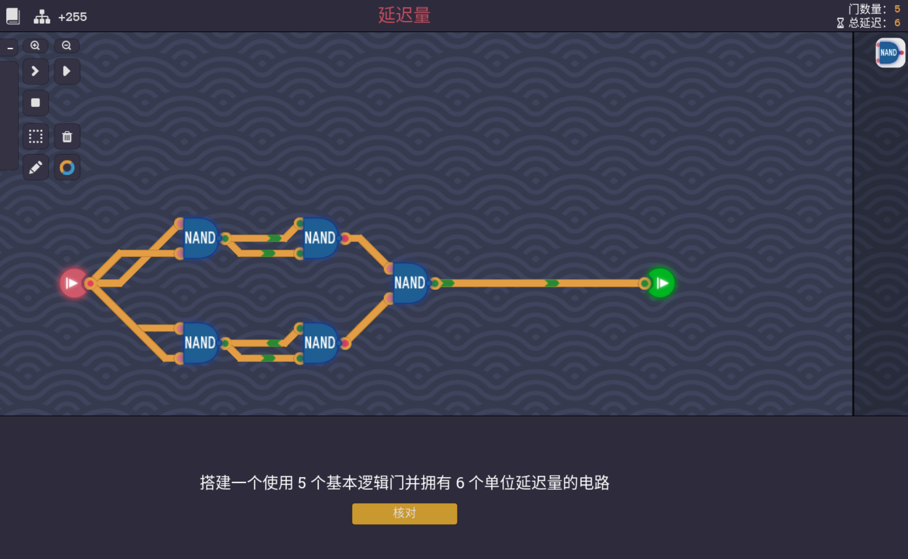

## 随机存储器

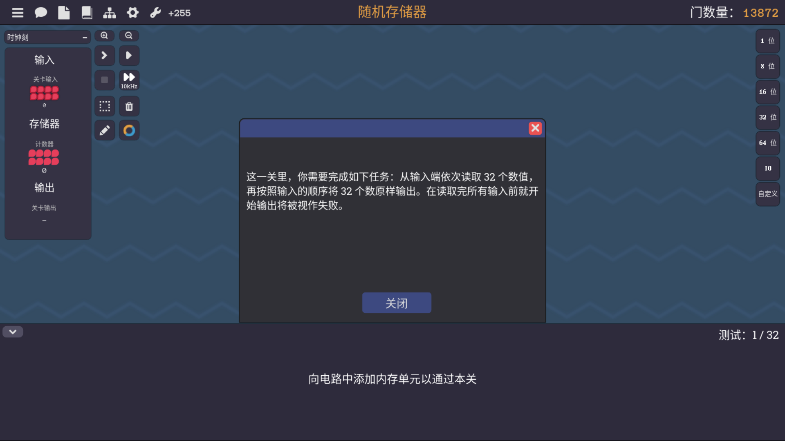
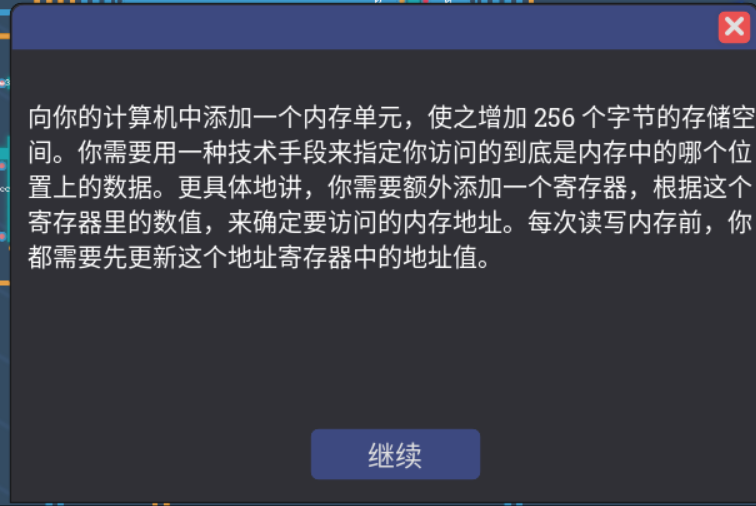

讲真，我看到这个要求之后，人有点懵，说实话，已经没有额外的寄存器位置可以供分配了，走线都已经布好了，想要撬开其实怪麻烦的，唯一有点头绪的可能是指令集中依旧没分配的其中两位指令资源，
现在也就考虑16位以及是最后三位的联动了，内存，已知的也就两个功能，读内存和写内存，但是要考虑好怎么搞定，目前实现的就是，一旦涉及内存信号位高电平，意味着这一刻必须断开8位写入器，
也就是通过一定手段激活禁用开关即可。

但又碰到了麻烦，我调试后才发现，最大的问题在于，，说是说依次读取，但是一个时钟刻就进来一位数，写入的时候并没有什么时间执行其他东西，比如说累加，以及是跳转，要打达成这边的循环得有几个必要条件，
先要有label loop标记循环行，再有if类的条件进行跳转到计数器内进行改变程序执行的位置，其中if和累加必定冲突，if需要占用程序操作位的前3bit，累加需要前三bit是0，
也不可能俩一起出现，如果这样那只有用丑陋的办法了， 就是代码一行一行自己指定内存写入位，十分的丑陋，我目前没想到啥解决办法，也没去看过官方攻略

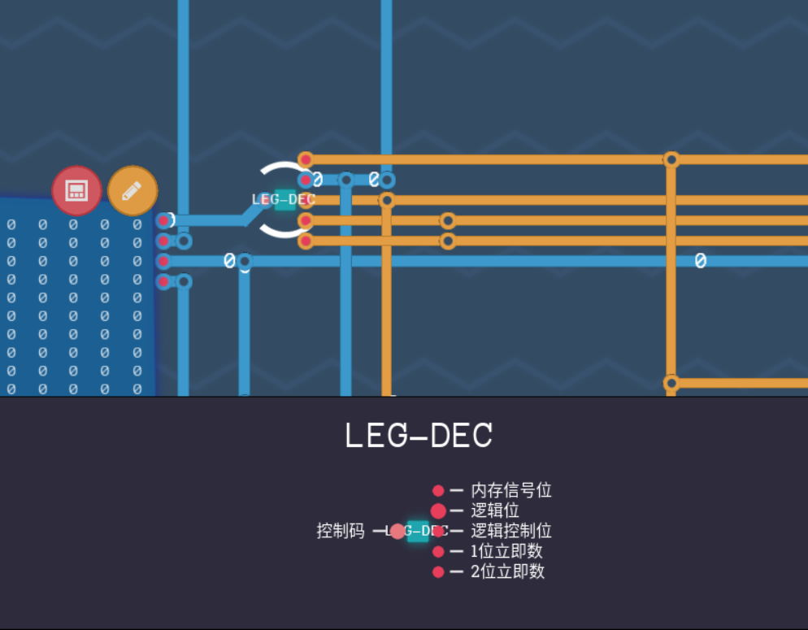
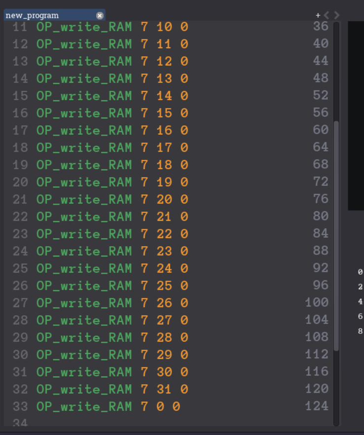
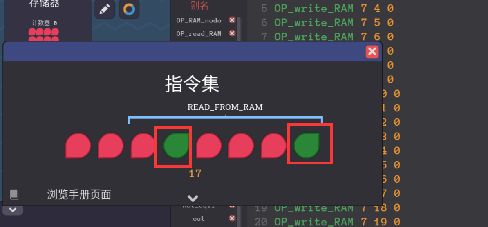

以及是，我指定了内存的读和写的两位，写则是16

-----------------

过了一些时间才着手解决这个麻烦，想好了思路，先确定好指令样式之后再决定怎么搭线是最好的，题中也就说了一句额外加寄存器，讲真不如直接拿一位的寄存器来当内存地址，
确定好的命令如下:

内存信号高点平的相关指令 输入位 内存位 输出位
如果是写入状态，
OP_write_RAM 写入位  内存地址位  空
OP_read_RAM   空   内存地址读取位 输出位 
其实很纠结，因为空了东西了，但确定下来就好办了，其中以下是内存写入的代码

```
OP_write_RAM 7 1 0
OP_write_RAM 7 2 0
...
OP_write_RAM 7 31 0
OP_write_RAM 7 0 0
```

其中OP_read_RAM相关的命令则变成了
```
OP_read_RAM 0 reg0 7
```
说明一下，内存地址读取位是指，从那一位寄存器里读出数据然后来写入，也就是说，只要从第二位选择器中拿到后面的数据就可以了，其中二选一控制器用读的17（控制码）就可以了，
这样可以通过寄存器直接输入数值了就，这样就可以构成循环的条件了，因为题目中没要求输出的时间紧凑度，如果再是上面那样急着输出就很难搞了，接上个话题，比如说我指定reg0为内存地址读取位，
那么我后面指定让reg0累加1，然后判断reg0是否小于等于32就可以了

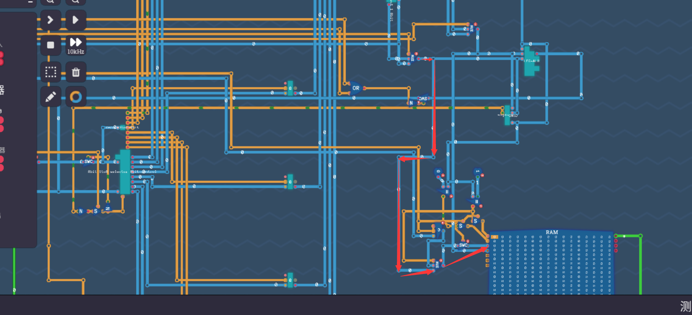

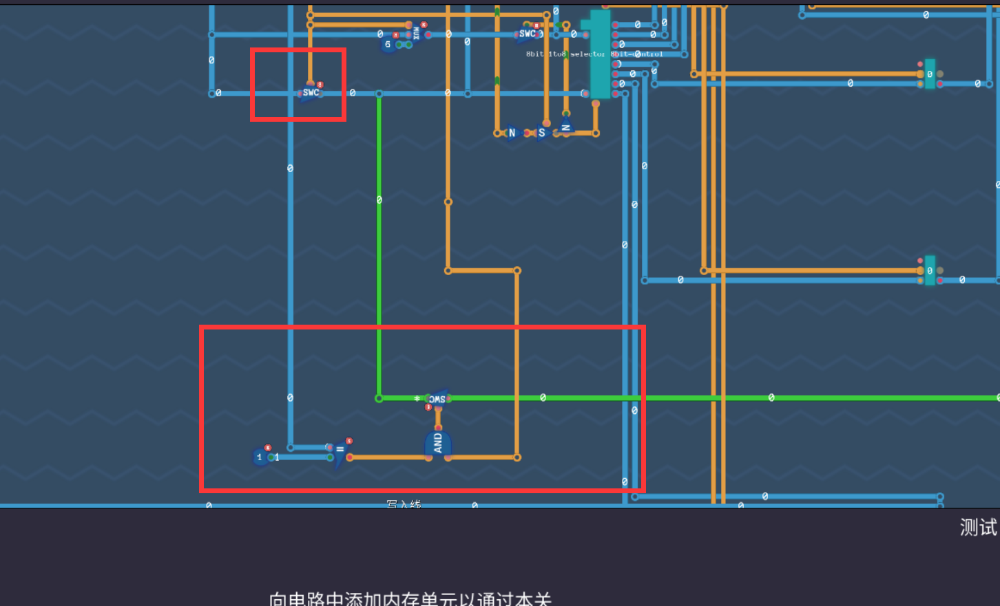

```
label loop
OP_read_RAM  0  reg0   out
add_i1 1 reg0 reg0
lesseq1i reg0 32 loop
```
其中这是代码，add_i1是指第一位是立即数第二位是reg寄存器地址的，下面的lesseq1i也是一样，指的第二位是立即数模式进来的数字，这样就能解决了

吐槽一下这个出的问题，太烂了，我很讨厌低效的代码，拷贝，改数字，挺丑陋的，但我又拿它没办法，read部分我其实想破罐破摔了，但是程序本身放不下貌似，溢出了，那就作罢只能换循环了，
这题是解的算扫兴了，希望后面别碰到这样的题了。

-----------------

下一篇博文见,下一篇链接(还没更新，更新完了放这里)