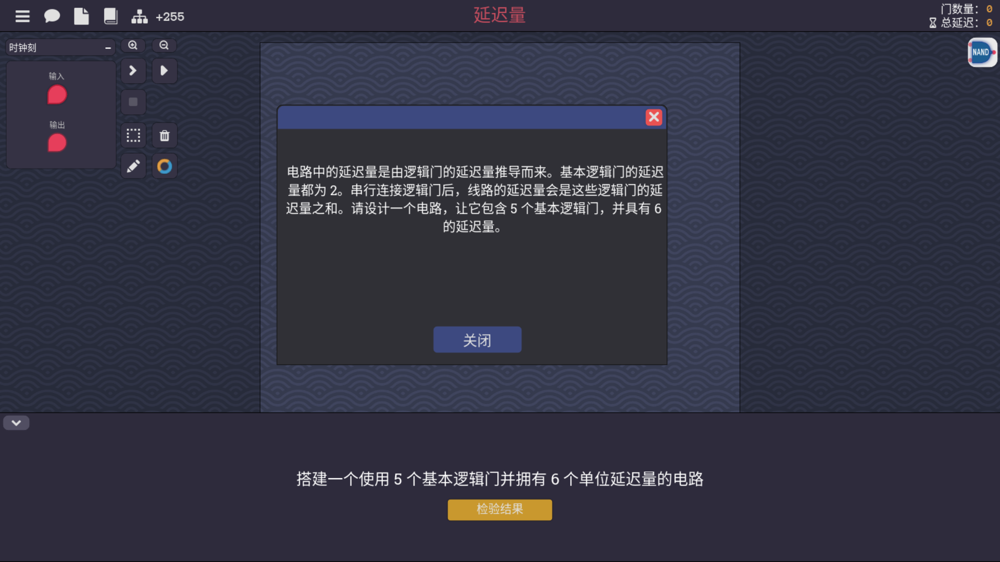

+++
date = '2025-02-14T15:10:30+08:00'
draft = false
title = '图灵完备游戏攻略4'
image = "/image/Turing-Complete-Logo.png"
categories = [
    "steamgame"
]
+++

# 图灵完备部分游戏攻略

## 条件判断

现在可以自定义指令集了，顺带改一改吧就，刚差点没找到怎么移动描述的位置，抓住AND右边的引脚拉到最边上再拖动左边的引脚即可

通过新建的指令集我们能看到，如果一旦涉及条件判断了，32位是必定亮起的，既然我们之前用过自定义的解码器，这回就得继续在解码器上进行修改了

逻辑电路的元器件我就不开图了，在之前我已经发过了，链接放在这[点击跳转](https://adeepblue.github.io/p/%E5%9B%BE%E7%81%B5%E5%AE%8C%E5%A4%87%E6%B8%B8%E6%88%8F%E6%94%BB%E7%95%A52/#%E6%97%A0%E7%AC%A6%E5%8F%B7%E5%B0%8F%E4%BA%8E)
小于的搞定了，小于等于条件也就是小于+等于也就是加一个或门就可以了，小于等于反面就是大于，也就是前面小于等于取一个反就可以了，大于等于是小于的反面，同样取反，
不等于也就是等于的取反，因为这里涉及1bit的信号8选1嘛，又没有这个元件，只好自己写了一个

首先先把COND-plus元件加入main中，并顺带蹭一下隔壁ALU的输入，因为都是一样的，其次用八位开关分别控制输出内容的去向，安排完cond-plus先把它的输出放着，来改动另一边的

说明一下左侧的内容，因为切到条件判断之后，原本是作为地址码输入的第四位，变成了直接修改计时器的值的数，因此，它需要两边都有能过的线，下面一侧直接输入的值，
也就是上面的32位的值，一旦处于1的状态就放行下面这个，使他作为一个数直接输入进计时器，另一侧，原本是直接输入地址码的变成了直接固定以访问计数器栏的值，
也就是说需要一个二选一的数据选择器，一旦条件改变变成执行条件检查就打到6这侧，这就完了么？不，并没有，还记得上面那一侧的COND的输出么？如果COND输出为0，
也就是说条件不成立，那么是否应该拦住去计数器的信号呢？那条画着没放全的线，就作为了右边两处方框的控制开关，如果条件没有成立，那就通过开关来自动关闭，即，
如上

## 移位

唔，刚好以前写了，就很离谱，当时写乘法运算器的时候用到了

当时还采用了两位8bit数的输出，不过看起来这里只需要给一位分配输出就好了，以及还有禁用开关，实际本质上就是把输出的8bit数分线后移位挨个输出，然后另一个按照八位开关考虑好输出哪一位就好了，
原理其实挺简单，实际画的东西相当多就是了

## 延迟量

六个单位延迟量，以及是使用五个nand门，结果需要有变化，nand的突变点在于两个高电平会返回低电平，其他时候都是高电平，那也就是说，如果两个口都接一处，
两个信号不同的情况会坍缩了，输出相反，同理，这样可以再接一级，再是最后一个nand再改一次，

