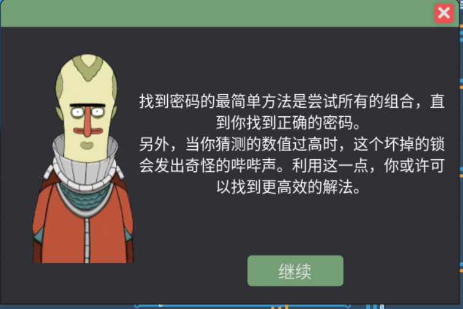

+++
date = '2025-02-06T10:07:57+08:00'
draft = true
title = 'Turing Complete'
+++

# 2025 02 06记录



看到第一想法是，想组织二分法去快速取值了，但想想简单吧还是遍历简单，所以准备
直接写两个程序，一个遍历一个二分法取值,以下是从游戏内汇编代码编辑器中拷贝过来的代码

```
# put in every num to the output
1
reg0_to_reg2
0
reg0_to_reg4
reg4_to_out

label output_loop
reg4_to_reg1
add
reg3_to_reg4
reg4_to_out

output_loop
always
```