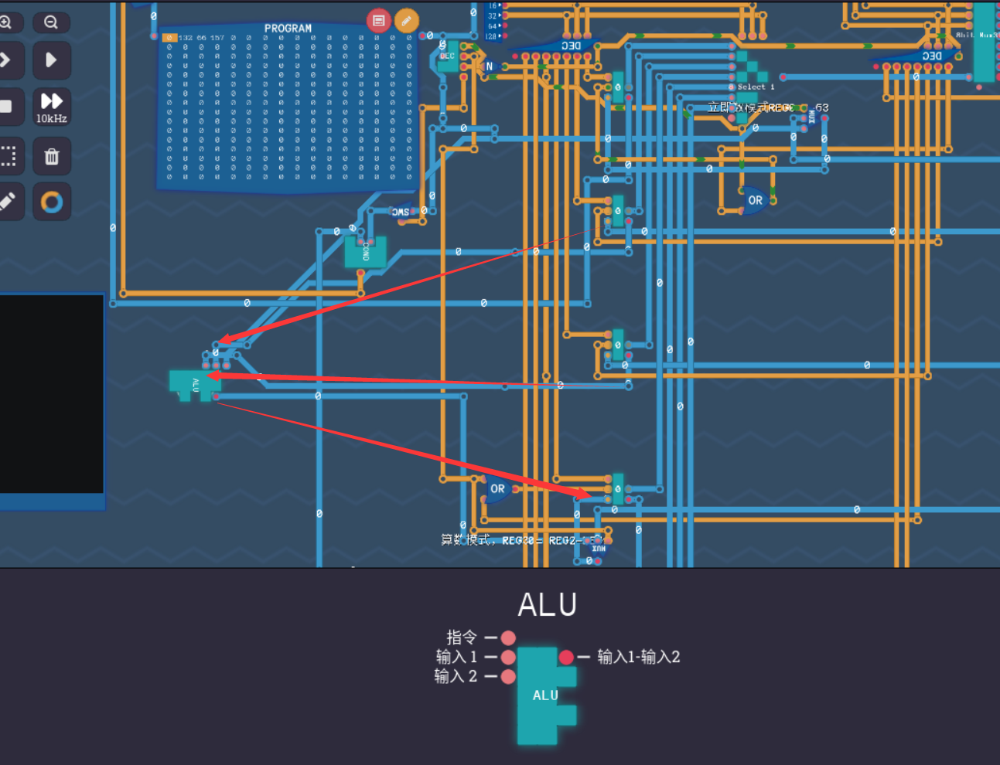

+++
date = '2025-02-06T10:07:57+08:00'
draft = false
title = '图灵完备游戏攻略'
image = 'Logo.png'
categories = [
    "steamgame"
]
+++

# 图灵完备部分游戏攻略
## 前言
话说在前面，因为先前并没有开博客网站，我先前的内容，除非我再去玩一次，可能会再写记录，目前估计不打算写了
,目前的进度如下图，已经造出了可以运行的计算机，也实现了简单的几个程序，以及开始了游戏内的汇编，会简单讲一下我造的计算机的布局，
我并不打算多看教程，基本多数是我自己在思考然后自己搞定的，写这个博客的目的是在我写一些程序或者跟程序相关的东西的时候留下一些痕迹，
不写就有可能会像我python这里这边这样，用过3D的绘图但回过头来不知道文件夹放在哪了，甚至还很难搜到，干脆就写博客了就


## 目前计算机的布局

这是我目前造好的计算机，如下图

### 寄存器

下面的是6个寄存器和一个输入，可以用来存储读取数据


### DEC状态选择器
以及是DEC，模式选择器，选择当前计算机处于什么状态，主要是取决于从程序码中读取的8位状态数中的前两位，这两位组成一个
二进制数表示0到4，分别代表DEC的四个模式从上到下分别对应0-3，对应着四种读写模式，接下来会介绍四种模式

## 四种模式
### 立即数模式
<span style="color:red">模式0</span>是IMMEDIATE(立即数模式)
，它会读取后面的六位直接存储在reg0中，
```
# 直接写数据会把程序码变成这个数,小于64时前两位数字都是0，立即数模式直接把1写入reg0
1
```


### 计算模式
接下来是<span style="color:red">模式1</span>，计算模式，如箭头所示，reg1的输出会到ALU元件的输入1部分，reg2的输出会到ALU元件的输入2部分
其中ALU的输出通过一个二选一线连到了reg3的输入端，在模式是计算模式下，reg3的读写开关时打开的,至于ALU是什么在下一步处讲
现在可以理解为，输入1跟输入2经过ALU的一翻操作之后输出变成了reg3的值，这些都是基于先前给的指令集添加的功能，以下是之前的游戏要求，也就是
现在已经实现了的东西，指令码是最后三位


在这个基础上,我新增了两数相乘的功能，也就是现在写着的unused的地方，现在已经这个按键位置可以实现乘法的功能了


以及，这个指令的操作意味着，我先设定好reg2和reg1的值之后，我只要输入这个指令就可以把以上能得到的结果输入到reg3，至于怎么设定reg1和reg2的值后面会说
### 复制模式
再然后是<span style="color:red">模式2</span>,copy模式，数字复制模式，这个指令会执行的操作是从前三位指代的寄存器的位置复制数值到后三位指代的寄存器上

也有特殊的，三位值如果指代的是6，也就是110的状态下，左侧三位指代的输入，右侧三位指代的输出
### 条件判断模式

<span style="color:red">模式3</span>，条件判断模式，条件是否满足如上，检测到reg3是否满足条件，满足后把reg0的值输入到程序的计数器内，也就是
可以实现跳转功能


## 汇编

可以为你已经有的指令创建一个别名，然后在程序中执行时，这个别名会被对应的指令数字替换，这样做可以增加
代码的可读性，让你知道当前代码什么意思，也就构成了现在的汇编代码编辑器的页面现在已有的东西，其中立即数模式不需要汇编，因为当前两位是0的时候后面的作为数字直接进入reg0.
计算模式直接写对应的模式的英文，比如add，当然，在执行汇编命令add，也就是68之前，需要将reg1和reg2赋值完毕再计算
如果没赋值就进行计算在多数情况下没有意义，至于复制模式，已经将相当多的指令直接指定好汇编别名了，现在能看到的基本都是以
哪to哪的格式进行命名的，至于第四个条件模式，一般用于代码的循环吧，等于是重新跳转到哪里执行，会在下面一个模块中描述，目前定义了
if_reg3_not0,也就是reg3不等于0，以及一个always命令，见条件判断模式中的100

## 基础已经能实现的一些功能
综上，已经明白reg0到reg3都是已经有功能附加在身了，能自由控制的也就是reg4和reg5的值了，先说一个可类似for循环的操作，
先定义一个数，到reg4比如说，初始化可以通过立即数模式加复制模式完成，下面是举例
```
4
reg0_to_reg4
```
现在以及执行的命令有，我先将10赋值给reg0，然后再把reg0(10)的值赋值给reg4，从而完成了循环数的初始化
再有就是条件变动了，因为几乎所有的条件几乎都围绕着0附近展开的，所以一般情况下的循环就是从你定义了一个数，慢慢
下降，到0为止，停止跳转操作：

跳转操作，修改的计数器的位置，等同于修改了下一个要执行的程序命令，比如说条件成立之后，我计数器变为3，原来是10再次碰上跳转时依旧会跳转到3
那么如果我加入一个条件数进行限制呢？一定条件下不运作了，最简单的实现就是，一个数，每次操作完都减一，然后等到0的时候停止执行，这是可能的最简便的方法吧？
事实上也是如此，当初我没写乘法运算器之前，也就是通过循环一个数直到它为0的操作来实现乘法的操作的，前面有关卡
实际也就是类似等同于python中以下的代码运算，但这里毕竟程序执行一次的时间肉眼可见，至少当时执行乘法的操作的时候
当时计算的很慢，也就是进行了一次时间换空间的操作，用循环数的方法，消耗了`first_num`倍率的时间，进行了一次乘法操作，我写的乘法器只需要一次的
计数器累加次数，相比下面部分完全写好的循环部分，多的是不少的计数器累加次数，实际上这就是计算机内部的时钟频率，基于时钟频率进行的执行各种程序操作
```python
sum_num = 0
first_num = 6
second_num = 4
for index in range(first_num):
    sum_num = sum_num + second_num
```

啰嗦了不少东西，现在完善一下以上曾经实现的类似上面python代码的操作，已经提到初始化好loop_num了
```
label loop
# 初始化减数(操作数1对操作数2进行操作，顺序是如此定的，比如4-1，第二位就是1)
1
reg0_to_reg2
```
label会标记当前行的行号,比如说这里是第四个代码执行行（注释操作并不会占用代码执行行，会被忽略）
label的定义的关键字是`loop`，也就是，后面如果读到是`loop`的话，就输出4，一般我的习惯性操作就是，把reg0的值复制到reg3来，然后
直接让reg3判断是否已经满足条件，如果条件满足，那就是进行跳转，但执行`if_reg_not0`的时候reg3已经有数值了，所以
`loop`得放到`if_reg_not0`前面,继续上述代码
```

reg5_tor_reg1
in_to_reg2
# 执行加法操作，被加数是输入数
add
# 执行完后把输出数复制回reg5
reg3_to_reg5
# 输出循环数行到reg0


# 复制reg4到reg1
reg4_to_reg1
# 执行减法操作，并将输出值赋值给reg3
sub
# 输出完刚好直接检验减完1之后的值是否是0
# 先初始化好reg0的值，如果reg3条件成立就跳转到label loop那行执行
loop
# 判断！
if_reg3_not0
# 如果执行完毕，输出reg5累加数
reg5_to_out
```


## 关卡密码锁
---2025 02 06记录
 


看到第一想法是，想组织二分法去快速取值了，但想想简单吧还是遍历简单，所以准备
直接写两个程序，一个遍历一个二分法取值,以下是从游戏内汇编代码编辑器中拷贝过来的代码，但现在转念一想，我好像，
如果使用二分法得写一个除法程序，先放一放，得思考一下除法程序的思路，以及是除数为0的报错处理方法，但先放着了，后面再说，
以下是目前的遍历代码

```
# put in every num to the output
1
reg0_to_reg2
0
reg0_to_reg4
reg4_to_out

label output_loop
reg4_to_reg1
add
reg3_to_reg4
reg4_to_out

output_loop
always
```
---2025 02 09记录
需要对一个数模4的结果等效于 4 % 3
